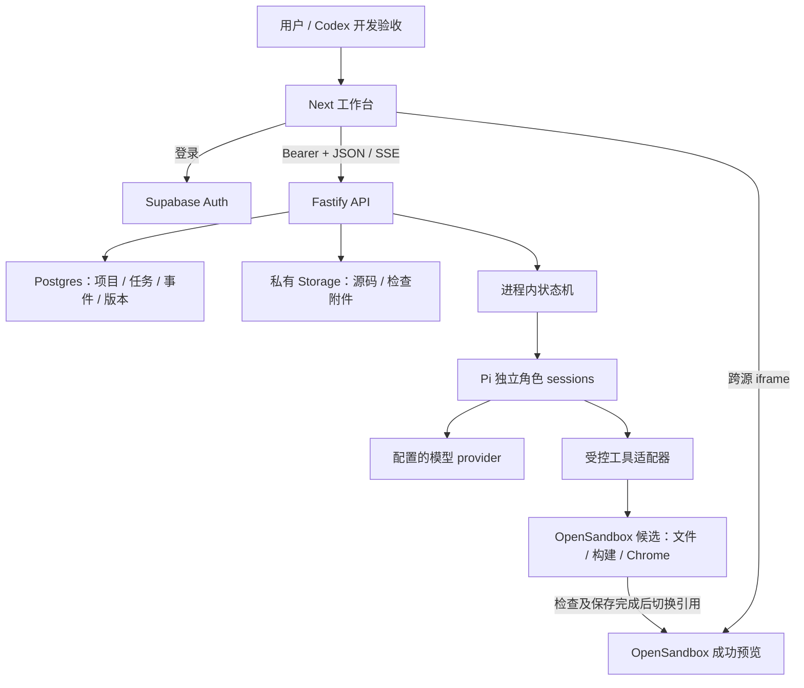
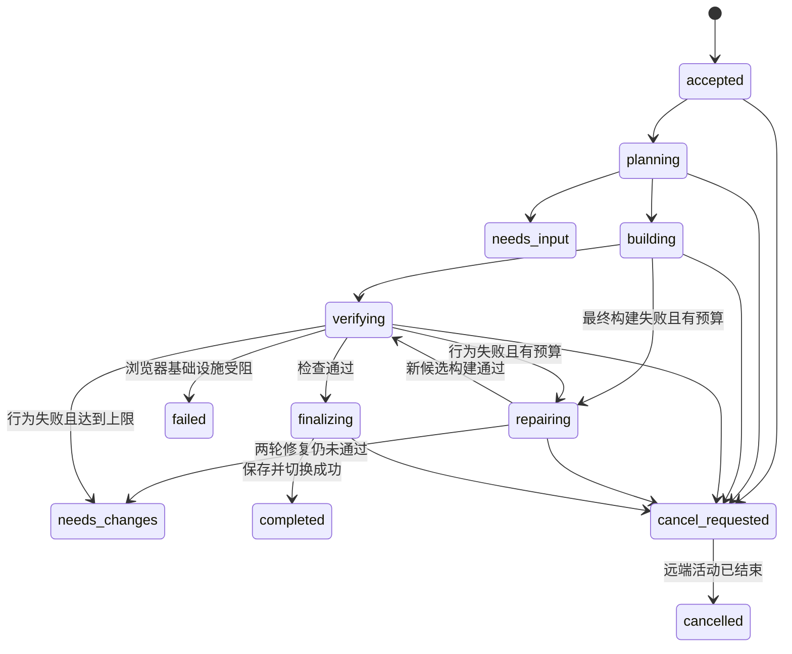

# Pivloom TRD

> 最新执行状态：2026-09-22基础联合验证已通过：真实Pi四工具生成、OpenSandbox/gVisor构建与Chrome、跨来源iframe交互和刷新、Auth/Storage、BYOK页面、单沙箱与Supabase共同负载。正式工作台生成尚待接入，模块完整E2E仍按各票门槛执行。详见[联合验收](foundation-validation-2026-09-22.md)。

版本：1.1 · 2026-09-22 · 状态：设计规格，待实现与集成验证。范围以 [PRD](PRD.md) 为准，测试以 [E2E](E2E.md) 为准。

2026-09-22沙箱决定：采用OpenSandbox Docker + gVisor systrap，已在授权服务器通过沙箱基础设施实测；Pi保留，E2B不再是前置。已验证文件/命令、React构建、Chrome、跨origin iframe、取消、TTL和清理。完整Pi生成与Supabase联调、联合容量及正式产品E2E仍待通过。详见[实测记录](sandbox-g0-results.md)与[方案依据](sandbox-options.md)。本地开发/E2E使用localhost或隧道，不依赖公网域名。

本文中的接口、表结构、文件目录与伪代码是我们的实现契约；标注“官方 API”的部分才是上游能力。版本是研究基线，不能把尚未编译、部署的组合写成已验证栈。

## 1. 固定技术决策

| 决策 | 本轮采用 | 原因及边界 |
|---|---|---|
| 工作台 | Next.js / React / TypeScript，Tailwind + shadcn/ui | 自己实现小工作台，借成熟组件；不整体 fork builder 再更换三层运行时 |
| Agent | Pi coding-agent SDK，三个独立 session | 复用工具循环、精确编辑、流事件和上下文管理；不再套 DSH/Codex 第二层 loop |
| API 与调度 | 一个常驻 Fastify 进程，进程内执行器，Postgres 持久状态 | 不在短生命周期 HTTP/serverless 请求里跑长任务；不引入 Redis/BullMQ/Temporal |
| 生成应用 | 一个 React + TypeScript + Vite 模板 | 多文件、可持续修改；不同时支持 Next/后端/移动/视频模板 |
| 代码执行 | OpenSandbox Docker + gVisor systrap，已通过沙箱基础设施探针 | 所有生成代码、安装、构建、预览和产品 Chrome 都在沙箱；服务端只保留可信调度与模型调用 |
| 产品内浏览器 | agent-browser CLI，独立 Chrome session | Reviewer 真实操作；不做 stream、远程接管、Midscene 或另一个浏览器 Agent 平台 |
| 身份与平台数据 | 自托管Supabase Auth + Postgres + 私有 Storage | 预建评审账号；项目/消息/源码快照独立于 OpenSandbox 生命周期 |
| 开发 E2E | Codex 桌面内置浏览器 | 验证真实工作台与 iframe；它是开发工具，不是产品可嵌入的开源 SDK |
| 部署形态 | 单 Linux 主机，Docker Compose 管理 web + api，复用宿主 Caddy | 一个公网 HTTPS 来源，API/SSE 反向代理到常驻进程；Supabase优先同机裁剪部署；沙箱同机部署，Supabase共存容量仍须联合验证 |
| 源码版本 | 完整、不可变、带内容哈希的文本快照 | 本轮不用 Git 作为运行时数据库；GitHub 只交付我们自己的仓库 |
| 多角色 | 固定 Coordinator → Builder → Reviewer，最多两次修复 | 只允许 Builder 写源码；不用通用多团队/评论触发系统 |

部署主机供应商不进入代码耦合；优先使用用户已有、可以运行常驻容器的主机，不在编写文档时购买资源。`APP_ORIGIN`、模型 profile、沙箱镜像digest 与实际截止时间是部署输入，G0 验证后写入交付记录。

已授权主机检查补充：主机已有 Caddy 和其他 Next.js 应用，部署时复用宿主 Caddy、保留既有站点，Pivloom web/api 使用独立服务与未占用的回环端口，不再启动第二个争抢 80/443 的代理。Compose 管理本项目服务；此调整不改变单实例 API、同源 HTTPS/SSE 和身份/私有存储与隔离沙箱的边界。实测资源见[部署检查记录](deployment-readiness.md)。

### 1.1 研究基线与版本锁定

| 组件 | 候选基线 | 锁定方式 |
|---|---|---|
| Node.js | 24 LTS；Pi 包要求至少 22.19 | G0 记录准确 patch 和容器 digest |
| Pi | `@earendil-works/pi-coding-agent@0.86.1`，相关 Pi 包同一版本 | 精确依赖 + lockfile；不使用旧命名示例拼新 API |
| OpenSandbox | SDK `@alibaba-group/opensandbox@1.1.0`；服务端 `15426df5d146d6ce7499a16bd1ed871e7242fe27` | 沙箱探针已执行；正式adapter尚待实现和编译 |
| gVisor | `release-20260914.0`，systrap | 官方SHA512校验；独立Docker runtime已实测 |
| agent-browser | `0.38.1` | OpenSandbox 镜像固定二进制版本及 Chrome 版本 |
| Next / React | 研究基线 Next `16.3.5` / React 19 | G0 核对 peer dependency，记录实际完整版本 |
| 生成模板 | Vite `8.3.0` / React 19 / TS | 模板带 lockfile，与应用依赖版本一起快照 |
| Fastify | 研究基线 `5.12.5` | 精确依赖，Node 24 上构建验证 |
| UI / DB / SSE 辅助库 | shadcn 需要的少量组件、supabase-js、pg、Zod、eventsource-parser | G0 选择相容版本后精确锁定；不因本文未列 patch 就使用生产浮动 `latest` |

这些不是“截至今天全部最新”的声明。已研究的固定提交和证据级别见第 3 节。API 签名必须以最终锁定包的类型声明和编译结果为准。

2026-09-22核对了Pi、agent-browser、Next、Fastify、Vite的包元数据，Pi要求Node `>=22.19.0`。另已实际执行OpenSandbox/gVisor、Node24.13.0、React19.2.4、Vite8.3.0、TS5.9.3和Chromium153.0.8010.52的基础设施探针；锁定镜像及记录见[结果](sandbox-g0-results.md)。Pi与完整产品组合仍未通过。

### 1.2 补充 ADR：是否需要 Deep Agents / LangChain / LangGraph

2026-09-22 根据用户追加问题复核官方 TypeScript 文档。**本轮三个都不引入；继续基于 Pi SDK 做产品开发，不 fork Pi 内核。** 以下是与当前需求的适配判断，未做三套框架的性能对比实验。

| 候选 | 官方定位与实际价值 | 对本轮的判断 |
|---|---|---|
| [Deep Agents](https://docs.langchain.com/oss/javascript/deepagents/overview) | 基于 LangChain/LangGraph 的 harness，包含文件工具、上下文管理、子 Agent 等能力 | 与 Pi coding harness 重叠。若选择它，应作为底座替代候选；不在 Pi 外面再包另一套自主工具循环 |
| [LangChain](https://docs.langchain.com/oss/javascript/langchain/overview) | 模型/工具抽象和可配置 Agent；Agent 基于 LangGraph | 当前模型调用、工具执行已由 Pi 负责。没有不可替代集成需求时，不增加消息、工具、事件与取消协议转换 |
| [LangGraph](https://docs.langchain.com/oss/javascript/langgraph/persistence) | 图编排、checkpointer、跨运行数据存储、暂停/恢复等 | 当前固定三角色 + 有限修复可用显式状态机；已接受重启后中断并手动重试，不需要为透明恢复引入图运行时 |

这不表示 LangGraph 与 Pi 技术上不能组合。未来若要求长任务跨进程恢复、跨天人工暂停、复杂并行分支归并，可让 LangGraph 只负责外层业务节点，节点内部调用 `RoleRunner`，保留 Pi 作为唯一 coding loop。届时必须设计 checkpoint 与项目 revision 的一致性、节点重复执行的幂等、OpenSandbox/Chrome 的重建和远端副作用确认；存图状态不会自动保存这些外部资源。内存 checkpointer 也不提供跨重启持久性。[Checkpointers](https://docs.langchain.com/oss/javascript/langgraph/checkpointers)

重新评估的触发条件：明确要求自动从中断继续、需要数小时以上的人为等待、固定流程已无法清楚表达的动态分支，或现成 LangChain 集成能经原型证明显著减少适配工作。在此之前，`RoleRunner / WorkspacePort / BrowserPort` 足够保留替换边界，不提前开发通用编排框架。

## 2. 总体结构与模块边界



图中的候选与成功预览是不同 sandbox ID；同一个候选通过后可原地改变用途为 preview。下一次修改创建新候选，不在当前成功预览目录继续写。每次修复也创建新的候选沙箱，还原上一次失败快照；旧候选的检查和附件保存后销毁，旧 URL 不复用为新版本。

这不是分支并行生成系统。一个项目任一时刻只有一个生成/修复流程，一个流程任一时刻只有一个可写候选。成本是创建环境和恢复文件的额外耗时；收益是版本、浏览器目标与取消语义明显简化。模板预装基础依赖降低冷启动成本，具体耗时须 G0 实测。

### 2.1 模块职责

| 编号 | 模块 / 建议位置 | 输入 → 输出；职责 |
|---|---|---|
| T01 | `api/auth` | Bearer token → verified user；认证、项目归属、受限入口 |
| T02 | `api/repositories` | 业务命令 → 事务化项目/任务/版本记录；参数化 SQL 与冲突控制 |
| T03 | `api/orchestrator` | accepted run → 有限阶段状态机；角色交接、预算、取消、终态 |
| T04 | `api/agents` | RoleInput + toolset → RoleResult；Pi SDK 集成，不决定产品成功 |
| T05 | `api/workspace` | sandbox 操作 → 文件/命令/预览句柄；OpenSandbox adapter、资源清理 |
| T06 | `api/snapshots` | 冻结源文件 → 校验快照/文件查询/恢复；保存与指针切换 |
| T07 | `api/browser` | scoped action → 观察/截图/日志；agent-browser adapter、版本绑定 |
| T08 | `api/events` + `web/run-events` | 持久事件 → SSE → UI 投影；重连、去重、限流与错误显示 |
| T09 | `web/features/workbench` | 项目/任务/版本状态 → 聊天、角色活动、预览与源码 |
| T10 | `infra` + `api/recovery` | 部署/启动/健康检查 → 可服务状态；中断标记、预览恢复 |
| T11 | `api/limits` + `api/diagnostics` | 调用上下文 → 配额/截止时间/脱敏/关联日志 |

只建立这些边界需要的文件，不在空仓库先创建插件平台或十几个独立发布的包。

### 2.2 建议目录

```text
apps/web/                     Next 页面及工作台组件
apps/api/src/
  routes/ auth/ repositories/ orchestrator/
  agents/ workspace/ snapshots/ browser/ events/ limits/ recovery/
packages/contracts/           JSON schema、共享类型、错误码；无运行时凭据
templates/react-vite/          可构建空模板、精确 lockfile
infra/                        Dockerfile、Compose、Caddyfile、OpenSandbox 模板说明
migrations/                   有序 SQL
tests/integration/            状态机、适配器、真实数据库测试
tests/fixtures/               明确标注的预览/缺陷/故障场景
docs/                         本套规格与以后实际测试报告
```

使用普通 workspace 管理依赖即可。没有实际复用需要时不加 Turborepo、通用 runtime package 或消息总线。

## 3. 具体借鉴哪些开源实现

复用分成三种：**依赖官方包**、**参考设计自行实现**、**明确延期**。不能把“读过源码”写成“已集成”。

### 3.1 Pi：直接复用执行底座

稳定提交 `13cbf77df2396303013a41646bcfa77b4271ae56`；MIT。SDK 入口和调用图研究使用 main `c7cdb460aa8a0cebef3446c4166729b8a0d97ead`，比 stable 领先 8 个提交；下列行号标明所属提交，不混用。

| 上游模块 / 符号 | 具体复用 | 我们必须补齐 |
|---|---|---|
| [`createAgentSession`，main sdk.ts:175](https://github.com/earendil-works/pi/blob/c7cdb460aa8a0cebef3446c4166729b8a0d97ead/packages/coding-agent/src/core/sdk.ts#L175)；[stable SDK](https://github.com/earendil-works/pi/blob/13cbf77df2396303013a41646bcfa77b4271ae56/packages/coding-agent/docs/sdk.md) | SDK 组装 Agent、AgentSession、模型、会话与资源加载 | 独立 session、模型配置、远程工具、任务生命周期 |
| [read 工厂](https://github.com/earendil-works/pi/blob/13cbf77df2396303013a41646bcfa77b4271ae56/packages/coding-agent/src/core/tools/read.ts)、[write 工厂](https://github.com/earendil-works/pi/blob/13cbf77df2396303013a41646bcfa77b4271ae56/packages/coding-agent/src/core/tools/write.ts) | `createReadToolDefinition` / `createWriteToolDefinition`，替换 operations | 远端读写、路径边界、文件大小、写权限与取消检查 |
| [edit 工厂](https://github.com/earendil-works/pi/blob/13cbf77df2396303013a41646bcfa77b4271ae56/packages/coding-agent/src/core/tools/edit.ts) | `createEditToolDefinition` 的精确替换、diff、同文件 mutation queue | 同项目只有一个 Builder；远端文件是唯一写目标 |
| [bash 工厂](https://github.com/earendil-works/pi/blob/13cbf77df2396303013a41646bcfa77b4271ae56/packages/coding-agent/src/core/tools/bash.ts) | `operations.exec(command,cwd,{onData,signal,timeout,env})` | OpenSandbox 命令句柄、流输出、deadline、远端 kill 与环境白名单 |
| [SessionManager](https://github.com/earendil-works/pi/blob/13cbf77df2396303013a41646bcfa77b4271ae56/packages/coding-agent/src/core/session-manager.ts)、[sessions 文档](https://github.com/earendil-works/pi/blob/13cbf77df2396303013a41646bcfa77b4271ae56/packages/coding-agent/docs/sdk.md#sessions) | 每角色独立 in-memory session，按需保存结束摘要/entries 供诊断 | 项目真相放数据库和快照；下一轮以结构化上下文重建，不使用 `continueRecent` 猜用户 |
| [`AgentSession._emit`，main:626](https://github.com/earendil-works/pi/blob/c7cdb460aa8a0cebef3446c4166729b8a0d97ead/packages/coding-agent/src/core/agent-session.ts#L626) | 普通 `session.subscribe` 做 UI 事件投影 | 此回调不 await；不能用 `subscribe(async()=>写库)` 当阶段持久化屏障 |
| [`Agent.subscribe`，stable:265](https://github.com/earendil-works/pi/blob/13cbf77df2396303013a41646bcfa77b4271ae56/packages/agent/src/agent.ts#L265) | 底层 await 事件机制，可在必要点接屏障 | 优先用我们自己的工具 wrapper + `flush()` + 事务推进保证关键顺序 |
| [`AgentSession.abort`，main:1786](https://github.com/earendil-works/pi/blob/c7cdb460aa8a0cebef3446c4166729b8a0d97ead/packages/coding-agent/src/core/agent-session.ts#L1786) | 中止模型/重试并等待 idle | 自定义工具传递 signal，终止远端进程/候选沙箱；不能只中断 Promise |
| [Remote Execution](https://github.com/earendil-works/pi/blob/13cbf77df2396303013a41646bcfa77b4271ae56/packages/coding-agent/docs/extensions.md#remote-execution) | 官方 remote operations 扩展挂点 | 宿主资源扫描关闭、超大日志映射、所有启用工具均远程化 |

不复制 Pi CLI/TUI，不引入其示例子进程多 Agent 调度，不依赖尚未满足本产品恢复要求的 pi-durable。Pi 的 session 持久化不自动保存项目源码，也不自动实现跨崩溃工作流。

### 3.2 Multica：参考协作机制，不纳入源码

固定提交 `f41fae6b08fb734afcbd13205c0b3203dd0bc9c6`。完整核验见[团队机制](../research/multica-team-reference.md)。

| 定点实现 | 借鉴到 Pivloom 的规则 | 本轮不照搬 |
|---|---|---|
| [`IssueService.enqueueSquadLeaderTask`，issue.go:844](https://github.com/multica-ai/multica/blob/f41fae6b08fb734afcbd13205c0b3203dd0bc9c6/server/internal/service/issue.go#L844) | 先协调再分工，不同时唤醒全部成员 | 通用 Squad、Issue 分派 API |
| [`enqueueMentionTaskWithCommentPlan`，task.go:1429](https://github.com/multica-ai/multica/blob/f41fae6b08fb734afcbd13205c0b3203dd0bc9c6/server/internal/service/task.go#L1429) | 交接输入、角色与版本先持久化，再通知执行 | comment mention 解析和跨机器通知 |
| [`routeAssignedSquadLeaderFallback`，comment.go:2995](https://github.com/multica-ai/multica/blob/f41fae6b08fb734afcbd13205c0b3203dd0bc9c6/server/internal/handler/comment.go#L2995) | 成员结束触发明确后续阶段；单角色结束不代表总任务完成 | 反复唤醒自由规划的 Leader |
| [`resolveCommentTriggerEnqueue`，comment.go:2129](https://github.com/multica-ai/multica/blob/f41fae6b08fb734afcbd13205c0b3203dd0bc9c6/server/internal/handler/comment.go#L2129) | 去重不能吞掉新输入；忙碌必须明确反馈 | 合并评论、pending input 队列；我们用 409 + 保留草稿 |
| [`buildClaimedTaskResponse`，daemon.go:2700](https://github.com/multica-ai/multica/blob/f41fae6b08fb734afcbd13205c0b3203dd0bc9c6/server/internal/handler/daemon.go#L2700)、[`buildSquadLeaderBriefing`，squad_briefing.go:196](https://github.com/multica-ai/multica/blob/f41fae6b08fb734afcbd13205c0b3203dd0bc9c6/server/internal/handler/squad_briefing.go#L196) | 正确身份、角色上下文与协作规则在领取/执行时校验 | 依靠角色显示名称获得权限 |

其 LICENSE 是 Apache 2.0 文本加附加条件的 Multica License，对对外托管等有额外限制，不能标作纯 Apache-2.0。本轮只参考通用设计，独立编写实现，不复制其 UI/Go/daemon 代码。[固定版许可证](https://github.com/multica-ai/multica/blob/f41fae6b08fb734afcbd13205c0b3203dd0bc9c6/LICENSE)

### 3.3 浏览器、产品壳与基础组件

| 项目与证据 | 采用的模块 / 用法 | 保留在我们这边的实现 |
|---|---|---|
| [agent-browser 0.38.1 README](https://github.com/vercel-labs/agent-browser/blob/aff6125c023b810ea3f2e5deec5379e9a4270bdc/README.md)，Apache-2.0 | 直接调用 CLI 的 session、open、snapshot、click/fill、screenshot、console/errors 等能力；以实际锁定 CLI help 验证参数 | 独立 session 命名、允许目标、工具 schema、版本绑定、文件上传、预算与清理 |
| [OpenSandbox](https://github.com/opensandbox-group/OpenSandbox)，Apache-2.0 | 创建/连接、文件、命令、端口、TTL与生命周期 | 项目权限、预览代理、源码存储、Pi工具适配；采用已实测Docker + gVisor配置 |
| [bolt.diy Workbench](https://github.com/stackblitz-labs/bolt.diy/blob/2e254ac19a696394030601bc602f54945b12bfc4/app/components/workbench/Workbench.client.tsx)、[Preview](https://github.com/stackblitz-labs/bolt.diy/blob/2e254ac19a696394030601bc602f54945b12bfc4/app/components/workbench/Preview.tsx)、[FileTree](https://github.com/stackblitz-labs/bolt.diy/blob/2e254ac19a696394030601bc602f54945b12bfc4/app/components/workbench/FileTree.tsx)，MIT | 参考聊天旁边的预览/代码组织，目录存在性已核对 | 自己用本产品状态和 API 实现；不移植 WebContainers、action parser 或整套前端状态库；这些文件未做逐函数审计 |
| [Dyad Versioning](https://www.dyad.sh/docs/guides/versioning) | 参考将应用版本与聊天分开、已保存结果可恢复的体验 | 本轮完整快照；不复制桌面 IPC/Pro agent；tagger 和恢复 UI 延期 |
| [shadcn/ui](https://github.com/shadcn-ui/ui)，MIT | Button、Tabs、Textarea、Dialog、ScrollArea 等必要交互组件 | 工作台业务状态、可访问名称、错误和布局 |
| [AI Elements](https://github.com/vercel/ai-elements)，Apache-2.0 | 可按需选 Conversation/Message/Tool 展示；没有适配收益就直接用 shadcn | 不接第二套 AI SDK agent loop，不为了组件改变 Pi 协议 |
| [Supabase JS](https://github.com/supabase/supabase-js)，MIT；[getUser](https://supabase.com/docs/reference/javascript/auth-getuser) | 登录、验证 token、私有 Storage；Postgres 用参数化 SQL | owner 检查、事务、快照和状态；不是生成应用的 Cloud |
| [eventsource-parser](https://github.com/rexxars/eventsource-parser)，MIT | 解析 fetch 返回的 SSE 字节流 | Bearer、重连、cursor、去重、状态投影和错误策略 |
| [Caddy reverse_proxy](https://caddyserver.com/docs/caddyfile/directives/reverse_proxy) | HTTPS 同源路由与流式响应转发 | 部署配置、健康检查、禁用缓存、运行规模限制 |

**Codex 与 DeepSeek Harness**：Codex 的 app-server/exec 形态、DSH 的运行记录分层保留为研究参考，不是本轮依赖；Codex 内置浏览器用于我们的开发验收，不能从 Codex CLI 开源仓库推导它可以被嵌入公开产品。这样避免 Pi → DSH → Codex 多层 agent loop、三种状态体系和额外取消链。比较依据见[运行时 ADR](../research/runtime-decision-v2.md)。

### 3.4 证据可信度与复用纪律

源码检索已按用户要求先走 codebase-memory-mcp 图，再定点 snippet；本环境未提供 codegraph，因此用图工具 `get_code_snippet` 读取精确符号。Pi tools 目录存在索引排除，工具工厂按已知路径与 stable 文档定点核对；Multica 是相关文件的部分源码集，SQL 有解析缺口。不能把这份研究称为完整代码或许可证依赖闭包审计。

实现时优先依赖公开包；参考产品的 UI/调度模式自行实现。若后来需要拷贝代码，先核对具体目录 LICENSE 和传递依赖，保留许可/版权。已有星标统计只是候选筛选信号，不是集成质量或许可证证明。

## 4. 领域对象与不变量

| 对象 | 含义 | 不是什么 |
|---|---|---|
| Project | owner 下的一个应用及当前成功版本引用 | 不等于一个永不失效的沙箱 |
| Message | 用户需求、澄清与用户可读结果 | 不存模型隐藏推理，不承担调度职责 |
| Run | 一次被接受的需求/重试，含总预算与终态 | 不因刷新页面重新创建 |
| RoleRun | 某 run 的某角色在某 attempt 的实际执行 | 不是改个头像的同一会话 |
| Revision | 不可变源码快照，可能通过、未检查或失败 | 不是随时被覆写的工作目录 |
| Check | 对一个 revision 的行为观察与判定 | 不是普适正确性证明 |
| RunEvent | 有序、可重放的产品活动事实 | 不以事件表重放整个模型执行栈 |
| SandboxBinding | 实际 sandbox / revision / 用途 / 生命周期绑定 | URL 字符串本身不证明版本或有效性 |

强制不变量：

1. 一个项目最多一个活动生成 run；预览重建与生成的项目操作互斥。
2. 只有活动 Builder 可写入它拥有的 candidate sandbox；Coordinator/Reviewer 永远没有 shell 或写工具。
3. 每次检查带 run ID、roleRun ID、revision ID、sourceHash、sandbox ID 和 browser session ID。
4. `projects.current_revision_id` 只指向构建通过、源码已保存且本轮所需检查通过的 revision。
5. 旧版本的迟到结果、旧 attempt 的工具结果、取消后的完成消息都不能推进当前状态。
6. 框架中的 tool success 只说明该操作完成；总任务成功还需构建、预览、检查、持久化和事务切换。
7. 接受用户请求与最终结果均先持久化再向用户确认；流式展示的最后一小段日志允许未刷盘丢失。
8. 模型从不直接决定数据库 owner、sandbox ID、Storage key 或阶段跳转。

## 5. 状态机、角色与交接

### 5.1 Run 状态



任何非终态都可因服务重启进入 `interrupted`；执行错误可进入 `failed`。构建修复耗尽进入 `needs_changes`，不因图省略一条错误边而继续无限重试。终态为 `completed / needs_changes / needs_input / failed / cancelled / interrupted`，终态不可改回活动态。

`phase` 比 `state` 更细：`plan / provision / implement / build / snapshot / review / persist / cleanup`，用于错误定位和 UI 当前动作。`attempt` 从 0 开始，1、2 为两轮修复。任务外层 deadline/Token/工具预算始终优先，可能在两轮修复前结束。

`cancel_requested` 持续到结束确认；`cleanup_state=pending` 时显示“远端清理待确认”，不能另开该项目的生成。遇到失联，定时查询/终止已知 sandbox，或等待配置的有效期到期并核验，再解除阻塞。不要为让 UI 好看提前写 `cancelled`。

### 5.2 角色权限

| 角色 | 可用工具 | 不能做 |
|---|---|---|
| Coordinator | `project_summary`、`submit_plan`、`request_clarification` | 读宿主文件、shell、写源码、随意派生角色 |
| Builder | 远程 `read/write/edit/bash`；只读目录工具若启用须远程；`submit_build_result` | 访问其它项目、宿主执行、修改状态机/鉴权、声称自己完成检查 |
| Reviewer | `source_read`、`browser_open/observe/click/fill/select/press/scroll/screenshot/logs`、`submit_review` | 任意 shell、源码写入、访问工作台账号、改存储中的检查结果 |

每次工具 wrapper 都检查：`run` 未取消且仍活动、当前角色/attempt 匹配、剩余预算、sandbox/revision 归属。检查之后才调用 adapter；返回之后再次检查状态，防止迟到结果触发交接。

`submit_*` 只是提供结构化产物，由服务端校验后推进；不能让模型直接调用“发布成功”数据库操作。

### 5.3 交接契约

以下是我们自己的 TypeScript 数据形状，不是 Pi 内置类型：

```ts
type Role = 'coordinator' | 'builder' | 'reviewer';
type CheckVerdict = 'passed' | 'failed' | 'blocked';

interface BehaviorTarget {
  id: string;                 // B01…，在一份计划内唯一
  title: string;
  precondition: string;
  action: string;
  expected: string;            // 可观察结果，不写“页面很好看”
  required: boolean;
}
interface Plan {
  schemaVersion: 1;
  goal: string;
  changeSummary: string;
  assumptions: string[];
  outOfScope: string[];
  behaviors: BehaviorTarget[]; // 1–5；修改时含至少一个原有行为
}
interface Handoff {
  runId: string;
  fromRoleRunId: string | null;
  toRole: Role;
  attempt: 0 | 1 | 2;
  baseRevisionId: string | null;
  expectedRevisionId: string | null;
  sourceHash: string | null;
  plan: Plan;
  task: string;
  failedChecks?: string[];
  artifactIds: string[];       // 服务端产物引用，不接受任意外部文件路径
}
interface ReviewItem {
  behaviorId: string;
  verdict: CheckVerdict;
  expected: string;
  actual: string;
  observationEventIds: string[];
  screenshotIds: string[];
  reproSteps: string[];
}
interface ReviewResult {
  revisionId: string;
  sourceHash: string;
  items: ReviewItem[];
  summary: string;
}
```

计划最多 5 个目标，每个摘要有字符上限；schema 验证失败允许同一角色一次纠正机会，仍失败则 `AGENT_OUTPUT_INVALID`。修复任务使用旧计划、失败步骤和失败快照，不把全部聊天、所有截图和每个角色全部历史反复拼接。

结构化交接存于下一 `role_runs.input_json`，来源存 `predecessor_id`；无需另建通用消息队列表。唯一键 `(run_id, role, attempt)` 防止重复派工。阶段结果、下一 RoleRun 的 queued 记录、阶段事件在同一事务提交后，才调用下一角色。

### 5.4 调度伪代码

```text
acceptRun(): 校验身份、幂等键、项目操作互斥与容量 → 保存 run + 用户消息 + accepted 事件
executeRun():
  obtain validated Plan（新任务调用 Coordinator；可用的重试计划直接沿用）
  for attempt in [0, 1, 2]:
    assert active / deadline / budget
    create new candidate sandbox from input snapshot or blank template
    run Builder session with allowed remote tools
    revoke Builder tools; await all command handles settled
    service performs install/lock validation, typecheck + production build
    if final build failed:
      save bounded diagnostics/source when safe; repair if budget remains
      otherwise finish needs_changes
    freeze and persist candidate source snapshot
    start preview; health-check matching revision marker
    run Reviewer session against this revision + fresh browser session
    validate observed events and required behavior coverage
    if blocked: finish failed with CHECK_BLOCKED (not passed)
    if failed: persist findings; close browser, dispose candidate; continue if allowed
    if passed:
      flush events; verify source unchanged; transactionally promote current revision
      finish completed; close browser; retire old preview by policy
      return
  always: close browser and revoke writers; cleanup candidates not explicitly retained as TTL preview bindings; release in-process slot only when cleanup is confirmed
```

重试和修复分别计数：一次 run 内最多两轮 repair；用户手动 retry 新建 run，仍受账号总配额。模型的单个 Builder session 可自行使用编译反馈做编辑，但工具/时间总预算限制它；服务端最终构建失败才触发新的 repair attempt，不能产生没有上限的隐藏重试。

失败候选的源码与检查记录必须保留。构建通过的末次候选可在撤销写权限、关闭 Chrome 后转为有明确 TTL 的 candidate-preview；未显式保留的活沙箱正常清理。用户查看时优先使用有效绑定，失效后按所选 revision 显式恢复，不调用模型、不晋升 current。构建失败候选仅提供源码和问题。

早期 Builder-only 联调在检查组件未就绪时以 `CHECK_BLOCKED` 明确结束并保留带 TTL 的未检查候选，不能晋升 current 或记正式生成成功。完整生成验收在真实 Reviewer 接入后重跑；详细开发依赖以正式开发 Spec 与 DEV issues 为准。

## 6. Pi 集成与模型配置

### 6.1 `RoleRunner` 接口

```ts
interface RoleRunner {
  run(input: Handoff, context: {
    roleRunId: string;
    signal: AbortSignal;
    deadlineAt: string;
    modelProfile: string;
    tools: ScopedTool[];
    emit: (event: ProductEvent) => void;
  }): Promise<RoleResult>;
  abort(roleRunId: string): Promise<void>;
}
```

`ScopedTool/ProductEvent/RoleResult` 由本项目 contracts 定义；SDK adapter 把它们转换为 Pi tool definition/event，不把供应商原始事件直接作为前端长期协议。

### 6.2 组装原则

1. 在服务端创建独立、空的 agentDir/settings；关闭自动加载本机/项目的 extensions、skills、prompt templates 和 context files，只注入本产品受控指令。
2. 每个 RoleRun 一个 `SessionManager.inMemory`，显式 session ID；项目摘要、计划和准确 base snapshot 构成新 session 输入。连续开发不依赖恢复上次完整模型执行栈。
3. v0.86.1 的 `tools` 是**名称 allowlist**，真正定义放 `customTools`，同名覆盖内置工具；不能把旧版 `AgentTool[]` 示例照搬到 `tools`。
4. read/write/edit 工厂使用 remote operations；bash operations 只执行 OpenSandbox。未适配的 find/ls/grep 等工具不启用。各项目的逻辑 cwd 使用唯一命名，adapter 再映射到远端 `/workspace/app`，避免 SDK 的本地路径锁混淆项目。
5. `session.subscribe` 的增量事件进入我们串行的 EventAppender；关键 tool start/end 可在 wrapper 中 await 持久化。角色结束、快照提交和阶段转换前显式 `await flush()`。
6. 超长命令输出在 adapter 内截断并保存远端/Storage 工件；不把 Pi 默认本地临时日志路径暴露给只会读远端的模型。
7. 取消调用 `session.abort()`，同时由 workspace/browser adapter 终止远端活动；设置最长等待，无法确认则保留 cleanup pending。

### 6.3 模型选择规则

模型通信直接复用 Pi 的 `pi-ai`，通过 coding-agent SDK 及其模型/凭据接口组装；不自己重写 OpenAI/Anthropic 等 provider，也不接第二个 Agent loop。我们只实现产品允许的配置列表、权限、选择和任务记录。当前 Mock 前端尚未安装或调用 Pi，不能把技术决策当成已集成。

用户通过 `/settings/models` 管理自己的Provider、Base URL、API Key和模型；测试连接、保存、编辑、更新密钥、设默认、删除均纳入F15/DEV-14。服务端复用pi-ai，设置API按owner鉴权；普通用户无需编辑环境文件。

私有model_profiles保存归属/名称/默认状态，model_profile_versions保存不可变的provider、baseUrl、modelId、协议和配置版本；凭据使用独立于数据库的服务端主密钥加密并绑定owner/profile/version。响应只返回元数据、掩码与实测能力，不返回密钥或解密材料。修改创建新版本；Run保存modelProfileId/configVersion及内部凭据版本引用，幂等hash包含模型版本。删除阻止新任务使用，在途引用按结束后清理规则处理，不能悄悄切换模型。

连接测试必须真实验证Pi请求/流式/无副作用工具调用。自定义Base URL限制公开HTTPS并防止私网、回环、链路本地、DNS与重定向绕过。支持的协议以实测为准。用户首个方舟配置的地址/模型见基础设施文档，密钥不入规格。

Builder 需要稳定 tool calling；Reviewer 若要用截图判断布局，profile 必须支持图像输入且在 Pi 所用 provider adapter 中实测可用。没有真实可用凭据和验证结果前，不凭模型排行榜捏造“已锁定最优模型”。

G0 必须记录：准确模型 ID、provider、Pi provider 协议、工具调用和截图读取是否通过、一次生成的耗时/用量。若只有文本模型，必须明确 Reviewer 只做 DOM 行为检查、视觉检查由 Codex E2E 完成，不保留未经验证的“自动视觉验收”宣传。

凭据由 API 进程持有；不转发到 OpenSandbox、生成应用前端、SSE 或 prompt。SDK 使用独立服务配置，不读取开发者的个人 CLI 登录态。对 provider 的超时/限流只做有上限的瞬时重试；鉴权失败直接报错，避免无意义重复消耗。

## 7. OpenSandbox 工程、命令与预览

### 7.1 我们的 WorkspacePort

```ts
interface WorkspacePort {
  create(input: {projectId: string; runId?: string; templateId: string;
    lifetimeMs: number; signal: AbortSignal}): Promise<WorkspaceHandle>;
  read(handle: WorkspaceHandle, relativePath: string): Promise<Uint8Array>;
  write(handle: WorkspaceHandle, relativePath: string, data: Uint8Array): Promise<void>;
  listSourceFiles(handle: WorkspaceHandle): Promise<SourceFileMeta[]>;
  exec(handle: WorkspaceHandle, command: RemoteCommand): Promise<CommandHandle>;
  startPreview(handle: WorkspaceHandle, revisionId: string): Promise<PreviewBinding>;
  checkPreview(binding: PreviewBinding): Promise<PreviewHealth>;
  destroy(handle: WorkspaceHandle): Promise<void>;
}
interface CommandHandle {
  id: string;
  wait(): Promise<{exitCode: number; stdoutTail: string; stderrTail: string}>;
  cancel(): Promise<{confirmed: boolean}>;
}
```

这是产品接口，**不是OpenSandbox的原样API**。使用锁定的TypeScript SDK：Sandbox.create/connect、files.readFile/writeFiles/readBytes、commands.run/getCommandStatus/interrupt及Sandbox.kill。close仅释放客户端资源，不能替代kill。已用真实SDK验证background、非零退出码、长命令及子进程停止和创建途中取消；正式WorkspacePort仍须编译并接入Pi测试。gVisor文件导出统一走files API，不依赖docker cp。

### 7.2 模板与构建约定

- 模板包含 `package.json`、准确 lockfile、`index.html`、`src/main.tsx`、基础 `App.tsx` 和 CSS、TS/Vite 配置。
- OpenSandbox 模板预装 Node、基础包缓存、agent-browser、Chrome 与字体；浏览器版本和模板 ID 记录在部署产物中。空模板必须在本地和 OpenSandbox 都能 typecheck/build。
- 应用源根目录 `/workspace/app`；检查者缓存/Chrome profile 位于另一个受控目录，浏览器工具不向模型开放目录写入。
- 默认允许 React 原型所需的依赖；本轮避免原生模块和后端进程。改变依赖后生成并保存 lockfile，恢复时使用锁定安装。安装/构建脚本在沙箱执行。
- 服务端最终 gate 固定执行类型检查、production build 和预览启动；不相信模型自行汇报的 exit code。记录具体命令、退出码和日志尾部。
- 预览基于 build 产物运行在固定端口 4173，监听远端可访问地址；用SDK取得内部/proxy/4173端点，再由可信反向代理映射到每个 Revision 独立的预览 origin；SDK端点本身不等于公开HTTPS入口。生产式预览减少 HMR 与检查中代码变化。
- 生成代码不能覆写可信服务端 gate。若使用项目脚本，服务端先校验关键脚本或直接调用模板中锁定的构建入口；不能让模型把 `build` 改成空命令从而伪造通过。

### 7.3 文件与命令限制

read/write/edit 仅接受相对源码路径；归一化后检查 `..`、绝对路径、NUL、链接及 realpath 越界。禁写/禁快照 `.env*`、密钥、`.git`、依赖目录和系统路径。写调用二次确认 Builder scope，单文件 512 KiB、源码总量 5 MiB、文件数 200 的初始限制超出即给明确错误。

Builder 的 shell 在隔离沙箱中可执行开发命令，**命令字符串过滤不是安全沙箱**。它不得在宿主执行或获得跨项目 SDK/服务密钥。宿主与远端的环境变量仅白名单传递；不要把 `process.env` 整包转发。

每个远端命令登记 ID、run、role、attempt、deadline。`AbortSignal`、命令超时和外层任务取消都进入同一清理路径；取消 wait 不等于取消进程。若无法保证子进程一起结束，销毁整个候选沙箱并确认，上一成功预览在独立沙箱不受影响。

创建沙箱返回前发生取消时，返回句柄后立即登记并销毁；返回 ID 前服务崩溃的窗口用短初始 lifetime 限制资源悬挂，不声称不存在孤儿资源。实现验收必须记录这个限制和最长释放时间。

### 7.4 版本与预览绑定

候选写入结束后禁用 Builder 工具并等待全部命令退出，再生成 source snapshot。构建产物写入由服务端生成的 revision marker，例如专用 JSON 路径，内容含 revision ID 和 sourceHash；标记不参与源码哈希，不能由模型自报。预览健康检查读取该 marker，核对绑定后才能交给 Reviewer。

marker 是一致性诊断，不是对恶意生成代码的安全认证；可信来源仍是我们的调度记录和不可变快照。Reviewer 完成后再次核对文件哈希与绑定，若变更则 `REVISION_CHANGED_DURING_REVIEW`，不接受检查结果。

前端 iframe `src` 只取后端返回的当前有效 PreviewBinding。使用独立来源及最小 sandbox 权限（运行脚本、表单和该来源存储）；不允许顶层导航，不给工作台 token，不开放任意 postMessage 命令桥。只有后端拥有生成预览地址的权限，用户/模型不能提交任意代理目标。

每个 Revision 必须有独立 origin，不能只依靠同一来源下的 `/p/<revisionId>/` 或 cookie Path 隔离 localStorage。网关保留该路径，并在入口和资源路由同时核验 Host、路径 revision 与 capability；配置的基础主机不能直接读取预览。同一 Revision 恢复时保持域名稳定，新 Revision 不自动迁移旧来源的浏览器数据。

本地开发使用 `PREVIEW_BASE_URL=http://localhost:45311`，返回 `http://<revisionId>.localhost:45311/p/<revisionId>/…`，工作台仍可使用原 localhost 来源。预览 cookie 为 host-only、HttpOnly、`SameSite=None; Secure`。2026-09-22 已通过独立 IAB 夹具验证：localhost 工作台内嵌两个不同 `.localhost` 来源，均能设置并使用该 cookie 完成认证；这仅证明当前 IAB 的受信回环兼容性，不等于真实产品预览回归通过。修复已部署到 `dev06-04`，真实产品回归仍待完成。

公网预览使用 `https://<revisionId>.<configured-preview-host>`，与工作台保持不同 origin、相同 scheme 和 site（按实际可注册域判定，不能简单比较主机名末两段），cookie 为 host-only、HttpOnly、`SameSite=Lax; Secure`，不设置 Domain。`PREVIEW_BASE_URL` 不支持 IPv4/IPv6 字面量；不能把 IP 自动拼成域名。发布前必须验证预览子域 DNS、TLS 证书覆盖、同 site iframe cookie、Caddy 保留 Host 及前端 CSP，不能从 localhost 夹具结果推定公网可用。

预览地址可能被直接访问，按非敏感 Demo 内容处理；不得把“私有项目 API”误解成临时公网预览具备同等访问控制。敏感应用部署与预览身份代理不在本轮范围。

### 7.5 预览重建

`restorePreview(project, revision)` 与生成共用项目操作互斥：读取/校验私有快照 → 创建新 sandbox → 还原源码 → 锁定安装 → 构建 → marker/健康检查 → 保存新 binding → UI 更新。它不调用模型、不生成新 revision、不沿用之前 Chrome session。

数据库持有 binding 状态 `creating / active / expired / destroying / destroyed / error`。遇到失效，先置 expired 再返回可恢复提示。后端打开项目时可做一次健康检查；用户点恢复才进行成本较高的重建，不能每个 GET 都创建新沙箱。

## 8. 产品内浏览器检查

### 8.1 BrowserPort 与 session 隔离

```ts
interface BrowserScope {
  projectId: string;
  runId: string;
  roleRunId: string;
  attempt: number;
  revisionId: string;
  sourceHash: string;
  sandboxId: string;
  sessionId: string;
  allowedOrigin: string;
}
interface BrowserPort {
  open(scope: BrowserScope, path: string): Promise<Observation>;
  observe(scope: BrowserScope): Promise<Observation>;
  act(scope: BrowserScope, action: BrowserAction): Promise<Observation>;
  screenshot(scope: BrowserScope): Promise<ArtifactRef>;
  logs(scope: BrowserScope): Promise<BrowserLog[]>;
  close(scope: BrowserScope): Promise<{confirmed: boolean}>;
}
```

BrowserAction 是限定联合：click(ref)、fill(ref,text)、select(ref,value)、press(key)、scroll(direction)。本轮不开放 JS eval、任意命令、自选文件输出路径、任意 CDP 地址或未限定的 URL。CLI argv 由 adapter 按 schema 生成；不能直接拼模型提供的 shell 字符串。参数传到远程 shell 时仍要可靠转义，不能用 JSON.stringify 代替 shell quoting。

session 命名含内部随机 ID，绑定 `run/attempt/revision`；不同项目不能共享默认 profile。每次页面变化先重新 observe，再使用该次返回的 refs。refs 带 observation ID，只接受同一 browser session 最近有效观察中的引用，防止过期 ref 点错元素。

Chrome 在候选沙箱中访问 `127.0.0.1:4173` 的该候选预览；用户 iframe 访问独立预览origin，经可信代理访问OpenSandbox内部端点。二者是相同构建的两个入口、两个独立浏览器状态。服务端核验相同 revision marker；发布验收还需 Codex 内置浏览器实际访问公网 iframe，不能用内网检查代替对公网代理/iframe 行为的验证。

### 8.2 行为检查判定

Reviewer 输入是计划、待查 revision 和干净测试状态。它必须完成所有 required behavior，至少有一个真实动作和动作后的观察；动作/截图/日志事件由工具层保存，不能靠模型伪造 event ID。提交检查结果时服务端验证这些引用属于相同 scope。

`passed` 的必要条件：required items 全部通过、没有 blocked 项、构建通过、预览健康、revision/sourceHash 未变化、有真实行为事件。它仍是基于有限目标的检查结论，不等于任意业务逻辑已被证明正确。前端文案是“关键流程检查通过”。

`failed` 用于明确观察到与目标不符；`blocked` 用于页面无法访问、身份不足、工具故障或目标缺信息。浏览器基础设施受阻不进入无意义的源码修复循环，返回 `CHECK_BLOCKED`。安全的观察/打开操作可按错误类型重试一次；提交表单等有副作用的动作不能不检查结果就盲目重放。

浏览器错误中区分致命运行错误、关键请求失败与无关第三方告警。不能因为 favicon 404 一律否决业务；也不能把 JavaScript 异常忽略为“页面能截图”。报告保存具体错误及其影响。

### 8.3 页面不可信与外部副作用

生成页面、控制台和页面文本是待检数据，不能指挥 Reviewer 改工具权限、读取凭据或把结果发给第三方。只测试本次预览和合成数据，不访问用户的工作台账号、生产数据、支付或外部服务。

工具层限制 open 的目标和可跟随的导航；观察到离开允许来源立即阻止/结束当前检查。本轮的目标来源校验不等于完整网络 egress 防火墙；安装依赖和资源加载仍可能访问网络。沙箱不含平台密钥，测试数据不含真实个人信息。若之后处理敏感应用，另行设计完整出口控制与预览身份代理。

### 8.4 附件与保留

截图由 adapter 选择沙箱内受控路径并校验大小/MIME，上传私有 bucket，DB 只保存 artifact ID/key/hash。UI 通过鉴权代理或短期受控下载读取；截图中的文本按不可信内容显示。默认只保留关键成功点和失败点，不录全程视频。

源码/结果默认保留到用户明确清理；诊断截图和截断日志初始保留 7 天的可配置策略，交付验收期间不得提前清理。清理脚本只处理未引用或明确到期附件，不按“沙箱已经过期”删除源码。

## 9. 数据模型与事务边界

### 9.1 最小表结构

采用 Supabase Postgres 的私有 schema `nano`，不暴露为浏览器可直接读写的 Data API。以下是迁移基线；实施时转成有序迁移并测试，不宣称已在数据库执行。

```sql
create schema if not exists nano;
revoke all on schema nano from public, anon, authenticated;

create table nano.projects (
  id uuid primary key default gen_random_uuid(),
  owner_id uuid not null references auth.users(id),
  title text not null check (char_length(title) between 1 and 120),
  current_revision_id uuid,
  next_revision_no integer not null default 1,
  operation_kind text check (operation_kind in ('generate','restore')),
  operation_id uuid,
  operation_started_at timestamptz,
  preview_error jsonb,
  created_at timestamptz not null default now(),
  updated_at timestamptz not null default now(),
  check ((operation_kind is null) = (operation_id is null))
);
create index projects_owner_updated on nano.projects(owner_id, updated_at desc);

create table nano.runs (
  id uuid primary key default gen_random_uuid(),
  project_id uuid not null references nano.projects(id),
  idempotency_key uuid not null,
  request_hash char(64) not null,
  request_text text not null check (char_length(request_text) between 1 and 8000),
  kind text not null check (kind in ('generate','modify','retry','clarify')),
  retry_of uuid references nano.runs(id),
  parent_run_id uuid references nano.runs(id),
  expected_current_revision_id uuid,
  base_revision_id uuid,
  state text not null check (state in (
    'accepted','planning','building','verifying','repairing','finalizing',
    'cancel_requested','completed','needs_changes','needs_input',
    'failed','cancelled','interrupted')),
  phase text not null,
  attempt smallint not null default 0 check (attempt between 0 and 2),
  plan_json jsonb,
  summary text,
  cancel_requested_at timestamptz,
  cleanup_state text not null default 'clear'
    check (cleanup_state in ('clear','pending','confirmed')),
  error_code text,
  error_detail jsonb,
  budget_json jsonb not null,
  usage_json jsonb not null default '{}',
  deadline_at timestamptz not null,
  executor_boot_id uuid not null,
  created_at timestamptz not null default now(),
  finished_at timestamptz,
  unique(project_id, idempotency_key),
  unique(id, project_id)
);
create unique index one_active_run_per_project on nano.runs(project_id)
  where state in ('accepted','planning','building','verifying',
                  'repairing','finalizing','cancel_requested');

create table nano.messages (
  id uuid primary key default gen_random_uuid(),
  project_id uuid not null references nano.projects(id),
  run_id uuid not null,
  kind text not null check (kind in ('user','result','question')),
  content text not null,
  created_at timestamptz not null default now(),
  foreign key (run_id, project_id) references nano.runs(id, project_id),
  unique(run_id, kind)
);

create table nano.role_runs (
  id uuid primary key default gen_random_uuid(),
  run_id uuid not null references nano.runs(id),
  predecessor_id uuid references nano.role_runs(id),
  role text not null check (role in ('coordinator','builder','reviewer')),
  attempt smallint not null check (attempt between 0 and 2),
  session_id uuid not null unique,
  state text not null check (state in
    ('queued','running','succeeded','failed','cancelled','interrupted')),
  input_json jsonb not null,
  output_json jsonb,
  model_profile text not null,
  usage_json jsonb not null default '{}',
  started_at timestamptz,
  finished_at timestamptz,
  unique(run_id, role, attempt)
);

create table nano.revisions (
  id uuid primary key default gen_random_uuid(),
  project_id uuid not null references nano.projects(id),
  run_id uuid not null,
  revision_no integer not null,
  attempt smallint not null check (attempt between 0 and 2),
  source_key text not null unique,
  source_hash char(64) not null,
  manifest_json jsonb not null,
  source_bytes integer not null check (source_bytes between 1 and 5242880),
  build_status text not null check (build_status in ('passed','failed')),
  build_json jsonb not null,
  status text not null check (status in ('candidate','accepted','rejected')),
  created_at timestamptz not null default now(),
  foreign key (run_id, project_id) references nano.runs(id, project_id),
  unique(id, project_id),
  unique(project_id, revision_no),
  unique(run_id, attempt)
);
alter table nano.projects add foreign key (current_revision_id, id)
  references nano.revisions(id, project_id);
alter table nano.runs add foreign key (base_revision_id, project_id)
  references nano.revisions(id, project_id);
alter table nano.runs add foreign key (expected_current_revision_id, project_id)
  references nano.revisions(id, project_id);

create table nano.checks (
  id uuid primary key default gen_random_uuid(),
  revision_id uuid not null unique references nano.revisions(id),
  role_run_id uuid not null references nano.role_runs(id),
  verdict text not null check (verdict in ('passed','failed','blocked')),
  source_hash char(64) not null,
  items_json jsonb not null,
  artifacts_json jsonb not null default '[]',
  summary text not null,
  created_at timestamptz not null default now()
);

create table nano.run_events (
  id bigint generated always as identity primary key,
  run_id uuid not null references nano.runs(id),
  role_run_id uuid references nano.role_runs(id),
  attempt smallint not null,
  type text not null,
  payload_json jsonb not null,
  created_at timestamptz not null default now()
);
create index events_replay on nano.run_events(run_id, id);

create table nano.sandboxes (
  id uuid primary key default gen_random_uuid(),
  remote_id text unique,
  project_id uuid not null references nano.projects(id),
  run_id uuid,
  operation_id uuid not null,
  idempotency_key uuid,
  revision_id uuid,
  purpose text not null check (purpose in ('candidate','preview')),
  state text not null check (state in
    ('creating','active','expired','destroying','destroyed','error')),
  preview_url text,
  browser_session_id text,
  expires_at timestamptz not null,
  last_checked_at timestamptz,
  error_json jsonb,
  created_at timestamptz not null default now(),
  unique(project_id, idempotency_key),
  foreign key (run_id, project_id) references nano.runs(id, project_id),
  foreign key (revision_id, project_id) references nano.revisions(id, project_id)
);
create index sandbox_project_state on nano.sandboxes(project_id, state);
```

此 schema 只收敛存储形状，不以外键替代所有业务约束。必须在服务层验证 retry/parent run 同项目、check 的 RoleRun 与 revision 同 run、当前成功版本确实通过 gate、每个角色的输入/输出 schema，以及事件所属 attempt。生产迁移还需明确服务 DB role 的最小授权；不要为方便向 anon/authenticated 授权整个 schema。

`usage_json` 至少规范为 modelCalls、toolCalls、inputTokens、outputTokens、cachedTokens、elapsedMs 及可选 estimatedCost；供应商未提供的用量写 null 并标明来源，不能当作零。`build_json` 保存实际命令、exitCode、durationMs 和诊断工件引用。JSON 字段必须过共享 schema，不能把全部 provider 响应无筛选存进去。

### 9.2 接受请求的事务

1. 验证 user，查 `project.id AND owner_id=user.id`，其它人的 ID 返回 404。
2. 同一个事务 `SELECT ... FOR UPDATE` 锁项目行；先查幂等键。若 key + requestHash 已存在返回原 run；key 相同但内容不同返回 409。
3. 校验 expected current revision、`operation_kind`、cleanup pending 与全局容量预留。占用进程 semaphore 必须在失败时释放，数据库约束再防同项目竞争。
4. 选择 base：普通修改取 current revision；失败重试可取原 run 最新且校验有效的候选，否则取原 base；校验同项目且不可变。
5. 插入 run、用户消息、accepted 事件；将 `projects.operation_kind=generate, operation_id=run.id`。提交后返回 202，再启动进程内执行。

若在提交后、实际启动前崩溃，启动恢复标 `interrupted`，不遗失已接受需求、不擅自重新执行。不存在“接口收到就是任务肯定执行”的无限等待状态。

### 9.3 源码快照协议

采用 gzip 压缩的 JSON bundle，避免短期实现复杂 Git/tar 解包。内容包括 schemaVersion、templateVersion、排序后的 `{path, encoding:'utf8', content, sha256}`，以及文件清单。只包含本轮支持的源码文本、JSON、CSS、HTML、SVG 和 lockfile；二进制素材输入未承诺，遇到不支持文件明确拒绝，不能静默丢文件后声称完整保存。

1. 撤销写工具，等待所有命令 settle，遍历允许的源文件；过滤 node_modules/dist/缓存与禁存文件。
2. 归一化路径并拒绝链接/越界/重复路径，按路径稳定排序；对实际 UTF-8 字节计算每文件 SHA-256。
3. 使用固定序列化规则对 `schemaVersion + templateVersion + files` 计算总 sourceHash；时间戳、随机 ID、gzip 头不进入哈希。
4. 写私有 Storage key：`ownerId/projectId/revisionId/sourceHash.json.gz`；固定 key 不覆盖内容。校验写入大小、hash 与可读取性。
5. 在 DB 事务分配 revision_no、创建 revision 行及事件，再向 UI 宣告候选已保存。

Storage 与 DB 没有分布式事务：先对象、后引用。对象写成功而 DB 失败可能产生孤儿对象，维护脚本按未引用且超过安全时间清理；不能反过来先把 current 指向还没上传的对象。上传失败则无可成功引用的新 revision。

构建失败但源码能安全保存时，可存 build_status=failed 的诊断 revision 供下一轮修复；不能启动其预览或设为 current。每个 attempt 最多一个最终 snapshot，Builder 中间编辑不逐次创建版本。

### 9.4 成功提交与取消竞争

成功提交事务锁 `run + project`，核对：run 未取消、state/attempt 符合预期、expected current 仍匹配、源码对象可用、构建通过、对应 check passed、预览 marker 匹配。然后同事务更新 revision=accepted、project.current、run=completed、结果消息及 completed 事件，清除该 operation。

取消与成功提交以同一行锁确定先后：取消先提交则 finalizing 不能 promote；完成先提交则停止请求返回已完成，不倒退状态或删除成果。UI 不以请求发出的本地时间裁决。

阶段内副作用无法与数据库完全原子化；不声称 exactly-once。我们保证请求去重、阶段接受结果的条件更新、单实例项目串行、不可变快照和显式中断语义。

## 10. HTTP 与 SSE 契约

### 10.1 API 约定

基础路径 `/api/v1`；JSON UTF-8；所有业务接口要求 `Authorization: Bearer <access_token>`。列表分页默认 20、最大 50；时间使用 UTC ISO 字符串；bigint event ID 以字符串输出。Caddy 将同源 `/api/*` 保留路径转发给 Fastify，不能 `handle_path` 意外剥掉前缀。

| 方法 / 路径 | 请求 / 响应要点 | 行为 |
|---|---|---|
| `GET/POST /model-profiles` | 配置列表/创建；按owner隔离 | 创建可接收Key，响应只回掩码 |
| `PATCH/DELETE /model-profiles/:id` | 更新配置/默认/密钥或删除 | 变更产生版本；保留在途引用 |
| `POST /model-profiles/test` | 未保存配置的真实Pi测试 | 不持久化草稿Key；与保存版本测试同等目标校验 |
| `POST /model-profiles/:id/test` | 真实Pi连接/流式/工具能力结果 | 限频、超时、目标校验、错误脱敏 |
| `GET /me` | user ID、显示名、允许操作及余量摘要 | 不返回 provider/Storage 凭据 |
| `GET /projects?cursor=` | owned projects + nextCursor | 不混入其它 owner |
| `POST /projects` | `{title?}` → 201 `{project}` | UI 防重复提交；接受后跳转 |
| `GET /projects/:id` | 项目、分页消息、current revision、active run、preview/operation 摘要 | 页面恢复入口；读取不触发模型或自动建 sandbox |
| `GET /projects/:id/messages?before=` | 历史消息页 | cursor 只定位当前项目消息 |
| `POST /projects/:id/runs` | 见下方，202 `{runId,state,eventsUrl}` | 保存后启动；同项目忙返回 409 |
| `GET /runs/:id` | state/phase/attempt、角色、版本、检查摘要、错误、cleanup | 页面刷新和 SSE 断线兜底 |
| `POST /runs/:id/cancel` | 无业务参数；202 当前停止中状态，或 200 终态 | 幂等；不自动重试已完成 run |
| `GET /runs/:id/events?after=<id>` | fetch SSE | 先历史重放再订阅；有序去重 |
| `GET /revisions/:id/files` | 路径、bytes、sha、sourceHash | manifest，不含 node_modules/凭据 |
| `GET /revisions/:id/file?path=` | `{path,content,sha256,revisionId}` | 仅从该快照 manifest 取文件，不读任意服务器路径 |
| `GET /revisions/:id/check` | check/items/附件引用，或未检查状态 | 查询 owner；不能据版本号猜他人数据 |
| `GET /revisions/:id/artifacts/:artifactId` | 鉴权后的图片/日志 | 从 check 中的已登记引用定位，拒绝任意 key |
| `POST /projects/:id/preview/restore` | `{revisionId}` → 202 `{operationId}` | 项目忙则 409；相同 operation 返回已有状态；不调用模型 |
| `GET /projects/:id/preview?revisionId=` | `{state,revisionId,url?,expiresAt?,error?}` | 默认 current；显式指定可查看已授权候选；poll 恢复状态，URL 只在有效绑定时返回 |

Supabase Auth 登录使用其 JS SDK 的 `signInWithPassword`，无需再自建密码数据库；Fastify 用服务端 `auth.getUser(jwt)` 等经验证的身份接口校验访问，不仅 decode JWT。前端持公开publishable/anon key与用户session，私有数据走API；模型Key仅在用户录入时短暂存在表单中，HTTPS提交后清除，不持久缓存或从API回显。[登录](https://supabase.com/docs/reference/javascript/auth-signinwithpassword)、[身份验证](https://supabase.com/docs/reference/javascript/auth-getuser)

登录持久化/刷新由 Supabase JS 管理，过期认证失败由 UI 提示重新登录。退出清除前端 session 与私有缓存；本轮不额外构建立即吊销每个已签发 JWT 的会话平台，不声称复制出来的旧 access token 在退出瞬间必然失效。

### 10.2 创建 run

```json
{
  "text": "增加已完成状态筛选，并保留已有表单校验。",
  "expectedCurrentRevisionId": "7b8ed31a-a884-4f75-a93e-7175f948c514",
  "retryOfRunId": null,
  "parentRunId": null,
  "modelProfileId": "6b54c7f4-0b25-4ce2-934e-a8fa4d8e8a9f",
  "modelConfigVersion": 1
}
```

请求头 `Idempotency-Key: UUID` 必填。相同 key 和标准化 body 返回同一 run；网络重试必须沿用 key，用户修改输入后才换 key。hash 覆盖 text、expected revision、retry/parent、modelProfileId和modelConfigVersion。`retryOfRunId` 与 `parentRunId` 互斥，前者只允许适用失败终态，后者用于回答 needs_input；均需归属当前项目。

`expectedCurrentRevisionId` 的类型是 UUID 字符串或 JSON null，新项目为 null；例中 UUID 只是格式示例，实际值取刚读取的项目状态。重试时 text 必须与原失败 run 的请求一致；用户改变要求时使用新的普通修改请求。回答澄清时 parentRunId 指向 needs_input run，由服务合并原问题上下文与本次回答。

`preview/restore` 也使用幂等键，并在进行中的项目 operation 与 sandbox 创建记录中保存该键及 revision；相同 key/同 revision 返回已有 operation，key 冲突返回 409。完成后相同 key 从保留的 sandbox operation 记录返回原结果，不再创建沙箱。若旧结果已过期，返回 expired，由用户显式发起新 key 的恢复。项目没有 current 时，前端须从具体结果卡传 revisionId，不由后端任意猜一个历史候选。

request 不接受 role、模型凭据、sandbox ID、文件系统路径或任意 toolset。后端从项目及配置确定这些字段。前端发送时锁住该请求的快照，已知 run 的重连/刷新只查询状态；只有提交结果未知时才按原幂等键安全重试请求。

### 10.3 错误结构与恢复动作

```json
{
  "error": {
    "code": "PROJECT_BUSY",
    "message": "当前项目仍在执行任务，请结束后再发送。",
    "retryable": true,
    "runId": "UUID",
    "requestId": "UUID"
  }
}
```

| 错误码 | HTTP/任务结果 | UI 动作 |
|---|---|---|
| `UNAUTHENTICATED` | 401 | 登录；保留可安全保留的草稿 |
| `NOT_FOUND` | 404 | 返回列表；不泄漏对象是否属于别人 |
| `INVALID_INPUT` | 422 | 字段错误，不创建 run |
| `PROJECT_BUSY` / `CLEANUP_PENDING` | 409 | 保留草稿，显示活动任务/清理状态 |
| `STALE_BASE` / `IDEMPOTENCY_CONFLICT` | 409 | 拉取最新状态，不自动覆盖或重复生成 |
| `SERVICE_BUSY` | 503 + Retry-After | 全局容量满，未接受需求 |
| `QUOTA_EXCEEDED` | 429 | 提示额度限制，不自动无限重试 |
| `MODEL_AUTH_FAILED` / `MODEL_UNAVAILABLE` | run failed | 用户在模型设置更新自己的配置/稍后重试，不暴露凭据 |
| `BUILD_FAILED` | repair 或 needs_changes | 展示构建摘要；达到上限后重试入口 |
| `PREVIEW_START_FAILED` / `SANDBOX_EXPIRED` | failed 或 preview expired | 恢复预览或重试 |
| `CHECK_BLOCKED` | run failed，check blocked | 明确未完成检查 |
| `CHECKS_FAILED` | repair 或 needs_changes | 具体失败行为与修复次数 |
| `SNAPSHOT_SAVE_FAILED` | run failed | 不更新 current；可重试 |
| `DEADLINE_EXCEEDED` / `BUDGET_EXCEEDED` | run failed 后清理 | 保留已保存资产，说明限制 |
| `AGENT_OUTPUT_INVALID` / `REVISION_CHANGED_DURING_REVIEW` | run failed | 诊断记录和重试；不伪造完成 |
| `SERVICE_RESTARTED` | interrupted | 保留需求；新建重试 run |

### 10.4 SSE 事件

事件 envelope：`schemaVersion=1, eventId, runId, roleRunId?, attempt, type, createdAt, payload`。类型白名单：`run.accepted / run.phase / role.started / role.completed / tool.started / tool.output / tool.completed / revision.saved / preview.ready / check.completed / run.cancel_requested / run.finished`。

```text
id: 1042
event: run.phase
data: {"schemaVersion":1,"eventId":"1042","runId":"…","attempt":0,"type":"run.phase","createdAt":"2026-09-22T00:00:00Z","payload":{"phase":"review","role":"reviewer"}}

```

前端用 `fetch` + Bearer + `eventsource-parser`，而不是无法直接设置同样 header 的原生 EventSource。每个完整事件按 ID 去重；连接中断以 1/2/4/8 秒加小抖动重连，上限 8 秒，恢复后清零；401 刷新登录后重连，404 终止，格式错误拉取 `GET /runs/:id` 并显示连接问题。

后端先按 `(run_id,id > after)` 重放，再衔接实时事件，避免“读历史→订阅”的丢事件窗口：先订阅并缓冲，读取数据库高水位并重放到该位置，再发送缓冲中更大的事件；慢客户端有缓冲上限，超限关闭让其带 cursor 重连。测试应覆盖这个窗口。

`Content-Type: text/event-stream`、`Cache-Control: no-cache, no-transform`；心跳注释每 15 秒。客户端离开只断开事件连接，不取消后台 run。服务器在 token 到期前关闭连接并要求客户端刷新授权；不能让过期 token 的无限 SSE 一直读取。SSE 与静态资源分别配置缓存。

tool output 按 250ms 或 8KiB 批次持久化与发送，单事件最多 16KiB；总日志上限见预算。EventAppender 内部串行，关键状态转换先 flush，再写事务事件。普通 SDK subscriber 不充当这个屏障。

## 11. 工作台前端实现

### 11.1 数据与状态来源

URL 的 project ID 决定当前项目；页面 mount 后取 server snapshot，再接 active run 的 SSE。持久事实来自 query cache/API；输入草稿、页签、预览宽度、展开状态属于本地 UI 状态。避免聊天组件和预览组件各自维护一套“当前版本”。

单一 `WorkbenchState` 投影含 project、messages、activeRun、selectedRevision、currentRevision、previewBinding、connectionState。只有 `run.finished` 后重新读取权威结果才能切换 current；事件乱序或恢复后无法衔接时取服务器 snapshot。

草稿按 user/project 存 sessionStorage，退出清除；它不是项目持久化。发送成功后删除该草稿和 idempotency key；未知网络结果用相同 key/body 重发以取得原 run，或查询已知 run，不立即生成新 key。此时重发必须使用原请求快照，不能把用户刚编辑的草稿套进旧 key。

### 11.2 组件与可测试接口

| 组件 | 要求 | 建议稳定定位 |
|---|---|---|
| ProjectList | 空态、创建、打开、状态 | “新建项目”、项目标题 |
| PromptComposer | 字数、composition、发送/停止、草稿保持 | label “应用需求”；按钮 “发送需求”/“停止任务” |
| RoleTimeline | 真实 role/phase；工具折叠 | `data-testid=role-timeline` + 可读角色名 |
| RunResult | 摘要、检查、问题、重试 | `data-testid=run-result`；可复制 run ID |
| PreviewPane | revision 标识、加载/过期/恢复 | iframe `title="应用预览"`；“恢复预览” |
| PreviewToolbar | 刷新、新标签、桌面/窄屏 | 唯一可读名称，不依赖图标识别 |
| SourceViewer | manifest 树、只读文本、revision | `data-testid=source-viewer`；文件路径按钮 |
| ConnectionStatus | 断线/重连状态 | role=status |

这些 testid 是我们将实现的工作台契约；生成应用不能强制都生成相同 testid。其 E2E 依据用户目标和实际页面可见名称定位，防止测试只针对某个预制成品。

### 11.3 安全呈现与 iframe

消息与日志按文本转义，Markdown 禁止任意 HTML 执行；源码只读展示不执行。外链新标签使用适当 opener 隔离。每个 Revision 的 iframe origin 与 APP_ORIGIN 及其他 Revision 分离，CSP frame-src 限定网关实际使用的预览子域集合及端口（本地 `.localhost`、公网受控预览域）；不得给整个工作台设置任意 `frame-src *` 作为长期解决方案。

窄屏切换只改变预览容器宽度，不宣称模拟移动设备 UA/触摸/真实手机。完整工作台在小视口使用可切换区域，不让隐藏面板保留覆盖点击的透明层。

## 12. 部署、重启与资源预算

### 12.1 常驻部署

Compose 管理 `web`、`api`，反向代理复用已授权主机上现有的 Caddy，保留既有站点配置。Postgres/Auth/Storage优先裁剪自托管Supabase，服务凭据由部署过程生成；代码与浏览器使用通过G0验证的隔离沙箱。OpenSandbox Docker + gVisor已通过基础设施探针并部署内部服务，尚须Pi/Supabase联合验收。web 可使用 Next standalone 输出；需要一起复制 public 和静态资源，不能只复制最小 server.js 后漏样式。[Next output](https://nextjs.org/docs/app/api-reference/config/next-config-js/output)

Caddy 在 Pivloom 域名下将 `/api/*` 转发到 API 的宿主回环端口，其余转发到 web 的宿主回环端口；端口在部署前检查后确定，避开已有服务占用的 3000 等端口。容器内部可分别使用 4000、3000，但宿主 Caddy 使用 `127.0.0.1:<独立映射端口>` 访问，不能依赖 Compose 内部服务名解析。API 保留完整前缀，SSE 不做响应缓存。官方对 `text/event-stream` 有即时 flush 处理，部署时仍用实际线上事件验证代理未缓冲，不靠配置文字认定成功。[Caddy streaming](https://caddyserver.com/docs/caddyfile/directives/reverse_proxy)

预览子域使用独立 Caddy 路由转发到 PreviewGateway 回环端口，并保留原 Host 供网关核验。DNS 与证书须覆盖实际 `<revisionId>.<configured-preview-host>`；工作台与预览同 site、同为 HTTPS，仍通过不同主机名隔离来源。不能将所有 Revision 重新代理成工作台来源或一个共享预览来源。

API **只部署一个 replica**，不进行滚动双实例执行，也不自动扩容。单实例 semaphore 与进程内 registry 不支持多活；若以后扩容，必须先换跨实例租约/队列与副作用控制。48h 范围不假装具备高可用。

2026-09-22 内部联调部署例外：为消除本地 API 到远端 PostgreSQL / OpenSandbox 的逐次网络往返，API 先与这些服务同机，采用独立 `pivloom-api` 账号和 systemd 常驻服务；本地 web 经 SSH 转发访问 API 18010 与独立预览 18011 的回环端口。配置、停止旧实例和回滚步骤见 [API 部署说明](../infra/api/README.md)。这是正式公网发布前的过渡方式；最终 Compose 部署 API 前必须停止该 systemd 实例，不能同时启动两个 executor。公网 web、HTTPS/SSE 和完整容量验收仍由 DEV-13 完成，不以内部 API 健康代替发布验收。

### 12.2 配置清单

| 配置 | 所在位置 | 规则 |
|---|---|---|
| `APP_ORIGIN` | web/api/proxy | 精确 HTTPS origin；本地用明确 localhost 来源 |
| `NEXT_PUBLIC_SUPABASE_URL` / publishable key | web | 公开项目配置可进前端；不授予私有 schema/bucket 权限 |
| `SUPABASE_URL` / server Storage key | api secret | 仅可信服务，日志脱敏 |
| `DATABASE_URL` | api secret | 参数化 SQL、TLS、连接池；不进沙箱 |
| `OPEN_SANDBOX_URL` / `OPEN_SANDBOX_API_KEY` | api config/secret | 仅可信backend访问回环或私有管理端点；部署代理生成Key |
| `SANDBOX_IMAGE` / `PREVIEW_BASE_URL` | api/proxy config | 锁定工作镜像digest；预览基址须为主机名，由网关派生每 Revision 独立 origin，本地 localhost、公网与 APP_ORIGIN 同 site/同 scheme，IP 不支持；runtime由服务端固定为gVisor |
| 用户模型provider/baseUrl/modelId | 私有profile元数据 | 通过设置API校验归属、端点和协议 |
| 用户模型API Key | 私有加密凭据 | 页面录入，服务端解密使用；不读取个人CLI授权 |
| `MODEL_CREDENTIALS_ENCRYPTION_KEY` | api secret | 部署生成，独立于数据库保存，不发给浏览器或沙箱 |
| `MAX_* / *_TIMEOUT_MS` | api config | 启动验证范围，不能客户端覆盖 |
| `TEST_PROFILE` | 仅隔离测试环境 | 生产构建/启动拒绝启用故障注入 |

环境变量示例只放名称和占位值。生成应用环境仅含构建所需公开配置，绝不继承以上 secret。

### 12.3 启动与重启恢复

启动顺序：配置校验 → DB 迁移版本检查 → 新 boot ID → 恢复扫描 → routes ready → 接受任务。readiness 与 liveness 分开：活着不等于可接新生成任务。供应商短时故障应反映在能力状态，不能每次 health poll 实际创建沙箱或调用模型。

恢复扫描将旧 boot ID 的活动 run 标记 `interrupted`、role_runs 标记 interrupted，并登记需清理的 candidate；项目保留 current revision。未知远端状态未清理前仍阻止新生成。预览可以重新健康检查或标 expired，待用户恢复。

同时扫描**已经终态但 cleanup_state=pending** 的记录，继续清理而不改写其终态；以及没有 active run 的 restore operation，将未完成恢复标为可重试错误。清除项目 operation 必须 compare operation_id，不能误清后来接受的操作。needs_input 等无远端活动的终态立即释放 operation；有清理待确认的终态保留项目阻塞到确认结束。

不自动恢复旧 `queued` role，也不重新执行未知结果的 shell。重试创建新 run。收到正常停止进程信号后先停止接新任务，触发活动任务清理，等待限定窗口；超时退出由下次启动按 interrupted 处理。演示期间避免部署更新中断正在体验的人。

### 12.4 初始预算（待 G0 校准）

| 项目 | 初始值 / 规则 |
|---|---|
| 每项目活动生成 | 1；生成与恢复互斥 |
| 全局活动生成 | 1；满额返回 SERVICE_BUSY，明确未接受，不建隐形队列 |
| 全局预览恢复 | 1；总 sandbox 容量也必须允许 |
| 活跃 sandbox | 与Supabase联合实测后设置硬上限，不沿用旧候选值4；须覆盖旧成功预览+新候选的共存，不驱逐正在检查的候选 |
| 一次 run 墙钟上限 | 30 分钟；包含所有角色与修复 |
| 一次模型请求 | 120 秒；受 run 剩余时间再次限制 |
| 单安装 / build | 120 / 90 秒；都受外层 deadline 限制 |
| 单浏览器动作 | 15 秒；Reviewer 每 attempt 上限 20 分钟，仍受整个 run 的 30 分钟上限约束 |
| 修复轮数 | 2；不是至少保证执行两轮 |
| 工具调用 | 每 run 总计 80 次；计入失败/重试 |
| Token | 每 run 校准后 400,000 输入+输出 token 总预算；跨角色、纠正和修复轮共用一个账本，可设置更低值；实际 provider 用量记录，缺失字段不当作 0 |
| 日额度 | 每账号默认 20 个 accepted run，可由维护者配置；不以 UI 隐藏按钮替代服务限制 |
| snapshot / 文件 / 文件数 | 5 MiB / 512 KiB / 200 |
| 日志 / 截图 | 每 run 日志最多 2 MiB；每张图最多 2 MiB、每 attempt 最多 6 张 |
| 预览有效期 | 初始 15 分钟 idle 目标；实际 SDK lifetime 与可续期能力在 G0 固定；到期可恢复 |

Token 预算按已知 usage 和每次调用预估/预留做约束；在途调用可能产生已授权范围内的少量超额，不能声称精确计费硬截断。任务 deadline 到达立即停止新调用并清理。金额预算只有配置了准确模型价格才计算，不能用未知价格给出虚假总费用。

2026-09-22 首次三角色集成校准：#7 A 首轮真实任务的 Coordinator、Builder、Reviewer 分别报告 5,313、27,511、17,882 token，共 50,706 token、11 次模型请求；后续请求的完整输入与最大输出预留已超出原 60,000 上限，任务以 TOKEN_BUDGET_EXCEEDED 结束，并非浏览器不可用。考虑完整行为逐项操作约 20 轮的容量估计，将每 run 上限校准为 200,000，Reviewer 每 attempt 校准为 300 秒；每请求 90 秒、整个 run 10 分钟及工具 80 次不变。仍按最终请求正文预留，未知、错误及中止用量保守保留；这次调整不表示 #7 真实 E2E 已通过。

2026-09-22 第二次校准（依据真实 run 墙钟，取代上一条中的时间与 Token 数值）：一次真实三角色 run 实测 Coordinator 73 秒、Builder 207 秒、Reviewer 290 秒才走到检查收尾，合计约 570 秒，已贴着 600 秒上限；Reviewer 的 14 次请求平均约 20 秒，由模型固定输出的 thinking 决定，且 `max_tokens` 无法关闭（供应商对该模型拒绝 `thinking:{type:'disabled'}`）。原来的 90 秒单请求上限会把正在正常收敛的规划请求判成失败，300 秒 Reviewer 上限也不足以覆盖 5 个行为的逐项操作。据此校准：一次 run 30 分钟、单次模型请求 120 秒、Reviewer 每 attempt 20 分钟、每 run Token 400,000；工具 80 次不变。同时启用有上限的 provider 瞬态重试（`maxRetries=2`、`baseDelayMs=1000`、单次退避上限 8 秒，仅限 SDK 判定为瞬态的 429/5xx/网络与超时类错误，配额、计费与鉴权失败快速失败），每次尝试都单独在共享账本上预留与计量。所有数值仍是上限，不是目标耗时；本次校准不表示 #7 真实 E2E 已通过。

资源到期策略必须实际实现：至少每分钟扫本服务登记的过期候选/预览并清理；OpenSandbox服务端TTL作为兜底（最小60秒；本次配置最大1800秒）。离开工作台不立即停止用户正在生成的任务；也不能让无人使用的 Chrome 和预览无限存活。

## 13. 测试分层与可观察性

**主用户流程使用 Codex 内置浏览器**，含线上工作台、登录、需求输入、iframe 交互、两轮修改、刷新重新进入和窄屏。不是用产品 Reviewer 的“passed”取代独立开发验收。

集成测试负责 UI 不足以严格证明的事实：幂等/并发、停止与完成竞争、远端 kill、版本匹配、数据库事务、SSE 窗口、owner 越权、Storage 故障和启动恢复。浏览器测试和集成测试各报告结果，不把 API 成功当作 UI 流程通过。具体矩阵见 [E2E](E2E.md)。

最低关联字段：requestId、projectId、runId、roleRunId、attempt、revisionId、sandboxId、browserSessionId、toolCallId、sourceHash。日志使用结构化 JSON、脱敏参数和截断输出；记录耗时、退出码、模型 usage、检查失败类别。无需另搭 Langfuse/LangSmith 服务。

测试专用故障注入在 adapter 边界由隔离环境配置和维护脚本触发，不通过公网 `?fail=true`、用户 prompt 或普通账号接口开启。真实生成用例必须关闭 fake model/fixture runner；可重复故障用例明确标注所替换的边界。

## 14. 实施路线与交付门槛

设 `T` 为实际截止时间，`B` 为截止前真实可用的集中工作时间。先填写 T/B；下面是 B 的分配建议，不是从本文起再给自己 48 小时。若 B 只有原题建议的 6–8 小时，P0+P1 的完整性有集成风险，不能用文档长度承诺工期。

| 阶段 | 建议预算 | 必须完成的结果 | 不通过时的动作 |
|---|---:|---|---|
| G0 · 最小技术探针 + 早部署 | 10% | 锁包；Pi 真实 tool call；OpenSandbox 远程读改写/命令取消；React 构建和公网 iframe；agent-browser 在 OpenSandbox 的操作/截图；Auth/Storage 可用；线上 API/SSE 骨架 | 暂停产品 UI 扩展，定位具体适配问题；不能凭本地 smoke 跳过 |
| G1 · 一次完整生成 | 25% | 登录/项目/需求 → Builder → build → snapshot → 预览；真实源文件与活动；先允许开发阶段未检查状态 | 模型、快照、预览链路未通，不做团队动效和额外导航 |
| G2 · 持续修改与可靠性 | 20% | 两次修改、源码视图、刷新/登录恢复、预览重建、停止/失败重试、同项目互斥 | 先修断链，P2 全部取消 |
| G3 · 固定团队延展 | 20% | Coordinator/Reviewer 独立 session；真实检查、带版本交接、两次修复上限；单个故障链路走通 | 记录阻塞与剩余工作，不把单 Builder 宣称为完成团队 |
| G4 · 独立 E2E 与交付 | 25% | Codex 内置浏览器执行关键及异常用例；线上重跑核心链路；README/源码/权限/提交说明 | P0/P1 的严重失败阻止宣称对应功能完成 |

G1 的暂时 Builder-only 是开发顺序，不是最终公开产品的虚假 Team Mode。只有 G3 完成，才将团队能力标为已交付。P2 只能在 G4 门槛通过后评估，不能占掉测试预留时间。

### 14.1 可直接开发的任务切片

| 任务 | 依赖 | 完成产物 / 验证 |
|---|---|---|
| W01 建立 workspace 与 contracts | 无 | 类型/错误码/配置 schema；空模板 build；锁文件 |
| W02 G0 适配探针 | W01 | Pi/OpenSandbox/browser 实测记录；失败时保留确切版本与错误 |
| W03 DB/Auth/API 骨架 | W01 | 迁移、owner 检查、项目 API；I01/I09 |
| W04 单 Builder runner | W02/W03 | remote tools、输出、最终 build；不使用宿主执行 |
| W05 snapshot/preview | W04 | 快照可读取/恢复，revision marker，源码 API；I05 |
| W06 工作台与 SSE | W03–W05 | 可用聊天/状态/iframe/源码；E04/E05/E07/E08/E09 |
| W07 取消/重试/中断 | W04–W06 | 状态条件更新、远端清理、启动恢复；I02–I04/I07 |
| W08 Coordinator/Reviewer | W02/W05/W07 | 两种新 session、schema、BrowserPort、版本检查；I06/I08 |
| W09 有限修复与结果卡 | W08 | 失败交接、attempt 上限、简短结论；E22–E24 |
| W10 部署、E2E、交付 | 从 W03 就开始部署；最终依赖以上 | 公网链路、完整测试记录、运行说明、成果清单 |

不承诺任务编号对应既有文件。每个切片完成后填写实际验证结果，再进入下个依赖；无需为低影响样式变更增加镜像实现的测试，但关键状态与副作用必须有集成断言。

## 15. 已验证、尚待验证与架构扩展条件

| 状态 | 当前事实 |
|---|---|
| 已完成 | 飞书要求重读、Atoms 官方功能核对、Pi/Multica 关键源码机制、候选版本/许可研究 |
| 已完成局部试验 | agent-browser 本地独立 smoke；Codex 内置浏览器表单/跨源 iframe/刷新/控制台/视口探针 |
| 已完成前端 | 可运行的 Mock 工作台、模拟流程及本地交互验证；不代表真实服务通过 |
| 已完成沙箱子探针 | 授权服务器OpenSandbox/gVisor、React构建、Chrome真实操作、独立iframe、取消/TTL/清理及资源采样；[实测报告](sandbox-g0-results.md) |
| 尚未完成 | Pi + OpenSandbox + 模型实际集成，工作台真实API接入、Supabase部署与联合容量、正式产品E2E、提交材料发送 |
| G0剩余门槛 | 模型profile与Pi工具兼容、正式adapter类型检查、Auth/Storage与联合容量；锁定完整部署输入与截止时间 |

只有出现明确新需求才扩展：多实例需要 durable queue/租约；跨进程长任务恢复再评估 LangGraph；多人同时编辑需要冲突模型；应用永久托管需要部署服务；生成应用后端需要独立数据库/凭据隔离；可视化编辑再评估 Dyad tagger。当前端口接口为这些可能性留边界，不提前把它们实现进 48h Demo。
