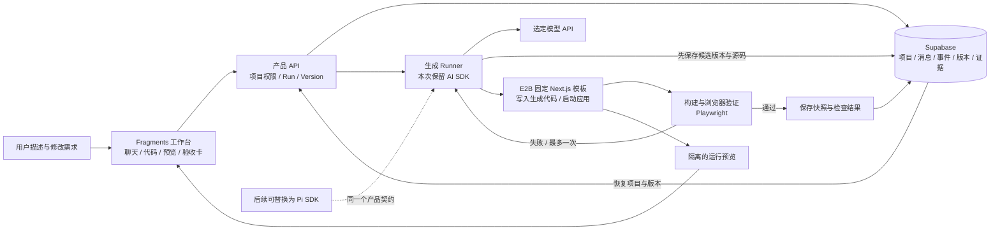

**nano-Atoms：产品拆解、开源复用与架构决策**

> 本文为初轮历史研究。用户已扩大为完整产品目标，当前功能与技术决策请以 [v2实施蓝图](implementation-blueprint.md) 为准；本篇的6–8小时/单文件路线不再是最终架构。

调研日期：2026-09-21。面向本次 Atoms Demo 的实现决策；本文件为本地研究稿，不是已完成的实现或测试报告。

**讨论后的修订（2026-09-21）**：用户质疑验收证据的实际读者与阅读成本，该质疑成立；本报告早先将“逐版本需求验收卡”作为主创新的建议撤回。检查、失败截图和版本关联保留为内部质量机制，默认不要求用户阅读。浏览器方案也从单独列 Playwright，修订为“能持续观察、操作并反馈修复的浏览器 Agent”。优先评估 agent-browser 的持久会话、实时画面与工具接口，Midscene 用于有明确需求的视觉断言。完整补充见 [浏览器方案研究](browser-agent-options.md)。下文尚保留的验收证据产品设计属于早期备选，不代表最新推荐。

**结论先行**

建议采用两步路线：**本次用 E2B Fragments 做小型产品底座，保留现有 AI SDK 与沙箱链路，把时间花在持久化和可验证的生成闭环；后续需要多文件持续开发时，优先评估 Pi coding-agent SDK，基准验证收益后再替换生成后端。** 第一版明确限定为“固定 Next.js 模板内的单文件交互页面”，模板提供其余工程配置。不把 Pi、DeepSeek Harness、Codex 同时接进第一版，也不从零复刻完整 Atoms。

推荐的第一版组合是：

| 职责 | 采用方案 | 复用方式 |
|---|---|---|
| 聊天、代码、运行预览的产品骨架 | E2B Fragments | fork 一个主项目，固定一种网页模板 |
| 模型请求与流式结构化生成 | 主项目已有 AI SDK | 保留已有链路，补验证失败后的反馈再生成 |
| 生成代码的运行环境 | E2B | 使用 SDK 与预制模板；不自建沙箱集群 |
| 项目、对话、版本、检查结果 | Supabase/Postgres | 新增少量业务表；截图和源文件快照用 Storage |
| 浏览器观察、操作与检查 | 优先评估 agent-browser；按需 Midscene | 持久浏览器、截图与运行反馈；关键业务结果保留确定性检查 |
| 值得验证的产品体验 | 自己实现 | 准确修改、实际操作后修复、版本恢复；证据默认内部使用，不宣称市场首创 |
| 后续通用 coding runtime | Pi coding-agent SDK | 独立 Runner 适配器；需求成立时才替换 |

这是基于源码结构和交付范围的工程判断，不是已跑过的安装耗时或模型效果排名。Fragments 比几个更高 star 的完整 builder 小，且当前仍有更新；更适合本次有限范围。[Fragments](https://github.com/e2b-dev/fragments)、[AI SDK](https://github.com/vercel/ai)、[E2B](https://github.com/e2b-dev/E2B)、[Supabase](https://github.com/supabase/supabase)、[Playwright](https://github.com/microsoft/playwright)

**1. 文档真正要求实现什么**

已通过 `lark-cli docs +fetch --as user` 读取指定飞书文档，返回成功，revision 510。题目建议集中投入 6–8 小时、在收到任务后 48 小时内提交。这里的核心交付物是一个能被他人在线体验的 Agent 应用生成产品原型。

| 题目要求 | 可操作的验收方式 | 优先级 |
|---|---|---|
| 智能体驱动代码／应用生成 | 输入一个新需求，实际产生代码并运行；不能仅切换预置截图 | 必做 |
| 可视化展示生成结果 | 网页内可操作预览，能够点击、输入、提交 | 必做 |
| 真实交互 | 至少一条完整业务行为，例如新增记录、过滤、修改状态 | 必做 |
| 数据持久化 | 平台项目、聊天和代码刷新后恢复；生成应用的数据另行验证 | 必做 |
| 在线访问 | 评审用稳定的 Demo 入口进入并创建／打开项目 | 必做 |
| 源代码与说明 | 可运行源码、配置说明、架构取舍、完成与未完成项 | 必做 |
| 初始化／注册等流程 | 简单访客或登录入口即可，复杂账号体系不应挤掉主流程 | 按时间裁剪 |
| 一个延展能力 | 优先做可见、可验证的质量闭环 | 加分项 |

题目没有要求做完整支付、广告投放、企业协作、任意后端框架、多 Agent 市场，也没有要求生成的每一个应用都有永久独立域名。先保证提交的 builder 本身有稳定在线入口。原始依据为[用户提供的文档](https://deepwisdom.feishu.cn/wiki/EHf8wgbtbibv8JkOkjNcXTD4nlg)，本报告不复制完整题面或联系人信息。

**2. Atoms 的产品形态：值得学的是交付过程**

Atoms 当前官网将产品定位为通过 AI 团队完成想法研究、规划、构建和增长的工作台；用户购买的是可运行产品与持续修改能力。官网展示多个专业角色，但角色数量不等于我们必须采用的进程或 Agent 数量。[Atoms 官网](https://atoms.dev/)

官方帮助中心显示的主流程可以拆成六个产品对象：

| 产品对象 | 用户在其中做什么 | 我们第一版对应物 |
|---|---|---|
| 项目入口 | 描述目标、选择起点 | 新建项目＋三个示例提示词 |
| 项目聊天 | 提需求、看任务分配和工具活动、追问修改 | 对话＋真实阶段事件卡 |
| App Viewer | 操作网页、切换设备、看错误、请求修改 | iframe 预览＋桌面／手机切换 |
| 代码与文件 | 查看生成源码 | 简单代码查看与下载 |
| 历史版本 | 查看、恢复或从旧版开始 | 成功版本快照＋恢复按钮 |
| 发布与后端 | 保存状态、接入数据、发布可访问产物 | 持久项目入口；后端固定能力；发布后置 |

项目聊天文档说明了任务活动卡和工具卡；App Viewer 文档明确区分可交互预览、错误处理与视觉修改。[Project Chat](https://help.atoms.dev/en/articles/12129550-project-chat)、[App Viewer](https://help.atoms.dev/en/articles/12129554-app-viewer)

Atoms 已有可视化编辑、Race Mode、多 Agent 协作、错误修复、版本恢复和 Remix。不能把“多模型生成几个版本”“一键修 Bug”“回滚”单独宣传成新的产品发明。当前公开材料没有充分证明它是否已经以我们拟议的方式展示“逐需求、逐版本的回归证据”；因此这里只将该方向视为我们的产品取舍，不主张市场首创。[官网功能](https://atoms.dev/)、[Project History](https://help.atoms.dev/en/articles/12129557-project-history)

Atoms Cloud 的启发更实用：为生成器提供确定的认证、数据库、存储与部署能力，降低每次生成任意技术组合的难度。我们可以复用同一原则：限定模板和数据接口，让模型专注于产品行为。无需复制它的完整云平台。[Atoms Cloud 官方说明](https://atoms.dev/blog/introduce-atoms-cloud)

**3. GitHub 高 star 候选：按功能筛，不按 stars 排选型**

下面是 2026-09-21 通过 GitHub API／`gh` 读取的快照，stars 后续会变化。`pushedAt` 只是仓库活跃信号，不等于稳定发布或代码质量；许可栏是仓库声明摘要，实际移植应保留对应文件的许可。代码级核验和仅 README 级核验在后文区分。

| 项目 | Stars | 适合借用的功能 | 本次判断 |
|---|---:|---|---|
| [DeepSeek Harness](https://github.com/deepseek-ai/deepseek-harness) | 231,844 | 插件化能力、事件日志、工具流水线 | 架构参考；developer preview，不作为短时产品底座 |
| [Codex](https://github.com/openai/codex) | 125,652 | coding runtime、事件协议、会话、审批 | 可替代执行后端；不直接复用桌面产品 |
| [Supabase](https://github.com/supabase/supabase) | 110,470 | Postgres、Auth、Storage、API | 直接复用后端能力，Demo 用托管服务更省事 |
| [Pi](https://github.com/earendil-works/pi) | 107,977 | 轻量 coding SDK、工具循环、会话压缩 | 后续自定义 Agent runtime 首选 |
| [Playwright](https://github.com/microsoft/playwright) | 96,442 | 浏览器行为验证、截图、错误证据 | 直接依赖，支撑创新点 |
| [OpenHands](https://github.com/OpenHands/OpenHands) | 88,690 | Agent 控制台、运行层分离 | 参考；不要把整个开发者平台搬进 Demo |
| [GPT Engineer](https://github.com/AntonOsika/gpt-engineer) | 55,092 | 早期代码生成思路 | 已归档；排除新项目底座 |
| [Langfuse](https://github.com/langfuse/langfuse) | 34,884 | tracing、模型成本、评估数据集 | 后续引入，第一版用自己的 Run／Event 表 |
| [Open Lovable](https://github.com/firecrawl/open-lovable) | 28,518 | 聊天＋代码生成＋云沙箱网页预览 | 适合借 builder 链路；不是可直接上线的多租户 SaaS |
| [AI SDK](https://github.com/vercel/ai) | 26,870 | 模型适配与前后端流式交互 | 本次保留 starter 的已有实现 |
| [Onlook](https://github.com/onlook-dev/onlook) | 26,775 | DOM 与源码映射、可视化编辑 | 后续重点参考；完整移植成本高 |
| [Dyad](https://github.com/dyad-sh/dyad) | 21,597 | 本地应用生成、修改、预览体验 | 桌面形态；参考流程和合适许可的模块 |
| [bolt.diy](https://github.com/stackblitz-labs/bolt.diy) | 19,895 | Web IDE、终端、代码／预览联动 | 产品参考强；浏览器运行方案有额外边界 |
| [OpenSandbox](https://github.com/opensandbox-group/OpenSandbox) | 15,438 | 自托管执行、文件、生命周期、端口入口 | 已有 Docker／K8s 环境时替代 E2B |
| [E2B](https://github.com/e2b-dev/E2B) | 13,901 | 沙箱、命令与文件操作、预览端口 | 本次采用一个执行服务即可 |
| [Puck](https://github.com/puckeditor/puck) | 13,343 | 基于组件配置的 React 可视化编辑 | 适合受控页面搭建；不直接替代任意源码编辑 |
| [Fragments](https://github.com/e2b-dev/fragments) | 6,378 | 小型生成器骨架、代码与真实预览 | 本次主项目候选第一名，优先验证运行 |
| [Convex Chef](https://github.com/get-convex/chef) | 4,609 | 面向固定后端 API 的生成模板 | 后端架构参考；完整 fork 需替换特定认证 |

这里有一个有意的取舍：**主底座不选 stars 最高的，而选要改动的系统最少的。** Fragments 的 6,378 stars 足够表明它是值得审查的公共项目；它的小范围也让我们有时间补自己的产品能力。更大项目可以分别贡献编辑体验、执行接口、验收和可观测性思路。

**4. 几个完整 builder 应该怎么用**

**Fragments：作为第一版起点，但必须清楚它还缺什么。** 已定位的主链是结构化生成代码、写入 E2B、获得运行预览；核心输出是单个 `file_path + code`，不是完整的 read/edit/test 工具循环。多轮消息存在，但当前聊天主要在 React 状态中；设置和输入的 localStorage 不等于项目持久化。现有 publish 延长沙箱存活并可生成短链，不能视为永久托管。应固定一个 Next.js 模板，加项目／版本数据、浏览器检查和一次反馈再生成，形成受限但真实的闭环。[生成入口](https://github.com/e2b-dev/fragments/blob/cc07f43736855f42191de7ac011350cef6752342/app/api/chat/route.ts#L19)、[产物结构](https://github.com/e2b-dev/fragments/blob/cc07f43736855f42191de7ac011350cef6752342/lib/schema.ts#L3)、[当前 publish](https://github.com/e2b-dev/fragments/blob/cc07f43736855f42191de7ac011350cef6752342/app/actions/publish.ts#L10)

它已有 Supabase Auth 接口，可减少接入工作，但 API 仍需验证服务端身份和项目归属；不能相信请求 body 自报的 userID。固定依赖和可写文件路径，关闭无关模板及可选 Morph 服务，先减少外部依赖。[现有 auth](https://github.com/e2b-dev/fragments/blob/cc07f43736855f42191de7ac011350cef6752342/lib/auth.ts#L27)

**Open Lovable：适合参考更完整的生成和修改界面。** 它的核心定位是网页重建／生成，不能只看名称便当作完整 Lovable 开源版。GitHub 最近 push 为 2025-11-19，使用前需核对依赖与供应商接口；可以借聊天、代码应用、预览与沙箱适配的设计。我们不在第一版同时引入抓取、复刻任意网站、复杂全局状态和另一套生成协议。[Open Lovable](https://github.com/firecrawl/open-lovable)

源码还有一个比 stars 更影响选型的事实：conversation endpoint 直接读写 `global.conversationState`，SandboxManager 使用进程内 Map 和单个 activeSandboxId。它们不能原样承担我们的用户／项目隔离与持久恢复。适合定点参考 URL／品牌导入、Vite 错误反馈、多文件解析和 ZIP 导出。[conversation-state](https://github.com/firecrawl/open-lovable/blob/69bd93bae7a9c97ef989eb70aabe6797fb3dac89/app/api/conversation-state/route.ts#L9)、[SandboxManager](https://github.com/firecrawl/open-lovable/blob/69bd93bae7a9c97ef989eb70aabe6797fb3dac89/lib/sandbox/sandbox-manager.ts#L11)

**bolt.diy：学习 Web IDE 交互，谨慎采用其运行底座。** 它涵盖代码、终端、预览、模型切换、历史恢复和若干部署／后端集成。仓库是 MIT，但 WebContainers 的条款独立，不能由 bolt.diy 的许可推导它可用于任意商用托管。当前 main 最新提交为 2026-02-07，稳定 release v1.0.0 为 2025-05-12；功能丰富与当前维护速度应分开判断。若只是个人原型可评估浏览器路线；本次为了服务端浏览器验收和一致执行环境，优先 E2B 路线。[bolt.diy](https://github.com/stackblitz-labs/bolt.diy)

WebContainers 官方区分 production 商用与 prototype／POC，前者需要商业许可；运行还依赖 cross-origin isolation 等条件，且原生 Node addons 有限制。浏览器运行可减少服务器执行负担，但不是云 Linux 沙箱的无差别替换。[商业使用](https://webcontainers.io/enterprise)、[COOP／COEP 配置](https://webcontainers.io/guides/configuring-headers)、[运行限制](https://webcontainers.io/guides/troubleshooting)

**Dyad：借迭代流程，不把桌面应用迁成云平台。** 它最近仍活跃，稳定 v1.15.0 发布于 2026-09-11；但本地桌面运行假设与我们在线多用户入口不同。许可按目录区分：大部分 Apache-2.0，`src/pro` 使用 FSL-1.1-ALv2 并有竞争用途限制。不能把整个仓库当成同一种宽松许可模块。[Dyad](https://github.com/dyad-sh/dyad)

有一个真正值得单独复用的模块：`@dyad-sh/react-vite-component-tagger`，独立 Apache-2.0，用 DOM 标记关联组件的源码位置；同仓也有 Next.js webpack 版本。它可作为第二阶段“选中元素→携带源码位置发起修改”的基础。还需自己实现 iframe 点击桥和编辑后验证；必须匹配模板的实际构建器，不能将 Vite／webpack 插件默认视为兼容其他构建器。当前 Dyad 正式 tool-calling Agent 核心在 Pro 目录，不能与这两个 Apache 小包混为一谈。[Vite tagger](https://github.com/dyad-sh/dyad/tree/2fc642bc84513a87b99361a9b399634fffa3cdb4/packages/%40dyad-sh/react-vite-component-tagger)、[Next.js tagger](https://github.com/dyad-sh/dyad/tree/2fc642bc84513a87b99361a9b399634fffa3cdb4/packages/%40dyad-sh/nextjs-webpack-component-tagger)、[当前 Agent 架构](https://github.com/dyad-sh/dyad/blob/2fc642bc84513a87b99361a9b399634fffa3cdb4/docs/agent_architecture.md)

**Onlook：最值得为后续“点哪里改哪里”研究。** README 描述通过代码插桩将页面元素映射回源码，然后同步修改 iframe 与代码。它面向 Next.js＋Tailwind，并依赖自己的沙箱、后端及编辑器体系；不是将某个 React 组件粘进来就完成。当前开源仓库与下一代 hosted early-access 产品也需区分。本次只预留选中元素上下文接口，不搬完整编辑器。[Onlook 固定版本 README](https://github.com/onlook-dev/onlook/blob/423e2e924366419e418ee049093872d535eea41a/README.md)

**Puck：如果产品走组件配置路线才适合。** 它以 `config + data` 渲染受控组件并提供拖拽编辑，适合营销页面、表单搭建。任意 AI 生成 TSX 的双向源码编辑不是同一数据模型。若为了接 Puck 把所有应用改成 JSON 页面描述，会改变本次代码生成产品的能力边界。[Puck 固定版本 README](https://github.com/puckeditor/puck/blob/90665dfbe201398fe9fbe54cfac31e3d08391b90/README.md)

**Convex Chef：借固定后端与模板的约束方式。** 它是 bolt.diy 的 fork，依赖 Convex 的数据、认证等能力，证明“生成器＋稳定后端接口”是可以采用的架构。官方 README 明示其认证与 Convex 内部控制平面绑定，production fork 要替换；因此不作为零成本、即 fork 即部署的方案。[Chef README](https://github.com/get-convex/chef#readme)

**5. Pi、DeepSeek Harness、Codex：具体参考哪一个**

三个项目解决的是 Agent 执行层，前面的 builder 解决的是用户直接操作的产品层。两层可以组合，但不需要在同一层叠放三个框架。

| 维度 | Pi | DeepSeek Harness | Codex |
|---|---|---|---|
| 核心设计 | 模型层、Agent loop、coding session 分层 | Cordis 插件，模型／工具／会话／loop 都可替换 | Rust coding core，SDK／app-server 对外 |
| 最值得学习 | 小内核、SDK 嵌入、工具扩展、上下文管理 | 追加式会话事件、能力接口、工具中间层 | Thread／Turn／Item、实时事件、审批与恢复协议 |
| 本次直接用 | 已有 Pi 经验且要通用多文件编辑时可选 | 不作为默认选择 | 已有可用 Codex Linux worker 时可选 |
| 当前要补的产品能力 | 项目数据、云沙箱、预览、版本、发布 | 同样要补；还需理解 profile／插件组合 | 同样要补；还要管理原生进程和工作目录 |
| 状态／许可 | MIT；本次稳定版候选 v0.86.1 | MIT；0.1.6-alpha.2，developer preview | Apache-2.0；不同接口稳定性要单独核实 |
| 长期判断 | 自定义 TS Agent 产品的优先候选 | 需要插件化运行平台时重点验证 | 需要 Codex 交互能力时作为另一种 Runner |

**Pi 的具体接入点。** 当前旧 `badlogic/pi-mono` 地址已重定向至 `earendil-works/pi`，包命名也已调整。SDK 入口 `createAgentSession`，通过 `subscribe` 接事件、`prompt` 发任务。稳定版支持自定义 read/write/edit/bash operations，同名 custom tools 可替换内置工具；可将文件与命令执行转给 E2B，而不用 fork agent loop。当前 `tools` 是名字白名单，不要套旧版本把工具对象数组传进去。源码链为 `AgentSession.prompt → Agent → runLoop → provider → tools`。[Pi SDK](https://github.com/earendil-works/pi/blob/13cbf77df2396303013a41646bcfa77b4271ae56/packages/coding-agent/docs/sdk.md)、[Remote Execution](https://github.com/earendil-works/pi/blob/13cbf77df2396303013a41646bcfa77b4271ae56/packages/coding-agent/docs/extensions.md#remote-execution)

Pi 的会话 JSONL 不等于业务任务恢复；会话分支也不会自动还原代码。新的 `pi-durable` 已有记录契约与内存存储，不应说它完全不存在，也不能说它已提供成熟的跨崩溃任务系统。Pi 本身没有完整云租户隔离。远程 Ops 只替换工具 I/O，资源发现、会话、大输出日志仍有本地行为，需要隔离目录及受控资源加载。[Pi durable](https://github.com/earendil-works/pi/blob/13cbf77df2396303013a41646bcfa77b4271ae56/packages/durable/README.md)、[Pi security](https://github.com/earendil-works/pi/blob/13cbf77df2396303013a41646bcfa77b4271ae56/packages/coding-agent/docs/security.md)

**DeepSeek Harness 的具体借鉴点。** 固定分析 commit `ddefc45f...`：模型可见历史从追加式 SessionEvent 派生；持久事件与现场流式事件区分；工具注册、策略、执行在明确的能力接口处组合。它有 SDK、headless、Code mode 和子代理，不是只有 CLI。当前 TS SDK 的单次 run 等待整个 Agent idle，不保证一条 prompt 对应一个独立结果；wire 也没有精细的 mid-turn cancel，不能直接给 Web UI 承诺逐任务取消。Code mode 是模型用代码编排工具，不是网页生成产品模式。[架构](https://github.com/deepseek-ai/deepseek-harness/blob/ddefc45fbc7f8e46dd73185e68295696d1297887/docs/architecture.md)、[SDK 协议边界](https://github.com/deepseek-ai/deepseek-harness/blob/ddefc45fbc7f8e46dd73185e68295696d1297887/packages/sdk/protocol/README.md)

DSH 本身还有 Pi AI provider 适配，说明“Pi 或 DSH”并非完全互斥的整个技术栈选择。我们借它的接口与事件设计即可，不必第一天引入所有插件、工作流和多 Agent。[Pi AI adapter](https://github.com/deepseek-ai/deepseek-harness/blob/ddefc45fbc7f8e46dd73185e68295696d1297887/packages/llm/llm-pi-ai/README.md)

**Codex 的具体接入点。** 固定分析 commit `48f897e4...`：TS SDK 的 `startThread/resumeThread` 与 `runStreamed` 包装 `codex exec --experimental-json`；不能笼统说全部 SDK 都基于 app-server。app-server 的 Thread／Turn／Item 和双向通知适合丰富的 Agent UI，但桌面界面、云调度和 SaaS 数据层不是开源 core 的自动附赠品。官方当前仍对 app-server 命令及 WebSocket transport 给出实验性／生产使用限制说明，部署要按实际接口验证。[TS SDK 源码](https://github.com/openai/codex/blob/48f897e4ce94152818ce0563b3a8aac3a70ce9b8/sdk/typescript/src/exec.ts#L91)、[app-server 文档](https://learn.chatgpt.com/docs/app-server)、[开源范围](https://learn.chatgpt.com/docs/open-source)

**最终取舍：本次保留 starter 的 AI SDK；后续需要真正 coding harness 时优先 Pi SDK；借 DSH 的事件／能力边界，借 Codex 的交互协议。** 这避免为了“技术上用了某个热门 Agent”而重写本来能跑的生成链。若后续基准显示 Codex 在我们的任务集上显著更好，可以替换 Runner；本次没有做模型质量、成本、速度的 A/B 实测，不按印象排序。

**6. 建议的创新：让用户知道“哪些行为真的被测过”**

产品可表达为：**描述需求 → 得到可操作应用 → 看见验收结果 → 保留一个可恢复版本。**

示例任务：“做一个活动报名管理页，能新增报名、按状态筛选，刷新后记录还在。”

系统先生成简短验收卡；第一版只支持几种可执行检查，避免做任意自然语言测试平台：

| 验收项 | 实际检查 | UI 如何展示 |
|---|---|---|
| 新增报名 | 填写表单、提交、断言列表新增对应记录 | 已通过／失败＋截图 |
| 按状态筛选 | 创建两个状态的数据，选择筛选，断言结果 | 已通过／失败＋失败步骤 |
| 刷新保留 | 写入后 reload，再断言记录存在 | 标明测试的是何种存储与环境 |
| 新修改不破坏原功能 | 对下一版本重跑原验收项 | 新增项与回归项分别展示 |

模型可以提出测试草案，**真正的 pass/fail 只能由程序执行结果产生**。要求和断言版本在生成前固定，生成器不能为了变绿自行删改验收项。无法验证的需求显示“待人工确认”，不显示“全部通过”。Playwright 的 locator 和自动等待断言适合这一层；它不等于证明整个应用没有缺陷。[Playwright assertions](https://playwright.dev/docs/test-assertions)

固定模板同时约定关键控件的可访问名称或 test-id，例如报名姓名输入、提交按钮、状态筛选和结果列表。生成器可以自由设计外观，但不能删改这些检查接口；验证器仍检查真实行为，而不是只检查标记存在。第一版只覆盖已定义的任务模板，未支持的自由需求如实标注未自动验收，避免定位器变化被误报成业务缺陷。

第一次检查失败时，将错误、目标行为、当前完整代码和运行截图回给生成器，允许一次修复。这里的第二次生成必须由真实执行反馈驱动，不能仅重复原始提示词；这是受限生成代理具备观察反馈闭环的关键。仍失败则保留可见失败状态与上一成功版本，让用户继续修改。不要无限重试，也不要用预录的绿色结果冒充现场执行。多轮修改应显式携带选中版本源码，不能只靠聊天摘要猜当前状态。

这项创新同时覆盖工程思维、体验、完成度和可交付性：评审能看到系统自己发现什么、修了什么、是否回归。相较完整可视化编辑器或多模型竞赛，它对这次任务的价值更直接。

**7. 组合后的架构与状态归属**

数据真相源留在产品层。最低限度有以下记录，可以少表实现，不必造复杂领域框架：

| 记录 | 最少字段 | 用途 |
|---|---|---|
| Project | id、owner、title、templateVersion、currentVersionId | 项目归属与当前成功版本 |
| Message | projectId、role、content、createdAt | 刷新后继续对话 |
| Run | id、projectId、baseVersionId、status、attempt、error | 一次用户请求的执行状态 |
| Version | id、projectId、sourceSnapshot、sourceHash、templateVersion、status | 可重建源码；不能只存 sandboxId |
| Check | versionId、sourceHash、requirementId、checkVersion、status、evidence | 验收结果与具体代码绑定，不能复用旧版结果 |
| RunEvent | runId、seq、type、payload | 实时进度和刷新后的重放 |

第一版生成单文件时，`sourceSnapshot` 可直接存代码文本＋模板版本；多文件阶段再改成文件 manifest／对象存储。截图、长日志和 ZIP 放 Storage。UI 不应将所有输出拼在一条 assistant 字符串里，至少区分生成、运行、验证、失败、完成。

写入顺序是：创建候选版本 → 保存确切源码 → 执行构建／检查 → 保存实际结果与截图 → 标记通过或失败。失败产物也可保留诊断，只有通过后的版本推进 `currentVersionId`。任务中断时，已生成代码不能随进程一起丢失。

建议的状态路径：`queued → generating → running → checking → ready`；检查失败可进入 `repairing` 一次，最终为 `ready / failed / cancelled / interrupted`。模型结束回复只代表生成阶段结束；检查结束才决定该版本状态。相同项目的两个写任务串行执行，避免后完成的旧请求覆盖新版本。

生成端只留一个窄接口：`generate({prompt, baseVersion, requirements, failureFeedback})`。第一版实现是 AI SDK＋结构化产物；以后可换为 Pi 的文件工具循环。预览、版本与验收不依赖某个模型供应商或 Agent 的原始事件格式。

**8. 持久化与部署最容易混淆的三件事**

**平台持久化**：项目、聊天、生成源码、版本、验收结果必须写数据库。React state、内存 global、短链和 sandboxId 都不够。后端重启后仍能加载项目，是最基本的验收。

**生成应用的数据持久化**：平台保存聊天不表示生成出的报名表会保存报名。推荐给唯一 Demo 模板提供固定的数据客户端／后端 API，让模型调用受控 CRUD 能力。数据存 Supabase 的独立演示数据空间，按 project 和访问身份校验；不要把平台 service-role key 填进生成代码。第一版不让模型自由执行数据库 DDL。若时间只够 localStorage，必须明确其“当前浏览器与当前 origin”的范围；沙箱重建换域后数据可能不可见，不能宣传为云数据库。[Supabase 官方仓库](https://github.com/supabase/supabase)

具体接法可限定为：模板预置数据客户端，后端在验证项目访问权后签发仅限该项目演示数据的短期凭证，API 校验作用域并配置实际预览 origin 的跨域访问。凭证只授予演示数据能力，不授予平台管理权限；过期由已验证的项目会话刷新。首小时就从 E2B iframe 完成一次真实 CRUD，尽早暴露跨域、身份和第三方存储限制。这是拟实施接口，不是 Fragments 已经提供的能力。

**预览不是永久发布**：E2B 暴露端口提供可访问预览，但沙箱有生命周期。提交链接应指向部署好的 builder；用户打开已存项目时，服务端检查沙箱，不在则从源码快照与锁定模板重新创建。静态正式发布、独立域名和生产后端属于后续能力。不要直接提交一个明天就过期的沙箱 URL。[E2B sandbox lifecycle](https://docs.e2b.dev/sandbox)、[连接已有 sandbox](https://docs.e2b.dev/sandbox/connect)

我们提供稳定的 `/p/:projectId/r/:revisionId` 版本评审页：先显示已保存代码、截图和验收结果，再恢复 live preview。公开的是经过明确分享的版本，接口仍验证访问权限；“链接稳定”和“沙箱永不停止”是不同承诺。

Node worker／任务与请求生命周期要明确：若所选部署环境不能覆盖实际构建与验证时长，用常驻 Node 进程执行任务，UI 经 SSE 订阅结果。Demo 可先单进程串行队列，进程中断时将遗留 Run 标为 interrupted 并允许从上个成功版本重试；这不等于承诺任意执行点无损续跑。无需第一天上 Temporal、Redis、Kubernetes。

**9. 不同功能借不同产品，但只维护一套产品状态**

| 功能 | 值得直接复用 | 自己保留的责任 | 第一版范围 |
|---|---|---|---|
| 聊天与预览 | Fragments 组件和调用链 | 项目上下文、错误可见性、恢复 | 必做 |
| 模型适配 | 已有 AI SDK | 提示词、生成范围、预算、修复次数 | 必做 |
| 沙箱与端口 | E2B SDK／模板 | sandbox 与 project 映射、快照、超时 | 必做 |
| 数据与文件 | Supabase | 表结构、访问策略、生成应用数据边界 | 必做 |
| 行为验收 | Playwright | 需求到断言的映射、证据与版本绑定 | 一个模板内做透 |
| 源码精准编辑 | Pi read/edit 工具 | 产品版本、工作区、预览 | 后续 |
| 点选定向修改 | Dyad Apache component tagger | 点击桥、源码范围、模板构建器兼容性 | 第二个扩展能力候选 |
| 完整视觉编辑 | Onlook 插桩设计；或 Puck 组件配置 | 源码数据模型是否兼容 | 后续二选一 |
| 成本与追踪 | Langfuse SDK | 项目级预算与隐私筛选 | 后续；不为 Demo 自托管整套 |
| 自托管沙箱 | OpenSandbox | 调度、入口、运维和权限 | 有基础设施再替代 E2B |

Supabase、E2B、Playwright 是不同层的能力组合；Open Lovable、bolt.diy、Dyad、Fragments 却是互相重叠的产品骨架。后四者只选一个主项目，其他读取思路或有边界地移植模块。不要维护四份聊天状态、四套文件协议、两个 Agent loop。

OpenHands 当前主仓库已强调 Agent Canvas，其 Python 执行能力另有 software-agent-sdk；适合学习界面与运行服务器分离，但不会自然减少这个 TypeScript 小 Demo 的胶水代码。[OpenHands](https://github.com/OpenHands/OpenHands)、[software-agent-sdk](https://github.com/OpenHands/software-agent-sdk)

Langfuse 支持 tracing、prompt management 与评估；许可中 enterprise 目录另行规定。它适合后续统一比较版本／模型，第一版用业务 Run 表记录时长和 token usage 更直接。[Langfuse](https://github.com/langfuse/langfuse)、[许可范围](https://github.com/langfuse/langfuse/blob/main/LICENSE)

**10. 6–8 小时的执行顺序与停止扩张条件**

以下是规划估算，前提是已有模型 API、沙箱和部署账号；调研没有实际安装并计时验证这些项目。48 小时提交窗口应留给依赖问题、部署和复核。

| 时间段 | 产出 | 验收门槛 |
|---|---|---|
| 0–1 小时 | 固定 Fragments commit、模板、模型；连通 E2B／数据库并做初次部署 | 新需求到真实预览；确认目标环境也能运行浏览器检查 |
| 1–2.5 小时 | 项目／聊天／源码版本入库、第二轮带代码上下文修改 | 刷新仍有项目；修改基于选中版本 |
| 2.5–4.5 小时 | 固定模板的数据行为、浏览器验收、一次错误反馈修复 | pass/fail 来自执行，生成应用至少一条真实数据流程 |
| 4.5–6 小时 | 验收卡、成功版本恢复、稳定评审页与沙箱重建 | 用户能查看证据、恢复旧版并重开失效预览 |
| 6–8 小时 | 全链路回归、失败／超时、部署复核、README与演示 | 新需求／修改／刷新／恢复／访问权限均经过实际检查 |

首小时验证失败时的回退是收缩：先用固定模板恢复最小生成预览链，再决定是否保留 starter；不要立刻开始迁移三个框架。至少保留最后 90 分钟做端到端交付检查。视觉编辑、团队协作、复杂 OAuth、多模型竞赛、插件市场、自托管云平台全部后置。

建议现场演示顺序：创建报名管理项目 → 系统列出三条验收项 → 生成可操作页面 → 新增数据并刷新 → 请求增加筛选 → 展示新版本与原功能回归结果 → 恢复上一成功版本 → 重开项目。失败修复只在真实失败时演示；可另附清楚标注的故障用例，不能将预置脚本伪装成自由生成能力。

**11. 真正值得后续投入的架构演进**

第一阶段先明确边界：单模板、少量页面、单个生成文件／受控产物、单写任务、一次修复。它是可扩展的产品原型，不是声称支持任意技术栈。

第二阶段才替换生成内核：Pi SDK＋远程文件／命令工具，支持多文件读改、真实构建反馈、压缩和 session resume；保留已经做好的 Project／Version／Check／Preview 层。以十个代表任务比较 starter 生成器、Pi、Codex：首次成功率、一次修复后的成功率、第二轮修改回归率、端到端耗时、token／sandbox 成本。没有这些数据，不为了星数迁移。

第三阶段按用户需求选择精准视觉编辑、生成后端 schema／迁移、多租户权限、耐久任务与并行 Agent。代码回滚与业务数据回滚必须分开：恢复旧 TSX 不应静默删除用户新产生的数据。

评估业务的核心指标应是“用户用几次操作得到可用结果”，技术指标是“同一验收集在下一次修改后仍通过”。多 Agent 数量、插件数量和框架数量都不是交付指标。

**12. 证据范围与阅读索引**

本次已读取飞书题面、Atoms 当前官网与帮助中心、GitHub 元数据、核心框架与候选 starter 的文档／关键源码。Atoms 的旧 `support.mgx.dev` 入口未成功读取，使用官网链接的当前 `help.atoms.dev`；浏览器界面工具超时，因此没有完成登录后的真实付费生成体验。产品行为依据官方文档，不把营销宣称当实测结果。

代码研究按要求先使用 `codebase-memory-mcp` 定位结构与符号。当前环境没有发现 codegraph 服务，使用图工具的 `get_code_snippet` 精读；图索引明确缺失的范围才定点读取源文件。主要分析发生在 `/tmp` 独立克隆，本工作区没有业务代码可供比较。

三个 runtime 的固定分析版本：Pi 稳定 `13cbf77d...`／main `c7cdb460...`；DeepSeek Harness `ddefc45f...`；Codex `48f897e4...`。详细接口与源码行号见同目录补充报告。外围候选如 Onlook、Puck、Chef、OpenSandbox、Langfuse 主要是 README／官方文档级审查，没有将其全部安装运行。

专项阅读：

- [Fragments／Open Lovable 源码比较](starter-comparison.md)
- [Pi SDK、调用链和远程工具接口](pi-runtime.md)
- [DeepSeek Harness 插件与 SDK 边界](deepseek-harness.md)
- [Codex SDK、app-server 与运行边界](codex-runtime.md)
- [bolt.diy／Dyad 与可复用模块](builder-modules.md)
- [OpenHands／E2B／OpenSandbox 的分层](runtime-alternatives.md)
- [组合方案的独立审查](plan-review.md)

本报告没有调用付费模型生成应用、部署产品、公开题面或向招聘方发送消息。下一步实施时最先验证的是：所选固定版本能否在目标部署环境中完成“新需求→预览→修改→恢复”这条真实链路。
