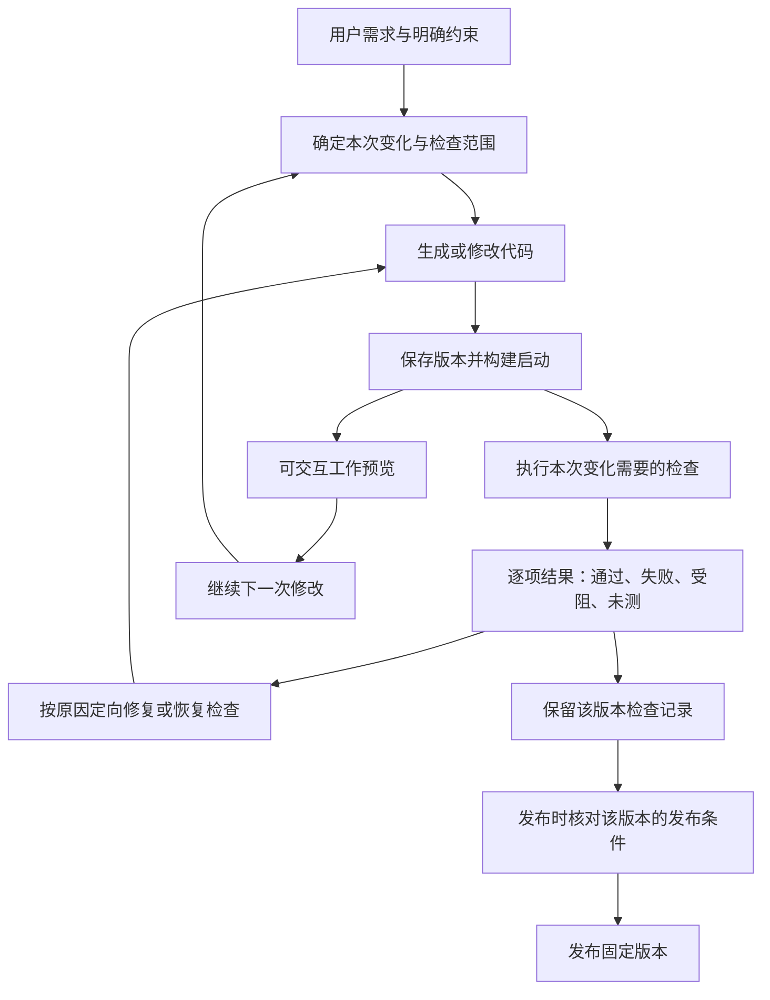

# 通用 AI 应用构建产品：竞品机制与 Pivloom Review 设计复核

日期：2026-09-27（Asia/Shanghai）。状态：研究与架构建议，不是已批准的新规格，也不是已实施的改造。

## 结论

**当前设计有架构层面的不足。修好 C3 的几个 bug 是必要的，但不足以支撑更复杂的通用应用。** 问题集中在：把太多业务验证放到浏览器层；每次重新生成累计验收步骤；用单个整体 verdict 决定开发是否继续；把测试失败、工具故障和未验证混在一个处理路径；缺少生成应用自身的长期测试资产与明确测试环境。

调研支持的方向是：**尽早提供可继续开发的运行版本，按变更与风险组织多层验证，保留独立的发布判断；复杂任务可以深度检查，但用户应看见进展、范围、成本和未完成项。** 这不是减少要求、假装通过，也不是把一切交给用户自己测。

已有的源码快照、版本绑定、隔离执行、持久化、取消、回滚、可信构建和明确发布值得保留。需要改变的是这些能力上面的工作流和验证策略，不必先更换 Pi、OpenSandbox 或照搬另一个大框架。

上一份 [C3 根因报告](issue37-c3-root-cause-2026-09-27.md) 回答“当前为什么失败”；本文回答“这种设计能否长期成为产品”。

## 1. 研究范围与证据标准

覆盖 **15 个产品／平台，以及 3 个固定提交的开源项目**。其中 Firebase Studio 正在退役、GitHub Spark 已退役，只作历史参考，不算当前可新建项目的推荐。产品有不同侧重，不用单一榜单排名。

方法：Agent Reach Exa/GitHub 检索，直接读取官方文档、工程文章、更新公告；源码先用 codebase-memory 图定位，再用 codegraph 读取关键实现。闭源产品没有公开的内部角色数、预算算法、隐藏测试矩阵均记录为未知。未注册付费、未跑竞品生成 benchmark，未改 Pivloom 实现或生产。

证据强弱：实际源码说明该提交做了什么；操作文档说明公开工作流；工程文章说明作者实验；宣传语只说明定位。它们都不能替代我们自己的成功率、漏检率和延迟测量。

## 2. 产品对照：它们如何组织生成、验证和交付

“未公开”不等于“没有”。表中“按需”也不等于从不自动检查。

| 产品与类型 | 可确认的反馈／验证机制 | 需要保留的边界 | 一手来源 |
|---|---|---|---|
| **Lovable：托管应用构建** | Preview 随构建更新；浏览器验证先让位于更快方法；前端测试、后端调用和 edge tests 分工；发布是独立快照 | 不必每次改动跑全部测试；Canvas 操作、精细配色等有明确限制；内部调度未公开 | [Preview](https://docs.lovable.dev/features/projects/preview)、[Testing](https://docs.lovable.dev/features/testing)、[Browser](https://docs.lovable.dev/features/browser-testing) |
| **Replit Agent：全栈开发环境** | App Testing 启用后按 Agent 判断周期执行，明确不是每条消息后都测；Checkpoint、运行预览和发布分开 | 并非承诺每条消息全量 E2E；深度安全审计另有入口，数据恢复不同于代码回滚 | [App Testing](https://docs.replit.com/features/agent/app-testing)、[Checkpoints](https://docs.replit.com/features/version-control/checkpoints-and-rollbacks) |
| **Bolt：Web／全栈构建** | Preview 开发迭代；完整安全审计由用户启动；Publish/Update 才更新线上 | 未查到每增量全量 AI E2E 的公开契约；版本恢复不会回滚 Bolt/Supabase 数据库 | [Lifecycle](https://support.bolt.new/get-started/project-lifecycle)、[Security](https://support.bolt.new/building/security)、[History](https://support.bolt.new/building/using-bolt/rollback-backup) |
| **v0：全栈代码与设计工作流** | Sandbox 运行真实应用；Agent 可调用浏览器、单测、终端；GitHub 项目可沿用 PR/CI 检查 | 有这些工具不等于每次全用；代码恢复不证明外部数据库恢复 | [FAQ](https://v0.app/docs/faqs)、[Agent tools](https://v0.app/docs/agentic-features)、[Versions](https://v0.app/docs/versions) |
| **Base44：托管应用与数据** | 独立 Testing agent，用户选择流程运行，独立测试环境，修复后复测，代码变化提示结果过期 | 不能测试登录表单、OTP、验证邮件本身；自动／定时测试暂未支持；不能把登录后测试当登录链已验证 | [Testing agent](https://docs.base44.com/documentation/managing-app-data/testing-agent)、[Test data](https://docs.base44.com/documentation/managing-app-data/testing-your-data) |
| **Mocha：托管全栈应用** | 实时 Preview；Dev/Prod SQLite 数据分开；发布应用迁移；可选 Max 推理模式 | 内部完整 Review 机制本次未查到；Restore 会删除后续版本，不能照搬成无损回滚 | [Data](https://docs.getmocha.com/basics/databases)、[Versions](https://docs.getmocha.com/basics/versions)、[Max](https://docs.getmocha.com/basics/max-mode) |
| **Anything（原 Create）：Web／移动构建** | Fast/Thinking 与 Max 分层；Max 自动编写、浏览器测试、后端检查、修复；发布和数据库变更独立处理 | **重型 Review 的反例**：Max 可达 100+ 步、约 30 分钟，小布局/文案推荐轻模式。长任务是有意选择，不是所有编辑统一负担 | [Max](https://www.anything.com/docs/builder/max)、[Publish](https://www.anything.com/docs/launch/publish)、[Data](https://www.anything.com/docs/apps/databases) |
| **Emergent：全栈生成** | Preview 随代码更新；部署前 health check；开发与生产数据库分开 | 公开资料未给每条聊天的完整自动验收矩阵；普通 redeploy 不把开发数据复制到生产，预览通过不代表生产相同 | [Deployment](https://help.emergent.sh/deployment-on-emergent)、[Platform](https://help.emergent.sh/platform-documentation)、[Rollback](https://help.emergent.sh/rollback-feature) |
| **Google AI Studio Build：全栈／Android** | 生成代码与实时 Preview；Web 为前端加 Node 运行时；Android 有模拟器；发布到 Cloud Run 独立进行 | “Verified execution”没有公开完整 grader 与触发矩阵；不能推断已经验证所有业务行为 | [Build](https://ai.google.dev/gemini-api/docs/aistudio-build-mode)、[Full stack](https://ai.google.dev/gemini-api/docs/aistudio-fullstack)、[Deploy](https://ai.google.dev/gemini-api/docs/aistudio-deploying) |
| **Atoms：团队式应用工作台** | Team Mode 可关闭，由 Alex 处理；复杂任务 Mike 协调；版本可预览，错误有修复入口，用户检查主旅程后发布 | 对标产品本身也不要求每条请求固定全员参与；内部自主 QA 矩阵未公开；恢复数据库是另一个选择 | [Agents](https://help.atoms.dev/en/articles/12129548-working-with-agents)、[App Viewer](https://help.atoms.dev/en/articles/12129554-app-viewer) |
| **Rork：原生移动／Web** | 浏览器、模拟器、真机各有预览路径；保存文件与聊天版本，错误可触发 Fix | 浏览器不覆盖全部原生能力；Cloud 文档明确真实生产后端即时变更，无独立 Preview 数据层，不能当隔离范本 | [Platforms](https://docs.rork.com/faq/general)、[Cloud](https://docs.rork.com/backend/rork-cloud)、[History](https://docs.rork.com/features/undo-and-history) |
| **FlutterFlow：Flutter 可视化工程** | Preview/Test/Run/Local Run 保真度不同；Test Pilot 是用户建立测试组后运行的 AI QA；可显式选择场景是否从干净状态开始 | 不同运行模式不能混作“真实原生已经测过”；外部数据库不因项目历史恢复而自动恢复 | [Run modes](https://docs.flutterflow.io/testing/run-your-app/)、[Test Pilot](https://docs.flutterflow.io/testing/test-pilot/)、[Environments](https://docs.flutterflow.io/testing/dev-environments/) |
| **Tempo：React／代码设计工作台** | Canvas dev server 热更新；按 worktree 隔离聊天改动；选入组件可做 PR 级像素回归、人审差异 | Visual Review 是可选、需配置的组件检查，不是完整业务 E2E；源码隔离不等于数据隔离 | [Canvas](https://docs.tempo.new/product/canvas)、[Chat](https://docs.tempo.new/product/chat)、[Visual Review](https://docs.tempo.new/guides/visual-review) |
| **Firebase Studio：历史／退役中** | 曾提供 blueprint→代码→Preview→迭代→App Hosting；后端规则有独立测试方式 | 2026-06-22 起停止新注册/工作区，2027-03-22 关闭；Firebase 后端服务本身继续 | [Migration notice](https://firebase.google.com/docs/studio/migrating-project)、[Full-stack guide](https://firebase.google.com/docs/studio/solution-build-with-ai) |
| **GitHub Spark：已退役** | 历史流程为生成→Preview 实操→迭代／代码→发布，可接仓库工程工作流 | 2026-08-04 停止新增，导出窗口到 08-31；已部署应用继续运行，不能作今天的新建选项 | [Deprecation](https://github.blog/changelog/2026-08-04-upcoming-deprecation-of-github-spark-on-github-com/)、[历史官方教程](https://github.com/github/docs/blob/88b4500cc2cfbda678d22b43a55a177b71b33339/content/copilot/tutorials/spark/your-first-spark.md) |

这张表没有证明某家质量更高。它证明了**没有一套“每次修改、全部累计行为、逐条模型看图、全过才能继续”的统一行业合同**；已有多种更有选择性的产品机制，也有明确的深度自动 QA 模式。

## 3. 源码对照：真正可复用的是机制

| 项目／固定提交 | 代码明确支持的机制 | 不能外推的结论 |
|---|---|---|
| **Dyad** `e5f1f5660c1373efea502cd5e687141c15809a97` | 应用启用 testing 后可按 spec/标题批量跑 Playwright；拒绝无修改重复跑；中断保留已观察结果；应用错误与基础设施错误分别处理 | 不是精确跨版本影响分析，也没有低于十分钟的保证；其 Git-diff Reviewer 与应用 E2E 是不同工具 |
| **OpenCode** `a42f393c850bec0c0f395fb91bf19b1ee8b31666` | 新 core runner 保存步骤快照/差异；达到已配置 steps 时实际关闭工具；修改工具回传 LSP diagnostics | 未配置限额就没有该硬边界；LSP 不能证明业务正确；它是通用编程 Agent，不是托管发布产品 |
| **bolt.diy** `2e254ac19a696394030601bc602f54945b12bfc4` | 流式文件与 action 队列；每 action 有状态；服务就绪驱动 Preview；build 是独立 action | 不是商业 Bolt 源码；action 去重不等于测试复用；预览出现不表示通过行为检查 |

关键源码：[Dyad run_tests](https://github.com/dyad-sh/dyad/blob/e5f1f5660c1373efea502cd5e687141c15809a97/src/pro/main/ipc/handlers/local_agent/tools/run_tests.ts#L206-L310)、[Dyad 测试入口](https://github.com/dyad-sh/dyad/blob/e5f1f5660c1373efea502cd5e687141c15809a97/src/pro/main/ipc/handlers/local_agent/tools/run_tests.ts#L575-L733)、[Dyad Review 编排](https://github.com/dyad-sh/dyad/blob/e5f1f5660c1373efea502cd5e687141c15809a97/src/hooks/subagentReviewOrchestration.ts#L59-L101)、[OpenCode runner](https://github.com/anomalyco/opencode/blob/a42f393c850bec0c0f395fb91bf19b1ee8b31666/packages/core/src/session/runner/llm.ts#L202-L253)、[bolt.diy Preview](https://github.com/stackblitz-labs/bolt.diy/blob/2e254ac19a696394030601bc602f54945b12bfc4/app/lib/stores/previews.ts#L169-L208)。

Dyad 的具体做法尤其有价值：每 spec 的失败次数与每轮批次数由代码限制；基础设施失败不消耗应用修复次数。它的默认测试批次预算本身可达十分钟，数据库逐 case 隔离还会放大。因此应借鉴范围、分类和无进展停止，不照搬数值。

## 4. 调研中必须保留的反证与现实边界

### 4.1 独立 Reviewer 不是错误，但固定每次调用它不成立

Anthropic 的应用开发实验说明独立 evaluator 能发现生成器遗漏的实际功能；后来随着模型能力增强，把每个 sprint 的评审改成末尾评审，以减少冗余。复杂 DAW 样本仍花数小时，QA 也仍有遗漏。这支持按任务难度与模型能力衡量 Reviewer 的价值，不能推导“多 Agent 总是更好”或“Reviewer 应全部删除”。[官方实验](https://www.anthropic.com/engineering/harness-design-long-running-apps)

其较早长任务方案保留完整功能清单，通过增量实现、基础冒烟和浏览器验证推进，不要求每次小改从头遍历整张清单。[长任务 harness](https://www.anthropic.com/engineering/effective-harnesses-for-long-running-agents)

### 4.2 Preview 与最终交付时间必须分别测量

Lovable 的 OJ 工程文章报告 Preview 打开时间改善；测的是预览启动，不是从自然语言完成一个复杂应用。类似地，Anything Max 的长任务时间、Tempo 的异步视觉 CI 时间，都不能用来证明“小增量等十分钟合理”。[OJ 工程文章](https://lovable.dev/blog/faster-previews-oj)

复杂应用的整体完成时间可能较长，合理做法是交付可操作的真实阶段成果并明确剩余工作。不能把十个快速但只有假数据的页面称为完整系统，也不能用“复杂”解释一个删除按钮反复等四十分钟。

### 4.3 竞品的数据设计并不统一，也不都值得复制

Replit、Mocha、Anything 提供不同形式的开发/生产数据分离；FlutterFlow 可配置多后端环境。Lovable 当前 Preview/Drafts 共享后端数据，Test/Live Beta 正在退役；Rork Cloud 说明生产变更即时生效。[Replit 数据环境](https://docs.replit.com/features/data-and-storage/development-and-production)、[Lovable 迁移说明](https://docs.lovable.dev/features/environments)、[Lovable Drafts](https://docs.lovable.dev/features/drafts)

因此，代码分支、Preview URL、数据库环境、发布版本是不同事物。看到“支持回滚”也必须继续问恢复代码、schema、业务数据还是外部副作用；不能直接合成一个“完整恢复”。

## 5. 我们当前设计的根本问题

### 5.1 把业务正确性几乎全部挤到最高成本的浏览器层

现有 A/B/C 主要按“脚本还是模型驱动浏览器”区分。A 改为脚本确实有价值，但它仍在每次修改时遍历整份行为计划。计算规则、状态转换、列表数量、后端授权、Canvas 图形不是同一种判断，统一浏览器轨迹会把复杂度、状态数和失败机会一起放大。

一般工程实践是多层测试组合，业务规则可在逻辑／接口层验证，少量端到端用例验证连接是否正确。不是机械遵守固定比例，而是避免所有边界条件都通过 GUI 重复验证。[Test Pyramid](https://martinfowler.com/bliki/TestPyramid.html)

代码依据：[runScriptedPlan](../apps/api/src/runtime/replay-plan.ts) `:224–250`、[RemoteBrowser](../apps/api/src/runtime/browser.ts) `:268–318`。上一轮已测单点击六次远程命令；即使修复这六次往返，测试层次问题仍存在。

### 5.2 没有稳定的“正确性标准”和长期测试资产

每轮 Coordinator 重写 steps/assertions，守卫只保证散文要求不变。后续 Reviewer 确定性地执行了模型临时生成的测试，却没有证明测试忠实表达需求。这正是 B09 范围错误、B32 21 次要求变成 6 次操作、断言极性翻转仍被接受的共同机制。

长期项目不能只保存一段越来越大的自然语言行为清单。应保存需求、业务规则、测试程序、测试输入与检查结果之间的关系；代码改动可以演化，测试也可以修正，但不能为让结果变绿而悄悄改变承诺。

### 5.3 把真实证据当成充分正确性证明

版本、source hash、截图和动作记录证明“在这个版本执行了这些动作”，不自动证明“测的是用户真正要求的性质”。错误的全页文本断言同样可以拥有完整证据；权限漏洞也可能在正常用户截图里完全不可见。

证据链值得保留，但必须加上合适的判定对象、前置状态和可信预期。既要测应用，也要校准判定器的假通过与假失败。Anthropic 的评估实践明确区分实际环境 outcome 与 Agent 自述，并建议按任务组合确定性、模型和人工校准信号。[Agent evals](https://www.anthropic.com/engineering/demystifying-evals-for-ai-agents)

### 5.4 产品进度与完整认证耦合太紧

需要精确表述：**Pivloom 已经在 Reviewer 之前绑定候选 Preview**（`executor.ts:335–349`），不能说“完全没有提前预览”。问题是终态 blocked/rejected 会回收候选沙箱，current 只保留 accepted，普通新请求/重试又主要取 current 作为基线。

这能保护上一成功版本，却也可能让可用的新增工作被留在候选里，下一次请求从旧版重新做。若后台仍锁住项目十分钟，提前展示 Preview 只是改善展示，没有改善继续开发的速度。

来源：[executor.ts](../apps/api/src/generation/executor.ts) `:413–425`、[generation.ts](../apps/api/src/data/generation.ts) `:542–569`。这应作为产品状态设计调整，不是假称只改 UI 就能解决。

### 5.5 完整验收清单、每次增量检查、平台回归混成同一条链

需要分开的三种工作：

| 工作 | 验证谁 | 何时执行 | 主要结果 |
|---|---|---|---|
| **本次开发验证** | 用户应用的本次变更及必要回归 | 每次生成／增量 | 变更是否可用，哪里仍有问题 |
| **项目发布检查** | 将要公开交付的应用版本 | 发布、重要里程碑、用户要求深查 | 是否满足该项目明确的发布条件 |
| **Pivloom 自身评测** | 我们的生成器、验证器、恢复机制 | 引擎／模型升级及平台发布 | 多类应用的成功率、延迟、误判、恢复与成本 |

#37 是这次平台交付的具体验收合同。它应被完成，但不应自动变成未来每个用户每句话必须付出的完整成本。反过来，新设计不能用来偷偷取消本次已经承诺的完整验收。

### 5.6 “失败就再修两轮”没有建立在可靠诊断上

当测试写错、浏览器坏、供应商配额耗尽时，重新让 Builder 写应用不解决问题。当前 blocked 优先又会阻止已有真实失败进入修复。需要按原因决定下一步，且同一源码／同一测试／同一失败无新信息时停止重跑。

固定重试次数只是最后一道成本上限，不是一套成熟恢复策略。应保留已完成结果、定位最小失败场景，修完后先复查该路径，再做必要回归。

### 5.7 “通用应用”还需要运行时范围，而不只是通用 Reviewer

当前 [PRD](../docs/PRD.md) 明确不承诺每个生成应用的通用后端，现阶段主要是静态前端与 localStorage。工作台自己的 Supabase 不是每个生成应用已经有独立数据库、权限系统与迁移流程。

未来 CRM、多账号协作、交易流程等应用，首先需要对应的后端运行、认证、测试数据和环境管理能力。Reviewer 无法凭浏览器截图补上缺失的平台能力。应逐步扩大支持范围，不宣称任意应用都能用同一种 QA 获得相同保证。

## 6. 推荐设计：按变化组织验证，分别管理开发、检查和发布

以下为 Pivloom 的建议，不声称任何竞品内部完整采用此结构。

图中“继续修改”不等于并发写同一目录。最低成本的实现仍可保持单个写入者：保存 checkpoint 后允许取消／取代旧检查，再从显式选择的工作版本继续；旧检查结果只归属旧版。之后才考虑在冻结快照上并行检查。

### 6.1 分开四个状态与四个时刻

1. **可运行／可试用**：构建与启动已确认，用户可以操作候选。
2. **可继续开发**：已保存明确工作版本，不必为了一个受阻检查重新生成已有工作。
3. **变更已验证**：声明的本次检查范围确有当前版本证据；未测旧功能仍标未测或旧结果。
4. **可发布／已发布**：满足版本、业务与风险相关门槛，再执行发布。

“工作版本”“最近验证版本”“公开发布版本”可以是不同指针。用户恢复历史必须明确恢复哪个；新请求必须记录实际基线，不能悄悄从失败候选或另一个旧版出发。

这里的 verified 是“通过某一明确检查集合”，不使用“应用完全正确”的无限承诺。通过率不是统计意义上的正确概率。

### 6.2 Review 的统一部分应是结果契约，执行器可以不同

一个小的 Verification module 对外只需要：待测版本、基线、变更意图、选定测试集合、运行环境与预算；返回逐项 outcome、证据、未执行原因与耗时。

模块内部承担环境准备、执行、取消、局部恢复和结果归并。调用方不应知道“先设置某个 latest、再转交一个 resolver、最后某层自己开计时器”这类隐含顺序。当前漏传和超时分支不通，说明这些条件散落在太多调用方。

不需要立即实现可插拔万能平台。第一版仅为当前前端栈提供项目测试命令与浏览器场景两种实际 adapter；需要后端时才补 API/数据能力。沿用现有版本绑定与 artifact 存储。

### 6.3 怎样为不同变更选检查

| 变更例子 | 必要的快速检查 | 必要时升级 | 不足以证明正确的信号 |
|---|---|---|---|
| 改颜色／间距 | 构建、目标界面渲染、点击命中与窄屏关键布局 | 明确视觉回归或设计评审 | 全部旧算术路径重走、只有截图没比目标 |
| 新增筛选／排序 | 逻辑或组件测试、真实筛选主流程 | 共享状态、分页、持久化相关回归 | 全页出现某个数字／标题 |
| 改计算、金额、日期规则 | 实际业务函数的边界与属性测试、少量 UI 接线检查 | 跨模块消费者与接口测试 | 用截图让模型心算大量样例 |
| 改角色／数据访问权限 | 匿名、用户 A、用户 B、管理员的接口与数据结果 | 浏览器登录与用户旅程、安全专项审查 | 正常管理员页面看起来没问题 |
| 改数据库结构 | 隔离数据上的迁移、旧数据兼容、读写与回退方案 | 预发布全流程和发布后冒烟 | 代码回滚成功、开发空库启动成功 |
| 游戏／Canvas／拖拽 | 状态机测试、真实输入、受控时间/随机性、画面与交互证据 | 专门浏览器／设备能力和探索性测试 | DOM 标签存在，或只凭静态画面 |
| 新的复杂应用 | 一次交付真实纵向流程并验证对应规则 | 里程碑集成、跨角色、发布完整门禁 | 多个只展示假数据的页面 |

此表是策略方向，不是已经可靠的自动影响分析。不能只靠文件名关键词或模型一句“低风险”。共享依赖、全局状态、权限、持久化和依赖升级都应扩大范围；未知影响时明确扩大或保持未验证。开始阶段宁可运行完整但便宜的逻辑／组件测试，也别过早造精确测试选择算法。

### 6.4 测试是长期资产，但错误测试不能被永久冻结

- 需求层保存用户要的结果、重要约束与合法变化；不把页面操作轨迹当需求本身。
- 测试层保存可执行程序、输入、测试对象、预期和 setup；稳定程序可复用，UI 定位可维护，业务标准不能为变绿而偷偷改。
- 结果层绑定当前源码、测试版本及环境。旧程序可在新代码上重跑；旧证据不能显示为本轮刚取得。
- 现有 B09/B30/B32 先校正，再资产化；不因“不可变”而维护错误测试。
- 模型可以提出或编写测试，不必每条都要求人手工写。对关键规则采用独立预期、失败对照和已知缺陷样本校准；生成器不能独自同时改变实现、判分规则和通过状态。
- 不要求用户每次批准无关的测试细节。只有业务预期本身含糊或发生实质改变时，才需要明确用户意图。

Playwright 的 fixture、明确 locator、自动等待断言和失败 trace 已覆盖大量通用执行语义，值得复用这些成熟能力，减少自造全页 contains 和单键步骤协议。[Fixtures](https://playwright.dev/docs/test-fixtures)、[Best practices](https://playwright.dev/docs/best-practices)

### 6.5 失败处理按原因走不同路径

| 结果 | 应做什么 | 不应做什么 |
|---|---|---|
| 稳定断言发现作品错误 | 保留最小复现，定向修应用，重跑失败项及必要回归 | 重新规划全部要求／从旧版重生成所有功能 |
| 定位／初态／断言契约错误 | 检查程序与预期是否一致，修测试定义后在同一候选复测 | 让 Builder 破坏正常行为来满足错误脚本 |
| 浏览器、网络、配额问题 | 标为受阻，恢复执行环境或保留可续查状态 | 把未测说成失败，或把整份结果清零 |
| 无新证据的相同失败 | 停止同样的重试，切换诊断方法或说明仍受阻 | 靠更多额度重复同一动作 |
| 当前版本已被下一轮取代 | 保留旧版结果，标为过期；只影响对应版本 | 把迟到结果覆盖新版本状态 |
| 取消或版本绑定失效 | 停止后续动作，不提升候选 | 为保留成果而忽略完整性约束 |

独立 LLM Reviewer 保留在开放性判断、视觉质量、复杂集成和探索性检查上。它必须有明确任务、证据、预算和“不确定”出口；不能推翻可复现的确定性错误来给总分。

## 7. 为什么这套方向能面向更复杂的应用

以未来“多人项目管理工具”为例：

- 新增任务筛选：测过滤函数／组件、真实筛选流程和直接相关状态，不重新遍历邀请、登录、权限等所有浏览器动作。
- 改“成员只能看自己团队任务”：自动升级接口授权、两个团队的数据访问、跨账号反例，以及用户旅程；UI 是否隐藏按钮不能替代服务端检查。
- 为任务新增状态字段：在隔离数据上验证旧记录默认值、迁移、列表查询和更新，再检查发布兼容性。
- 做完整新项目：先交付可登录并真实创建/保存/读取任务的纵向流程，再增加权限、邀请、提醒等；进度中始终列出未完成能力，最终做集成验收。

通用性来自“可执行真实项目、能选择合适证据、能管理状态与不确定性”，不是为每种 app 名称硬编码一套专用 prompt。随着项目增长，测试资产也增长，但大部分规则应在合适层次低成本运行，昂贵探索用在新风险和不确定区域。

更复杂不意味着总完成时间永远相同。产品应减少无意义等待，并让用户能持续推进；完整应用和关键风险仍需要相应工作量。不能承诺任何复杂度都几分钟结束。

## 8. 三种路线的取舍

| 路线 | 收益 | 无法解决的问题 | 判断 |
|---|---|---|---|
| 继续扩大预算、保持每次全量模型浏览器验收 | 改动少，短期可能走完更多行为 | 成本随累计行为增长；误判和错误测试仍在；复杂应用更难收敛 | 不作为长期路线 |
| 只保留 build／Preview，取消行为验证 | 最快给页面 | 功能空壳、错误数据、权限和回归无法被可信发现；违背当前交付承诺 | 不采用 |
| 可继续开发的工作版本＋分层验证＋独立发布策略 | 同时保留快速反馈与必要质量信号 | 需正确管理检查范围、测试资产、过期结果；风险选择必须验证 | 推荐，分阶段做 |

## 9. 如何证明新方案成熟，而不是再写一份漂亮方案

首先建立小而真实的跨类型样本库：信息展示、表单/列表、状态复杂前端、Canvas、带权限的后端应用（能力具备后）、已有项目增量与回滚。每类包含正常实现和已知缺陷，而不是只增加更多 happy-path prompts。

至少包含这些反例：按钮无动作、结果错误但页面含正确数字、保存后刷新丢失、其他用户读到数据、测试前置状态污染、旧源码的结果迟到、浏览器断线、视觉步骤失败、同一需求替代合法 UI。既要看坏应用能否被发现，也要看好应用会不会被错误拦住。

四个时间都记录：**首次可交互、可发起下一次增量、声明范围验证完成、发布完成**。再记录成功交付率、误报／漏报、无修改重跑次数、修复有效率、模型成本及远程工具耗时。均分简单修改与复杂里程碑，不用一个平均值掩盖长尾。

第一轮对照以同一候选、同一业务要求、同一测试基线比较新旧执行，先测执行器；之后用相同模型与任务样本比较真实生成闭环。发布门禁不能仅通过“更快失败”；也不能用同一个模型同时生成并评分，再把高分当独立质量证明。

不承诺未经测量的 30 秒或两分钟 SLA。针对小增量，应把可试用和可继续修改做到明显短于当前十分钟；可先制定实验目标，测试后再作为产品承诺。复杂深度任务需明确说明为什么久、进展如何、停止保留什么。

## 10. 落到当前仓库的最小迁移顺序

**阶段一：可信反馈。** 修上一轮已复现的结果丢失、resolver 漏接、统一 deadline、错误断言和场景初态。在一个已保存候选上建立正确且能抓已知缺陷的基线，不再每次重生成 C3。

**阶段二：执行效率与测试资产。** 当前 React/TypeScript 范围内先接项目逻辑/组件测试和沙箱内批量浏览器程序；复用已验证测试，按修复范围复测。减少远程逐键往返和整个计划重写。测量收益后决定进一步的影响选择策略。

**阶段三：产品状态与继续开发。** 明确工作版本、检查记录、最近验证版本、发布版本；在检查受阻时允许保留/恢复可用候选，并明确下一次增量基线。处理单写入者、检查取消／过期，避免只提前展示却仍锁住用户。

**阶段四：兑现原交付与逐步扩展能力。** #37 的冻结主线、两轮成功增量、回滚后 C3、蛇、新登录恢复及长期发布仍按承诺给真实证据。不能把未重测标为通过。随后按产品需求扩展生成应用后端、测试数据库、权限与迁移；不一次加入所有竞品功能。

三角色是原 PRD 的主动选定延展。可以让 Reviewer 主要运行确定性工具、把模型用于必要判断；若改为某些请求不再经历三个独立角色，属于明确的产品范围调整，应更新规格，不能只保留三个头像冒充原承诺。本轮未做这类变更。

## 11. 来源新鲜度与尚未确定的事情

- 直接页面优先于搜索摘要：Lovable Test/Live 已转为退役文档；Replit 模式名、Rork 原生平台范围、FlutterFlow 版本功能、Tempo 产品定位也有新旧差异。
- GitHub Spark 的旧文档已撤下，历史流程用官方仓库固定提交佐证；Firebase Studio 的旧教程仍在线，不代表还能新建项目。
- v0 部分 HTML 本次无法读取，采用其官方 `.md` 内容；Tempo 同样有官方 Markdown 路径。
- 闭源产品内部没有公开的默认检查矩阵、模型路由、预算和候选提交事务，不推测补全；“有工具”与“必执行”分开记录。
- 本次没有各平台相同任务的独立性能/质量 benchmark。厂商速度、长任务和安全扫描数字保持原口径，不作为我们的 SLA。
- Pivloom 当前静态前端范围之外的后端／移动架构是未来建议，不是已经交付的能力。

研究原始笔记位于 `/tmp/nano-atoms-research/`：`lovable.md`、`commercial-comparison.md`、`platforms-managed.md`、`platforms-mobile-design.md`、`google-atoms.md`、`oss-harnesses.md`、`design-counterarguments.md`。本文已包含结论所需的一手链接；无需依赖临时笔记即可审阅建议。

**最终判断：保留“真实运行、真实证据、可恢复版本”的方向；重新设计“验证什么、何时验证、失败后如何继续”这三件事。当前把全部工作塞进一次 Review 的做法，不适合作为通用应用产品的长期核心。**
