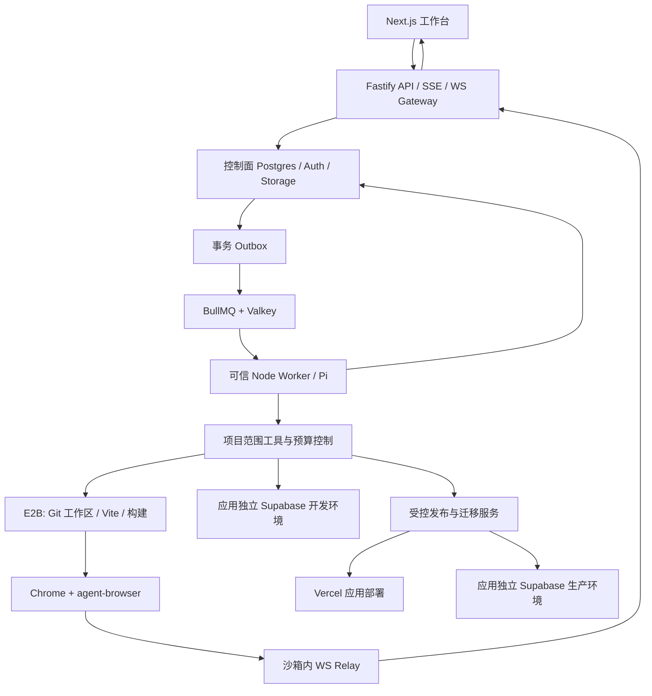

# nano-Atoms 产品范围与技术实施蓝图

> 最新范围调整：用户明确只有 **48 小时**。本次以 [48 小时交付方案](delivery-48h.md)为准：移出 M3/M4、大幅缩减 M2，并收敛 M0/M1。本文保留为长期产品与技术参考，以下“最终范围”“必须完成”和分期要求不等于本次承诺。

版本：2026-09-21 / v2，长期参考。本文形成于用户此前选择“尽量完整对齐 Atoms，接受更长周期”时。此前以 6–8 小时 Demo 为上限的 Fragments 单文件方案不再作为最终架构。研究对象为 **atoms.dev**，不是其他同名 Atmos 产品。

本文区分三类内容：**官方已说明的 Atoms 功能、我们决定实现的能力、已经实际验证的技术事实**。功能与技术选型已收敛；尚未完成的云端集成验证列为实施门槛，不把设计稿写成已完成产品。

## 1. 先确定产品是什么

我们要做的是一个**可持续开发、运行、修改和运营应用的 AI 工作台**。用户从一个需求出发，在同一项目中得到可用应用，接入真实数据，继续修改、发布和运营。核心交付物是多文件应用及其运行资源，不是一轮聊天产生的 HTML，也不是一份需求验收报告。

最终范围包含：项目与成员、需求与素材输入、计划与团队协作、多文件开发、真实浏览器、视觉修改、Cloud 后端、版本和发布、源码交付、连接器、应用内 AI、研究/Race、移动应用、视频创作、订阅与额度，以及上线后的分析、SEO、广告。我们按依赖分阶段交付，不把后期功能从目标里删除。

**不再把“每个版本都有验收证据卡”当主创新。** 内部保留检查、截图和错误，主要用于定位和修复；用户默认看到可用结果、清楚的状态、可以接管的浏览器和可恢复的版本。产品差异化先落在“改得准确、能实际试用、上线后还能继续改”上，再以真实用户测试验证价值，不声称这些能力市场首创。

原始飞书文档已通过 lark-cli 重新读取，revision 仍为 510；其基本交付要求没有变化。用户本轮扩大的是我们的实现目标。原始题面和联系人信息不复制进这份实施稿，也不对外发布。

## 2. 当前唯一主技术路线

| 层 | 选定方案 | 职责 |
|---|---|---|
| Builder Web | **Next.js 16.3.5 + React 19 + TypeScript + Tailwind + shadcn/ui** | 工作区、聊天、编辑器、浏览器面板、Cloud、版本、发布、运营 UI |
| 对话与执行卡组件 | **Vercel AI Elements** | 复用输入、附件、消息、工具结果等视图；接我们自己的事件协议 |
| API 与实时网关 | **Fastify 5.12.5 + @fastify/websocket** | 项目权限、Run API、SSE 重放、浏览器/终端 WS、受控后端和发布接口 |
| Coding runtime | **@earendil-works/pi-coding-agent 0.86.1** | 唯一主推理/工具循环；多文件读写、编辑、执行、会话与压缩 |
| 后台调度 | **BullMQ 6.3.8 + Valkey 9.1.2** | 长任务、并发、投递、重试；Postgres 是任务状态真相 |
| 开发工作区 | **E2B，JS SDK 2.51.0** | 隔离执行生成代码、装依赖、构建、dev server、Chrome |
| 浏览器控制 | **agent-browser 0.38.1** | 持久浏览器、页面快照、截图、操作、console/network、实时画面 |
| 视觉检查 | **Midscene @midscene/web 1.13.0** | 在同一页面做 aiAssert/aiQuery；不再开第二套浏览器行动循环 |
| 点选源码映射 | **Dyad React/Vite component tagger 0.9.0** | 将页面元素定位到源码；覆盖层、编辑补丁、撤销由我们实现 |
| 代码与终端 UI | **Monaco Editor + xterm.js** | 多文件查看/编辑/Diff；连接沙箱 PTY 的真实终端 |
| 平台数据 | **Supabase Postgres + Auth + Storage** | 项目、成员、Run、消息、版本、工件和用量；独立控制面项目 |
| 生成应用后端 | **独立 Supabase 项目 + Platform Kit** | 每个应用的数据库、最终用户认证、存储、Edge Functions、管理界面 |
| 默认生成模板 | **React 19 + Vite 8.3.0 + TS + Tailwind/shadcn + Supabase** | 持续编辑的多文件 Web 应用；有路由、认证、数据、上传和服务端函数 |
| SEO/SSR 模板 | **独立 Next.js + Supabase 模板** | 内容站、搜索落地页和必须服务端渲染的应用；按需求在创建时选择 |
| 移动应用 | **Expo / React Native / Expo Router + EAS Build + Maestro 2.10** | 独立原生模板、扫码/开发构建预览、Android APK、原生设备验收 |
| 视频创作 | **React 时间线 + HTML video + FFmpeg 9.0.1 worker** | 异步生成、片段选择/分割/裁剪、持久化编辑、服务端导出后下载 |
| 研究搜索 | **Exa API + exa-js** | 带URL和来源的研究输入；网页操作继续使用已有浏览器工具 |
| 正式发布 | **Vercel 部署适配器** | 不可变构建、公开域名、生产版本、域名管理；与 E2B 预览分开 |
| 源码交付 | **Git + GitHub App / Octokit** | 内部版本、ZIP 导出、仓库推送/拉取；后期已有仓库导入/PR |
| 可观测性 | **OpenTelemetry + Langfuse 开源部分** | 请求/工具/模型用量和故障定位；面向运营开发，不要求用户读 trace |

Node 统一选择 24 LTS；monorepo 先用 pnpm workspaces。版本是本轮核实后的实施基线，开工生成 lockfile 并固定镜像 digest，不能将网页上的 latest 作为长期可重复构建策略。没有在本轮声称全部依赖已完成联合安装测试。

**我们自己实现的核心**：项目与权限模型、RunCoordinator、Pi 远程工具适配、检查点/事件/副作用账本、Browser Gateway 与接管、视觉编辑事务、Cloud 资源映射、发布状态机、连接器授权和费用账本。这些是产品价值与工程工作所在，不能期待某个高 star 仓库一次补齐。

## 3. Atoms 功能对齐与我们的完成定义

M0–M4 表示交付阶段，具体依赖见第 13 节。下面各项均在最终目标内；高级变体可能晚于该项首次交付。详细官方 URL、套餐和文档冲突见 [Atoms 功能核验](atoms-feature-audit.md)。

| ID | Atoms 已说明的能力 | 我们实现到什么程度才算完成 | 主要复用 / 自建 | 阶段 |
|---|---|---|---|---|
| F01 | 工作区、项目、模板入口 | 注册/登录、创建项目、项目列表、刷新后续做；模板产生真实工程 | Supabase Auth；shadcn；自建 Project | M1 |
| F02 | 文本、附件、素材引用、主题输入 | 文本/图片/文档持久化并进入生成上下文；文件引用可追溯；后期语音 | AI Elements；Storage；PDF.js；输入解析自建 | M1–M3 |
| F03 | Question 与 Plan 卡 | 短澄清、可编辑计划；批准后执行；简单修改不强制冗长问答 | Pi；结构化 ProjectSpec；自建阶段状态 | M1 |
| F04 | 工程师与团队模式、@角色 | 规划/设计/实现/检查具有真实任务与产物；可暂停、交接、失败重试 | Pi 多 session；RunCoordinator | M1、M3 |
| F05 | Deep Research、Race | 引用来源的研究工件；多个隔离候选比较、选中后继续开发 | Exa API；Pi；Git branches；E2B | M3 |
| F06 | 执行活动、排队、停止、继续修改 | 显示真实工具状态；新需求可排队；停止有效；断线重连不丢结果 | BullMQ；Postgres events；SSE | M1 |
| F07 | 文件树、代码、Diff、手动编辑 | 多文件增量修改；人工编辑和 Agent 不互相覆盖；真实安装/构建 | Pi 工具；Monaco；Git；xterm.js | M1–M2 |
| F08 | 可交互预览、设备视口、日志、修复 | 同一个 Chrome 中观察与操作；失败上下文回传修复；用户可接管 | agent-browser；E2B；Browser Gateway | M1–M2 |
| F09 | Visual Editor、主题、素材库 | 点选→源码定位→局部修改→保存/撤销；主题 tokens 与资产替换有效；按模板公布支持范围 | Dyad Vite tagger；自建 overlay/AST patch；Next另做适配 | M2 |
| F10 | History、Restore、Remix | 代码版本不可变；能恢复继续编辑；Remix 另建项目，明确数据处理 | Git；Storage；Revision/Branch 服务 | M1–M2 |
| F11 | Cloud 数据库、表数据、Schema、CSV | 应用有真实持久数据；开发/生产环境分开；数据管理、迁移、权限可用 | Supabase；Platform Kit；迁移服务 | M1–M2 |
| F12 | 生成应用的登录与 Users | 应用端注册登录与后端授权有效；其用户与工作台成员分开 | 应用独立 Supabase Auth / RLS | M1–M2 |
| F13 | App Storage、Keys、环境配置 | 用户上传跨发布保留；公私有访问有效；test/prod secret 独立 | Supabase Storage；自建 secrets/capability 服务 | M1–M2 |
| F14 | 应用内 AI 模型库与用量 | 已发布应用可调用模型；按项目/最终用户限流和计量，前端无平台 key | 受控 AI Gateway；模型适配器；UsageLedger | M3 |
| F15 | Publish、Update、域名、暂停下线 | 有稳定线上站点；修改先在开发环境试用；发布有回执和版本；可回滚代码部署 | Vercel API；Release 服务；数据库迁移策略 | M1–M2 |
| F16 | 项目分享、Discover、ZIP 导出 | 项目协作链接与成品 URL 分开；可见性有效；导出可重新运行 | 自建 ACL/分享；Git/source archive | M1–M2 |
| F17 | GitHub 新库与手动 Push/Pull | 首先新库交付及受控同步；冲突可见；后期支持已有库/组织/PR | GitHub App；Octokit；Git | M2–M3 |
| F18 | 团队权限与连接器 | Owner/Editor/Viewer、邀请、项目权限；连接器按项目授权和操作记账 | Supabase；OAuth；MCP SDK；自建 registry | M2–M3 |
| F19 | Analytics、SEO 内容生产与 GSC | GA4/GSC 真实数据；批准页面计划→内容→代码集成→发布→跟踪 | Google APIs；Next SEO 模板；Pi SEO 工作流 | M4 |
| F20 | Google Search Ads、转化、推广资产 | 计划与预算审核→创建暂停广告→用户明确启用→指标与优化；费用独立 | Google Ads REST；OAuth；资产 API；自建工作流 | M4 |
| F21 | 移动项目、Expo Go预览、Android构建 | 独立mobile模板、二维码/设备预览、构建job与可下载Android产物；真设备/模拟器验证 | Expo/React Native；EAS；Maestro；详见移动专项 | M3 |
| F22 | Video生成、预览、片段分割、本地导出 | 独立视频job、参考素材、参数、持久时间线与实际导出文件；失败不丢原片 | 视频模型API；HTML video；FFmpeg；编辑器交互参考 | M3–M4 |
| F23 | Plans/Credits、工作区额度、运行钱包 | 订阅/充值/扣费/退款回执；构建、应用运行、第三方支出分账；余额与任务预算一致 | Stripe SDK；自建账户/用量账本，不照搬Atoms价格 | M2–M3 |

**对齐事实要准确。** Atoms 当前 GitHub 帮助文档描述的是新建个人私有库、手动 Push/Pull；不是任意仓库自动同步。SEO 包含计划、生成、工程集成和用户发布；当前专页不承诺代提交 sitemap。Ads 是真实 Google Search campaign，默认暂停；不能用一个“写广告文案”按钮冒充。[GitHub](https://help.atoms.dev/en/articles/12129569-connect-github)、[SEO](https://help.atoms.dev/en/articles/12129581-seo-agent)、[Ads](https://help.atoms.dev/en/articles/12129582-ads-agent)

当前 Changelog 与 Output types 已说明移动生成、Expo Go预览、Android构建，以及视频生成、基础剪辑和导出，因此 F21/F22 纳入范围。尚未证实的是 iOS/双商店交付、完整专业剪辑台和多人同文件实时编辑，不能以局部流程推断全部能力。FIG可上传不等于结构化设计转代码；Figma直接导入作为可选增强，不是已核实的Atoms对齐基线。[当前 Changelog](https://help.atoms.dev/en/articles/12129614-changelog)、[Output types](https://help.atoms.dev/en/articles/12129547-output-types)、[Expo Go入口](https://atoms.dev/app-preview/desktop)、[Plans](https://help.atoms.dev/en/articles/12129587-plans-and-credits)

## 4. 用户看到的产品结构

工作区首页保留项目、模板、最近活动、成员与用量。项目工作台以左侧对话和右侧产物为主：

- **对话**：需求、附件、问题、计划、任务进度、结果和后续修改；显示有用的步骤摘要，不展示一长串内部推理。
- **浏览器**：真实正在运行的页面、设备视口、地址/路由、接管与交回 Agent；能看见自动试用。
- **代码**：文件树、代码、Diff、终端；高级用户可展开，普通用户无需先理解源码。
- **Design**：选元素、文字/颜色/间距、主题和素材；复杂变更仍可用自然语言。
- **Cloud**：数据、应用用户、存储、函数、环境、密钥、运行用量。
- **History / Publish**：候选版本、已发布版本、恢复、Remix、部署状态、域名和分享。
- **Growth**：在站点可发布后开放分析、SEO 和广告流程，明确外部费用。

项目类型在创建时明确为 Web、Mobile、Video。它们复用工作区、素材、任务、计量和权限，但右侧产物分别是浏览器、移动设备/二维码/构建产物、视频播放器/时间线；不把三者都塞成同一种“网页预览”。

一条必须做顺的旅程：用户要求“做一个预约系统”→澄清角色/时段规则→生成页面与数据表→浏览器创建预约并刷新确认→用户点选日期控件修改→保存版本→发布→真实用户数据持续存在→下一次改页面不破坏生产数据。每一段都要实际工作，而不是只在 UI 放一个入口。

## 5. 系统架构与部署边界



Next 工作台可以部署在 Vercel；Fastify 网关与 Worker 用支持常驻进程的容器服务，Valkey 为独立持久实例，首期用 Docker Compose 管理这些常驻服务。**不把长 Agent 任务或持续浏览器 WS 塞进普通 Vercel Function 生命周期。** 初期是一个 monorepo 中三种主要进程，不需要先做一套微服务平台。

API 提交事务保存 Run、输入、Outbox，立即返回 runId。Worker 独立执行，网页关闭不结束任务。SSE 从持久 seq 重放进度；浏览器与终端的高频双向数据走 WS。队列只是触发和调度，任务真相在 Postgres。

模型凭据、Supabase 管理凭据、GitHub/Vercel 凭据只存在可信服务。生成代码、依赖安装脚本、shell、网页都在 E2B 中运行；沙箱不能继承全局服务密钥。项目级公开配置和受控短期能力按需要下发。E2B source/SDK 开源不意味着托管计算免费；Vercel、模型和外部服务同样按服务计费。

## 6. Pi、多角色与长期任务的具体设计

**为什么选 Pi。** 它已有 coding session、文件工具语义、工具循环、事件、压缩与多模型接口，且可在 TypeScript 中替换远程文件/执行操作。我们需要掌握项目、沙箱、工具和产品事件，而不是复制一个 CLI 的全部交互。选择依据是集成适配，不是未经测试的模型效果排名。

**多角色使用同一个 runtime 的不同会话。** PM 输出结构化需求与依赖；Designer 输出布局/资产/主题；Builder 写工作区；Reviewer/QA 独立检查；研究、SEO、广告后期使用受限工具会话。发布和数据库迁移以确定性服务为主。每个子任务有 role、parentRunId、输入工件、预算和输出契约。

初期同项目同分支只允许一个写入者。研究/设计/只读检查可以并行；Race 使用从同一 baseRevision 建立的独立分支、沙箱与测试资源，选中后串行集成。多个 Agent 不能同时自由写一个共享目录。这个租约统一覆盖 **Agent、Monaco、视觉编辑和可写终端**：用户接管终端前暂停其他写入并等待在途动作结束；退出后重新扫描工作树、文件hash和开发进程状态，再允许Agent续做。初期终端默认查看日志，需要显式接管才能输入命令，防止shell绕过编辑冲突控制。

Pi 接入点锁定 `createAgentSession`、`SessionManager` 与自定义 read/write/edit/bash。read/write/edit 的实际 I/O 走 E2B；bash 具有 streaming、deadline、signal 和远端命令句柄。默认资源加载关闭未经审核的扩展自动发现，避免生成项目把宿主运行权限扩展开。Pi 的 `tools` 在当前版本是名字 allowlist；`customTools` 接定义，同名覆盖，不能照其他版本示例误用。[Pi SDK](https://github.com/earendil-works/pi/blob/13cbf77df2396303013a41646bcfa77b4271ae56/packages/coding-agent/docs/sdk.md)

我们实现四层持久状态：产品任务、Pi 会话 entries、Git/源文件工件、工具副作用账本。检查点将同一安全边界的会话、代码 hash、已完成工具和预算关联起来。浏览器刷新直接事件重放；Worker 崩溃从检查点重建；沙箱消失从源码和锁定模板重建。恢复不等于重跑全部命令，更不意味着任意指令级续跑。

BullMQ 可能重复投递；迁移、发布、外部写入需要幂等键与回执。旧 Worker 失去租约后不能提交版本；旧远端命令还在跑时须先停止或隔离旧沙箱。取消从数据库请求标记开始，传到 Pi 和远端工具，收到清理回执后才显示停止。**不会把一个 subscribe(async …) 当成可靠写库事务。** 这些具体挂点和故障场景见 [运行时 ADR](runtime-decision-v2.md)。

不采用 DSH + Pi + Codex 三套嵌套 loop。DSH 的事件分层可借鉴，Codex 的 Thread/Turn/Item 可参考，但它们不进入主依赖；AI SDK/AI Elements 的 UI 使用也不意味着再启动一套 coding agent。

## 7. 内置浏览器与视觉修改

**浏览器默认采用同一远端 Chrome 的实时画面。** 用户看到的和 Agent 操作的是同一 browserSessionId + targetId。独立打开预览 URL 是另一个浏览器实例，会有不同 cookie、storage、导航状态，UI 将它标为“独立打开应用”。

agent-browser 0.38.1 已实际通过正式 npm 包的本地测试：独立 Chrome 启动、快照、JPEG 帧流、WS 点击改变页面状态、Dashboard 返回 200、A/B session 日志隔离、外部 CDP 指定 target 后读回原状态。**这证明基础能力可复用，不等于 E2B 与公网接管已完成。** [固定版本源码与发布](https://github.com/vercel-labs/agent-browser/releases/tag/v0.38.1)

两个已发现且必须处理的细节：stream 只绑定 loopback，E2B 里需要本地 relay 和控制面鉴权网关；CDP attach 初次可能落在 about:blank，必须保存并选择 targetId。浏览器工具返回统一 session/target/revision 元数据；旧 snapshot refs 在页面或浏览器重建后失效。

接管是产品状态机：Agent 操作→暂停新动作并等当前动作结束→人类拿到输入租约→交回时重新读取 URL、页面快照和截图→Agent 继续。原生工具能接受鼠标键盘，但不会替我们解决两个用户/Agent 同时输入。

**视觉修改采用 Dyad 独立 Apache tagger 0.9.0。** 本轮与 Vite 8.3.0 + React 19 的转换测试已通过，能注入源码位置和 source map。选中元素后，服务端按当前 revision、文件 hash 和可信映射清单验证位置，再做受限 AST 修改或把选中上下文交 Pi。DOM 中的路径不能直接变成文件写权限；列表多个实例可能对应同一源码节点，必须明确修改范围。

tagger 不是完整编辑器。点选覆盖层、坐标缩放、属性面板、AST patch、撤销和 HMR 后重新定位都由我们实现；不复制 Dyad 的 FSL `src/pro/**`。源码位置工具只用于开发预览，生产构建必须验收不残留注入。

上述实测覆盖 **Vite 模板**。Next 模板需要独立 SourceMapAdapter：优先参考 Dyad 的独立 Next/webpack tagger，在锁定的 Next 开发构建路径验证；不能假设 Vite插件可直接用于Next/Turbopack。适配完成前Next项目可聊天/源码修改，视觉面板明确受模板能力约束。移动项目也不使用Web DOM tagger冒充原生元素源码映射。

Midscene 用在同一 target 的视觉判断上，比如遮挡、错误提示和布局；准确数据、刷新持久化、金额和网络结果用确定性检查。结果区分通过/失败/不确定。默认两轮修复后给用户可行动的结果，不无限自修复，也不让检查 Agent 随意改标准。具体协议、测试证据和边界见 [浏览器技术定稿](browser-decision-v2.md)。

## 8. Cloud、应用数据与发布

**控制面和生成应用后端分开。** 控制面数据库保存工作台自己的项目、用户、Run、消息和账单；每个生成应用绑定独立 Supabase 项目，拥有自己的最终用户、业务表、文件和函数。开发与生产环境分开，不把全部生成应用塞在一个共享表里再寄希望于模型写对每个 projectId。

开发/生产的最小数据和凭据隔离、迁移控制是 **M1首次上线前置条件**。M2补的是完整管理界面、分支体验和运营能力，不把底层隔离推迟到M2。

默认提供平台代管应用资源；同时设计 BYO Supabase OAuth 入口，便于用户连接已有后端。普通项目创建能力与 Nano scale-to-zero 优惠不是同一件事：后者当前需供应商开放资格；不以拿到优惠资格作为基础可运行的前提。容量和每个应用的真实资源成本纳入计量。[Supabase for Platforms](https://supabase.com/docs/guides/integrations/supabase-for-platforms)

**Platform Kit 复用数据库/用户/认证/存储/日志等 UI，不照抄授权。** 本轮建图并精读了 `SupabaseManagerDialog` 和 API proxy；示例 proxy 与 AI SQL route 的权限检查只是 `Boolean(projectRef)` 占位。我们的 Fastify 后端必须先将内部 projectId 映射到获授权的外部资源，再按方法、路径和角色允许操作；不开放任意 Management API 透传。Kit 内可选 AI SQL 使用我们已有任务/模型服务，避免另开一套无范围检查的全局数据库助手。[Platform Kit](https://supabase.com/library/docs/platform/platform-kit)、[固定 proxy 源码](https://github.com/supabase/supabase/blob/e357ec8f9f0b530304f99d9e30c9785f2511bee8/apps/ui-library/registry/default/platform/platform-kit-nextjs/app/api/supabase-proxy/%5B...path%5D/route.ts#L3)

数据库变化以 migrations 为源文件工件。首先在开发数据库执行、验证 schema/RLS/应用流程，再由受控 Migration Worker 推到生产。官方 Platforms 文档中的迁移/restore-point 接口存在准入限制，因此**标准路径采用 Supabase CLI 的版本化迁移流程**，不假设私有接口人人可用。BYO 项目的数据库连接凭据需通过专用密钥界面提供，不能从 OAuth 自动取得密码。[CLI db push](https://supabase.com/docs/reference/cli/supabase-db-push)、[OAuth 集成](https://supabase.com/docs/guides/integrations/build-a-supabase-oauth-integration)

发布序列：冻结 candidate revision → 构建/检查 → 验证迁移兼容 → 准备生产配置 → 执行需要的兼容迁移 → 创建部署 → 线上健康检查 → 绑定生产域名/更新 live revision。部署失败保存回执和旧线上版本，不把“请求发出”当发布成功。[Vercel 部署 API](https://vercel.com/docs/deployments/overview)

代码回滚指切换应用构建，不自动倒回数据库和真实用户数据。开发恢复可使用明确的测试数据快照；生产默认前向修复与兼容迁移。Supabase 分支默认不复制生产数据，适合种子测试；E2B 内存/文件快照也不包含外部数据库、支付或广告状态。[Supabase branching](https://supabase.com/docs/guides/deployment/branching)、[E2B snapshots](https://www.e2b.dev/docs/sandbox/snapshots)、[Vercel rollback](https://vercel.com/docs/instant-rollback)

E2B pause/resume 用于节省开发工作区成本，Git/对象存储保留版本真相；沙箱终止不应丢项目。正式站点不依靠沙箱临时 preview URL。生成应用的 private Storage 权限、用户角色、函数 secrets 和前端 publishable key 都必须在模板层定义清楚；`VITE_*` 不能存服务端密钥。

**既有Vite应用后加SEO的默认路径**：增加同项目管理的 Next 内容子站，复用品牌、主题、公开素材和业务链接；默认使用独立内容子域（未绑定域名时给平台内容站URL），由Release记录其独立构建。原业务应用、数据库、登录与现有URL保持可用，用户不用重选最初模板或重建业务。内容页回链业务页面并配置独立sitemap/canonical。以后若需要同域 `/blog`，作为单独路由代理适配验收；不把“自动迁到Next且一切不变”当现成功能。此为我们的工程取舍，不是对Atoms内部实现的推断。

## 9. 移动与视频：独立产物，共用平台基础

**移动路线确定为 Expo + React Native + Expo Router。** Pi继续写真实多文件工程，业务后端仍是应用独立Supabase。Web的DOM/shadcn/tagger不直接复制成原生UI；移动模板另有路由、组件、原生依赖、app config和构建profile。

E2B负责编辑、依赖、Metro/Web预览；Android模拟器和原生设备使用独立runner。Android初期用EAS Build生成可安装APK，Maestro CLI/MCP负责真实原生层级、截图、操作和回归流程。Maestro Viewer可用于后续设备面板，但仍须做鉴权与设备绑定；不能用agent-browser窄屏测试替代原生验收。[Expo Router](https://docs.expo.dev/router/introduction/)、[Android APK](https://docs.expo.dev/build-reference/apk/)、[Maestro](https://github.com/mobile-dev-inc/Maestro)

正式native模板候选锁在Expo SDK57依赖矩阵，使用development build；Expo Go兼容profile单独维护。当前官方文档对最新SDK与商店Go支持版本存在差异，**不会承诺SDK57直接扫商店Go可用**，必须先实机验证。构建成功只表示产物可取，APK冷启动、持久数据、深链/权限等另行验收。iOS商店发布不在已核实对齐基线。完整版本与准入门槛见 [移动模块决策](mobile-decision.md)。

**视频路线确定为轻量React时间线 + FFmpeg权威导出。** 模型供应商生成片段的任务与剪辑导出任务分开；原片转存自有Storage后才成为稳定素材。用户选择/分割/裁剪/排序只修改非破坏性的timeline JSON；导出冻结一个revision，由FFmpeg worker编码、校验并写回MP4与manifest。下载到用户本地不等于浏览器本地渲染，产品用语必须明确。

OpenCut借时间线交互，不整仓fork：主仓正在重写，旧classic仓已归档，不能依赖未来Editor API。默认不引入Remotion；它不是无条件MIT商业免费。FFmpeg按具体构建核对许可，本方案H.264/libx264导出属于明确的GPL构建，保留相应声明并处理分发义务；WebAV的MIT浏览器处理能力留作增强，不承诺所有浏览器可本地编码。[OpenCut](https://github.com/OpenCut-app/OpenCut)、[FFmpeg许可](https://www.ffmpeg.org/legal.html)、[Remotion许可](https://www.remotion.dev/docs/license/faq)

M3视频验收是两个真实片段→编辑→刷新恢复→导出→下载播放；生成失败、导出取消、重复回调和worker重启都有明确状态。当前未调用视频生成API或做真实编码试验。实现范围、版本和任务数据设计见 [视频模块决策](video-decision.md)。

## 10. 核心数据对象与接口

| 对象 | 保存什么 | 不能混淆的对象 |
|---|---|---|
| Workspace / Membership | 租户、角色、成员、预算归属 | 生成应用的终端用户 |
| Project / ProjectSpec | 模板、目标、约束、后端和仓库绑定 | 一次 Run |
| Conversation / Message | 用户输入、Agent 结果、引用的附件/版本 | 临时 token 流 |
| Run / RunAttempt / Stage | 执行状态、角色、依赖、预算、取消、租约 | 已生成版本和已发布版本 |
| RunEvent / Outbox | 可重放有序事件、待投递任务 | 只在内存里的通知 |
| AgentSession / Checkpoint | Pi entries、摘要、工具边界、代码快照引用 | 仅保存一句“上次做到这里” |
| ToolInvocation | 输入 hash、状态、结果工件、外部回执、幂等键 | 模型自己声称已完成 |
| Revision / Branch | commit、源码 manifest、依赖 lock、迁移清单 | E2B sandboxId |
| SandboxLease / BrowserSession | 运行环境、target、generation、控制权、期限 | 永久部署 |
| BackendBinding / Environment | dev/prod Supabase ref、配置与迁移位置 | 工作台控制面数据库 |
| Deployment / Release | revision、构建、环境、域名、外部 ID、状态 | 预览 URL |
| Asset / Artifact / SecretRef | 原始素材、截图/日志、密钥引用 | secret 的明文聊天内容 |
| ConnectorGrant / ExternalAction | OAuth 授权、项目范围、审批、执行回执 | 简单“已连接”开关 |
| UsageEntry / Budget | 构建模型、沙箱、运行 AI、第三方成本维度 | 一个不可解释的总积分 |
| MediaJob / EditManifest / Render | 视频provider任务、不可变原片、剪辑决策、导出回执 | 源码Git版本或尚未转存的短期下载链接 |
| MobileBuild / DeviceSession | Expo项目、Android构建ID/产物、设备目标和检查 | 浏览器窄屏截图 |
| Subscription / LedgerTransaction | 平台套餐、余额预留、结算、支付webhook幂等 | 生成应用商户的收款和广告费用 |

建议公开应用 API：`POST /projects`、`POST /projects/:id/runs`、`POST /runs/:id/cancel`、`GET /runs/:id/events?after=seq`、`GET /projects/:id/revisions`、`POST /projects/:id/restore`、`POST /projects/:id/releases`、`POST /browser-sessions/:id/tickets`、`POST /browser-sessions/:id/control`。这些是我们设计的产品接口，不是宣称 Pi 或 E2B 已有同名方法。

Run 状态至少包括 queued、planning、awaiting_input、running、checking、repairing、completed、cancelling、cancelled、failed、needs_attention。Version 与 Deployment 各有独立状态。结算/外部写入必须以回执为准，事件带 schemaVersion、runId、attemptId、seq 和必要的 revisionId。

## 11. 开源复用清单与许可证边界

下表把直接依赖、源码移植和交互参考分开。Stars 仅为 2026-09-21 快照，不是选型分数。详细版本证据在专项报告；依赖引入时保存许可证/NOTICE、来源 commit 和本地改动。

| 组件 / 仓库 | 复用方式与具体范围 | 许可 / 商业边界 | 我们仍需实现 |
|---|---|---|---|
| [Pi](https://github.com/earendil-works/pi) | SDK；coding-agent/agent/ai 的会话与工具扩展点 | MIT | SaaS 生命周期、远程工具、状态与租户 |
| [agent-browser](https://github.com/vercel-labs/agent-browser) | 0.38.1 CLI/daemon/stream；Dashboard 仅开发诊断 | Apache-2.0 | Gateway、接管、项目与页面绑定 |
| [Midscene](https://github.com/web-infra-dev/midscene) | Insight/视觉断言 | MIT；模型推理另计费 | 同 target 接入、规则与误判评估 |
| [Dyad tagger](https://github.com/dyad-sh/dyad/tree/2fc642bc84513a87b99361a9b399634fffa3cdb4/packages/%40dyad-sh/react-vite-component-tagger) | 独立 npm 插件；不 fork Dyad 桌面产品 | 该包 Apache-2.0；`src/pro` 为 FSL，不移植 | 编辑 UI、AST patch、撤销、HMR 重定位 |
| [shadcn/ui](https://github.com/shadcn-ui/ui) | registry 组件源码：Sidebar、Tabs、Dialog、Resizable 等 | MIT | 工作台布局与产品状态 |
| [AI Elements](https://github.com/vercel/ai-elements) | PromptInput、Message、Tool 等视图源码 | Apache-2.0；已读实际 LICENSE | Pi 事件→视图 adapter，不能假设 useChat 直接兼容 |
| [Monaco](https://github.com/microsoft/monaco-editor) | editor/model/diff 能力 | MIT | 文件同步、保存事务、协作冲突 |
| [xterm.js](https://github.com/xtermjs/xterm.js) | 浏览器终端组件 | MIT | 沙箱 PTY、WS、权限、resize/取消 |
| [Fastify](https://github.com/fastify/fastify) | HTTP API；官方 websocket 插件 | MIT | 领域 API、SSE、ACL、会话路由 |
| [BullMQ](https://github.com/taskforcesh/bullmq) / [Valkey](https://github.com/valkey-io/valkey) | 队列与持久调度存储；官方 GLIDE adapter | MIT / BSD-3-Clause；不用 BullMQ Pro 必需特性 | Outbox、幂等、checkpoint、丢锁恢复 |
| [E2B](https://github.com/e2b-dev/E2B) | SDK 与预构建运行模板 | SDK Apache-2.0；托管服务独立付费 | sandbox manager、镜像、relay、生命周期 |
| [Supabase](https://github.com/supabase/supabase) | Auth/Postgres/Storage/Functions + UI Library Platform Kit | 主仓 Apache-2.0；各依赖按各自许可；托管独立计费 | 应用资源绑定、鉴权、迁移/发布编排 |
| [Octokit](https://github.com/octokit/octokit.js) | GitHub App 与仓库 API | MIT；GitHub 托管条款独立 | 导入导出、分支策略、冲突提示 |
| [MCP TS SDK](https://github.com/modelcontextprotocol/typescript-sdk) | 后期外部工具 client/transport，桥接 Pi 的受控工具 | 当前正由 MIT 迁至 Apache-2.0，部分原贡献保留 MIT；按固定版本保留声明 | OAuth、connector grant、工具权限/配额 |
| [Langfuse](https://github.com/langfuse/langfuse) | 开源 tracing/usage 观测部分 | 非 ee 目录 MIT；企业目录另许可 | Pi 手工 span/usage 对接、脱敏和留存策略 |
| [PDF.js](https://github.com/mozilla/pdf.js) | PDF 输入的文本提取/预览 | Apache-2.0 | 上传验证、解析限额、引用与权限 |
| [Stripe SDK](https://github.com/stripe/stripe-node) / [Resend SDK](https://github.com/resend/resend-node) | 应用支付/邮件连接器 | MIT；服务与费用不是开源包提供 | secret 注入、webhook、幂等和环境分离 |
| [Google APIs Node](https://github.com/googleapis/google-api-nodejs-client) / [Google Auth](https://github.com/googleapis/google-auth-library-nodejs) | GA4/GSC、OAuth；Ads 用官方 REST adapter | Apache-2.0；API准入和广告费独立 | 账户映射、计划审批、指标同步与外部动作 |
| [Exa JS](https://github.com/exa-labs/exa-js) | 官方搜索SDK；研究工具挂入Pi | MIT；搜索API独立付费 | 引用保存、内容抽取限制、研究任务与来源核对 |
| [Expo](https://github.com/expo/expo) / [EAS CLI](https://github.com/expo/eas-cli) | 移动模板、Router、构建提交 | MIT；EAS托管构建/Workflows不是开源CLI附带的免费服务 | 模板矩阵、预览网络、凭据/签名、构建状态 |
| [Maestro](https://github.com/mobile-dev-inc/Maestro) | CLI/MCP/Viewer、原生flow | Apache-2.0；设备与Cloud服务另计 | 设备隔离、工具adapter、真实安装/原生验证 |
| [FFmpeg](https://ffmpeg.org/) | 原生CLI导出worker；目标9.0.1 | 默认LGPL；本方案libx264构建按GPL处理，不混入nonfree | 时间线、导出spec、队列、终态文件与质量校验 |
| [OpenCut](https://github.com/OpenCut-app/OpenCut) / [WebAV](https://github.com/WebAV-Tech/WebAV) | 前者仅交互/局部代码参考，后者后期浏览器处理 | MIT；主仓/归档classic/Pro能力不能混同 | 我们维护的小型编辑器；不依赖未交付SDK |

GitHub App token 按安装仓库和权限发放，使用短期 token；不要求所有用户把个人长期 PAT 填进聊天。[GitHub 官方建议](https://docs.github.com/en/apps/creating-github-apps/about-creating-github-apps/best-practices-for-creating-a-github-app)

**连接器范围明确为官方目录中已列名的11项**，不是“接上MCP就全支持”：M2先完成GitHub、Supabase、Stripe；M3补Linear、Asana、Todoist、Box、Dropbox；M4接GA4、GSC、Google Ads。目录示例不等于每个账号都有全部功能，读写动作逐个验收。[Atoms Integrations](https://help.atoms.dev/en/articles/12129568-integrations)

任务/文件服务优先复用官方SDK：[Linear](https://github.com/linear/linear)、[Asana](https://github.com/Asana/node-asana)、[Todoist](https://github.com/Doist/todoist-sdk-typescript)、[Dropbox](https://github.com/dropbox/dropbox-sdk-js)均为MIT；[Box](https://github.com/box/box-node-sdk)为Apache-2.0。本轮核对仓库与许可，未声称已完成OAuth/工具联调。每个连接器记录grant、可用动作、范围、撤销和写入回执。Vercel是我们选定的发布基础设施，Resend是我们补充的应用邮件能力；不把它们冒充Atoms目录已确认条目。

工作台自己的Stripe订阅收费与用户生成应用里的Stripe商户收款分开建模。后者使用该应用拥有者的凭据、测试/生产环境和webhook回执；不能共用平台商户的secret。

## 12. 哪些项目参考、哪些不作为主底座

| 项目 | 借什么 | 不采用整套底座的原因 |
|---|---|---|
| E2B Fragments | 聊天→生成→沙箱预览的最短产品链路、模板组织 | 单文件 schema 与当前长期多文件目标不匹配；保留参考价值 |
| Open Lovable | 生成网站工作台、沙箱工具组织 | 既有源码的全局会话/沙箱状态需要重做，不能直接当多租户产品 |
| bolt.diy | Workbench、文件/终端/预览联动体验 | WebContainers 的执行和商业部署边界不适合本次 E2B/Chrome 默认架构 |
| Onlook | 点选、属性修改、页面与代码联动的交互 | 不把另一完整编辑器的文档/状态模型强塞到主工作区 |
| MetaGPT | 需求→角色职责→标准化工件交接的思想 | 它与 MGX 有公开产品谱系，但不等于当前 Atoms 商业产品的完整源代码；不再引入 Python 主 runtime |
| DeepSeek Harness | durable/live events 分层、插件/能力接口 | 当前 alpha；我们已选 Pi，会话与产品编排不重复建设两套 |
| Codex | Thread/Turn/Item、工具和取消语义；官方 CUA 示例交互 | 开源 CLI/SDK 与桌面完整浏览器不是同一交付物；保留以后质量 A/B 选项 |
| Stagehand / Browser Use | 浏览器 Agent/集成方式 | 已选并实跑 agent-browser，暂不同时装重叠控制层 |
| Puck | 固定组件配置编辑器 | 自由生成的 React 工程不天然等于 Puck component schema，不作为通用视觉编辑引擎 |

MetaGPT 官方 README 自述角色/SOP 和 MGX 的关系，可用于产品谱系参考，不能据此推断 Atoms 现用的生产架构。[MetaGPT](https://github.com/FoundationAgents/MetaGPT)

## 13. 分期交付，每期都有可独立使用的结果

| 阶段 | 交付物 | 必须通过的退出条件 |
|---|---|---|
| **M0 架构纵切** | Pi→远程多文件→构建→浏览器→修复；事件存储；最小发布；两租户 | 真正写远端文件；真实浏览器动作；取消和断线可控；沙箱重建不丢源码；无跨项目数据 |
| **M1 可持续构建产品** | F01–08/F10 的主流程；应用数据认证上传；最小dev/prod隔离与迁移控制；在线发布、版本和源码导出 | 连续修改同一应用；数据刷新/再发布后存在；开发不误改生产；失败能恢复 |
| **M2 完整工作台与交付** | 视觉点选/属性编辑、完整Cloud与环境UI、域名、History/Remix、GitHub、成员权限、订阅与额度 | 四种写入者无覆盖；代码/数据恢复清楚；生产发布回滚可控；授权和账单有效 |
| **M3 团队与生态、多种产物** | 专职角色、研究、Race、连接器、应用内AI；Mobile与Video独立工作流 | 候选隔离/预算有效；Android产物可运行；视频能实际导出；不同项目类型不混用验证 |
| **M4 增长闭环** | Analytics、GSC、SEO计划到页面交付、推广素材、Google Search Ads | 指标来自真实API；内容进代码且可发布；广告先暂停，启用有明确动作；费用分账 |

M4 的 Google Ads 需要开发者 token、OAuth 和对应账号准入；开源 SDK 不会代替供应商授权。先用测试账户验证创建暂停 campaign，再开放真实账户；“已连接”“生成计划”“创建广告”“开始花费”是四种不同状态。[Google Ads developer token](https://developers.google.com/google-ads/api/docs/api-policy/developer-token)、[创建 campaign](https://developers.google.com/google-ads/api/docs/campaigns/create-campaigns)

阶段代表依赖，不是暗示全部串行或给出未经工程拆分的总工期。M0 通过后，根据真实模型成功率、E2B冷启动/画面延迟、恢复复杂度与人员安排估算排期。产品范围在这里固定，具体迭代可以并行。

## 14. 已经验证什么，还必须验证什么

| 结论 | 本轮证据 | 状态 |
|---|---|---|
| Atoms 的核心流程及移动/视频/额度边界 | 官网/帮助中心逐项核验，并记录付费限制和冲突 | 官方文档级；未登录做完整竞品实测 |
| Pi 有所需会话和远程工具挂点 | 既有知识图谱→调用关系→定点源码＋稳定版文档 | 源码级；完整远程集成待验证 |
| agent-browser正式包含实时画面/输入 | 0.38.1隔离安装、本地测试页、WS帧/输入、目标页状态 | 已实跑通过 |
| Dyad tagger兼容目标Vite | 0.9.0 + Vite8.3.0 + React19转换输出与source map | 已实跑通过；HMR/生产构建待验 |
| Platform Kit可供Cloud UI复用 | 建图定位UI及API；读到占位权限检查 | 已查源码；鉴权必须重写 |
| BullMQ可接Valkey | 固定版官方GLIDE文档、合并记录 | 官方实现支持；我们环境故障演练待做 |
| Supabase/Vercel可支撑后端与发布 | 官方平台、OAuth、迁移和部署文档 | API能力级；未创建收费资源或生产部署 |
| Mobile与Video有可实施开源组件路线 | Expo/Maestro、FFmpeg/OpenCut的官方文档、版本和许可 | 未原生构建、未视频编码；M3各有专项集成门槛 |

**M0 必须完成的实际集成检查**：

1. Pi 在 E2B 中生成含路由、组件、数据访问的多文件工程，修复一个故意引入的构建错误。
2. 浏览器实际新增一条业务记录，刷新后读回；不能只判断有成功 toast。
3. E2B 内 stream relay 经 WSS 鉴权网关到产品，鼠标/键盘操作与 Agent 是同一 target；A 无法接管 B。
4. 页面刷新、SSE断开、网关重连、Worker重启分别测；终态和版本不重复、不丢失。
5. 模型流、长 shell、浏览器动作中取消；确认实际停止，无幽灵重试。
6. 故意在工具副作用后、记账前杀 Worker，恢复不重复迁移或发布；不确定结果进入 needs_attention。
7. tagger 的嵌套组件、列表、中文、滚动缩放、HMR重新定位、生产不注入均验证。
8. dev/prod 数据分离；代码恢复不抹掉生产新数据；RLS 用不同用户和租户执行负向测试。
9. 同一项目人工修改与 Agent写入冲突；旧revision/旧browser generation的操作被拒绝。
10. 统计真实完成率、修复成功率、用户接管次数、延迟、每次成功变更成本；据此选择默认模型与预算。

主框架现在可以确定，**具体默认模型不凭排行榜定死**：Pi 的模型 profile 是配置，M0 在我们真实任务集上比较 coding、视觉理解、工具稳定性和价格，再固定默认 provider/model。它是产品运行参数，不能用未经实测的一个模型名称冒充技术论证。

## 15. 下一步研发输入

可以据此直接开始 M0，不再扩充一长串替代框架。建议代码边界：

```text
apps/web                  Next 工作台
apps/api                  Fastify API、SSE、Browser/PTY Gateway
apps/worker               BullMQ processor、RunCoordinator
packages/runtime-pi       Pi adapter、角色资源和模型配置
packages/workspaces-e2b   文件/命令/沙箱生命周期
packages/browser          agent-browser工具、relay协议、接管
packages/visual-edit      tagger集成、manifest、AST补丁
packages/project-store    Project/Run/Revision/Checkpoint/Outbox
packages/cloud            Supabase资源与迁移
packages/releases         构建、部署、域名、回执
packages/connectors       GitHub/Supabase/Vercel及后续OAuth服务
packages/mobile           Expo构建、设备会话、Maestro adapter
packages/media            视频生成provider、时间线、渲染与工件
packages/ui               复用与定制组件
templates/react-vite      默认生成应用模板
templates/next-content    SEO/SSR模板
templates/expo-mobile     独立移动模板与运行profile
```

这是责任边界，不要求第一天全部拆独立包。首先交付能完整走一遍的纵切，再扩 UI、角色和连接器。

本轮源码研究按用户要求先用 codebase-memory-mcp 定位结构与调用，再读取精确符号；环境未提供 codegraph，定点源码使用同一图工具的 get_code_snippet。本文链接的专项报告保存版本、调用点和测试边界，旧调研保留作背景，当前决策以本文为准。
