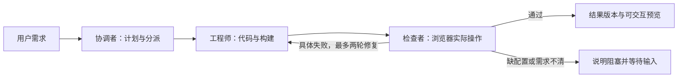

# Multica 团队机制：参考范围与限时实现决策

核验日期：2026-09-21。用户已确认所说的 Monica 指 [multica-ai/multica](https://github.com/multica-ai/multica)。源码研究及固定链接文档采用提交 `f41fae6b08fb734afcbd13205c0b3203dd0bc9c6`；官网文档按上述核验日期读取，不将动态文档冒充固定版本。本文提出实现方案，不表示 nano-Atoms 已实现团队功能。

## 1. 决策

**借鉴 Multica 的团队分工和任务交接，自行实现一个固定三角色小队；底层继续使用 Pi + E2B。** 不把 Multica 作为运行依赖，不复制其 UI 或服务端代码，不迁移现有技术路线到 Go/daemon 控制面。

当前 P0 仍是可在线使用的生成、预览、连续修改和持久化。将 P1 从“单 Agent 浏览器检查”细化为“协调者 → 工程师 → 浏览器检查者”的协作流程；它是一个连贯的延展，不再另开多个大功能。完整多团队配置、成员管理和并行候选延期。

## 2. 三个容易混淆的概念

| 概念 | 含义 | 本次处理 |
|---|---|---|
| Squad / Agent 团队 | 一个负责人和若干成员，按任务交接工作 | 参考一个固定三角色小队 |
| Workspace / 组织团队 | 人类成员、资源与权限的工作区边界 | 只保留项目访问控制，不做团队邀请和管理产品 |
| Race / 并行候选 | 多模型或多方案各自完成同一目标，再比较选择 | 不做；团队分工不要求重复生成多套应用 |

Multica 官方明确：分配给 Squad 时先唤醒 Leader，而非同时启动全部成员；Squad 本身不增加并发。Leader 根据成员职责决定交接。角色说明是提供给模型的上下文，不会自动赋予权限。[Squads](https://multica.ai/docs/squads)

## 3. 具体借鉴什么

| Multica 机制 | 对我们有用的部分 | 自行实现的边界 |
|---|---|---|
| Leader 与成员名册 | 明确当前任务由谁负责，下一步交给谁 | 三个固定角色，不开放任意动态建队 |
| Issue 与 Run 分离 | 一次需求可有多次执行和修复尝试 | 使用现有项目下的任务、角色运行和版本，不复制 issue 管理器 |
| 成员结果触发后续协作 | 编码完成后检查，检查失败后有明确修复任务 | 结构化交接，不靠解析普通聊天里的名字来调度 |
| 运行记录与目标状态分离 | 模型调用结束不等于应用完成 | 保留构建、检查与可预览结果状态 |
| 去重和防自触发 | 重复回报不重复派工，不无限循环 | 任务阶段唯一键、预期状态校验、修复次数上限 |
| 执行时间线 | 用户能看懂目前做什么、因何等待 | 角色、当前动作、阻塞原因和结果摘要；详细工具日志折叠 |

官方 Squad 采用评论中的结构化 mention 分派，成员回报后可再次触发 Leader；父任务在派工后仍在执行中，达到目标才进入评审状态。它还对自身消息、重复触发和权限作处理。上述是文档确认的机制，不代表我们应照搬它的评论协议。[Squads](https://multica.ai/docs/squads)

## 4. 我们的三个真实角色

| 角色 | 输入与产物 | 工具权限 |
|---|---|---|
| 协调者 | 输入用户需求与项目摘要；产出简短计划、范围、阶段任务；处理结果中的范围问题 | 读取项目元信息、提交计划、分派已允许的角色、请求澄清；不能改代码或执行任意 shell |
| 工程师 | 接收明确任务和当前版本；生成/修改工程，运行构建，交付版本与说明 | E2B 项目内文件、安装、构建与受控命令；唯一源码写入者 |
| 检查者 | 接收目标行为、版本和预览；实际操作浏览器，产出通过项、失败步骤或阻塞原因 | 浏览器观察/动作、截图、日志、只读源码；不能写源码，不能通过任意 shell 绕过限制 |

三个角色使用同一 Pi SDK 的不同 session、角色指令和工具集合，可以共用同一模型，不需要三套框架或三台机器。权限由服务端工具注册与执行检查落实，不能只在 prompt 中写“请勿修改”。

同一项目仍串行推进，只允许工程师写入。检查者用明确的测试身份操作预览；应用中的写入行为只作用于测试场景。交接带版本号，旧版本的检查结果不能把新版本标成已检查。

这是我们的限时方案，收敛了 Multica 的通用协作机制。调度服务负责强制阶段和权限规则，模型负责计划、实现和判断。简单追加修改可以直接进入工程师与检查者，界面如实显示协调者本轮没有执行。

## 5. 最小交接与持久化

沿用当前 Project、Run、Event、Revision 等对象，只补角色和阶段关联；不为三角色引入队列集群、通用工作流引擎或新的控制平台。

- 任务记录：用户要求、当前状态、当前阶段、修复次数、停止标记。
- 角色运行：角色、独立 session 标识、输入版本、状态、输出摘要和用量。
- 交接记录：来源运行、目标角色、具体任务、产物引用、预期版本。
- 检查结果：对应版本、实际执行的步骤、观察结果、截图/日志引用和失败说明。

服务端先持久化阶段结果，再推进下一角色。相同任务/阶段/尝试的重复结果只接受一次；收到停止请求后中止当前活动 run，取消待执行阶段，拒绝迟到结果触发后续交接；模型中止和远端命令结束确认后再显示已停止。进程重启仍按限时方案标记中断、保留已保存结果，用户再发起任务；不借这次研究扩展成透明故障恢复系统。

检查失败最多进入两轮修复；构建失败、浏览器不可访问、缺少用户输入与行为不符合需求应分开显示。检查者不能只输出一句“通过”而没有实际工具操作；也不能要求每次都必须发现缺陷。正常路径检查和可复现故障用例分别验证。

## 6. 用户界面借鉴

工作台保持聊天与预览，不照搬工程 issue 看板。聊天中显示：

1. 简短任务计划：这次要实现什么，哪些内容保持不变。
2. 角色活动：当前协调/编码/检查状态，真实工具动作可展开。
3. 交接摘要：例如“已完成表单，交给检查者验证提交和校验行为”。
4. 结果：可打开的版本、主要改动、检查结果和仍存在的问题。

结果卡是我们面向应用生成的设计，不冒充 Multica 已提供完全相同的界面。也不把三个头像当作协作已完成；没有执行的角色不显示伪造进度。

## 7. 为什么不直接集成整套 Multica

Multica 是管理编码工具的协作控制面：Next.js、Go 服务、PostgreSQL 和运行机器上的 daemon，后者调用已安装的编码 CLI。它支持 Pi CLI，并不等于现有 Pi SDK 与 E2B 已获得直接适配。接入还涉及任务身份、协议、会话、沙箱生命周期和预览回传，当前没有做这些集成实测。[固定版 README](https://github.com/multica-ai/multica/blob/f41fae6b08fb734afcbd13205c0b3203dd0bc9c6/README.md)、[自托管](https://github.com/multica-ai/multica/blob/f41fae6b08fb734afcbd13205c0b3203dd0bc9c6/SELF_HOSTING.md)

官方也明确其 daemon 权限不构成文件系统沙箱保证，因此它不能替代 E2B 的执行隔离。[安全模型](https://github.com/multica-ai/multica/blob/f41fae6b08fb734afcbd13205c0b3203dd0bc9c6/apps/docs/content/docs/security-model.mdx)

### 当前许可证影响直接复用

它使用 **Multica License：Apache 2.0 全文加附加条件**，不能标成纯 Apache 2.0。Part I 明确限制未获相应授权的对外托管，包括免费的公开实例；UI 抽取与改名仍涉及品牌条款；仅后端使用也有条件和署名要求。公开 fork 本身与对外提供托管是两种行为。

因此，本次不将其源码或组件纳入对外 Demo。参考通用任务分工与交接原则，自行设计接口和实现；后续若要直接嵌入或托管 Multica，再按具体使用方式核对授权。这里是许可证文字摘要，不对未审查的使用方式作保证。[固定版 LICENSE](https://github.com/multica-ai/multica/blob/f41fae6b08fb734afcbd13205c0b3203dd0bc9c6/LICENSE)、[NOTICE](https://github.com/multica-ai/multica/blob/f41fae6b08fb734afcbd13205c0b3203dd0bc9c6/NOTICE)

## 8. 完成边界

本次只建议一个固定角色小队，以下仍延期：任意 Squad CRUD、跨团队路由、多人邀请、26 种 CLI 接入、多机器 daemon、Autopilots、聊天平台连接器、Race 和复杂分支合并。

团队延展的验收是：真实计划与任务 → 工程师生成版本 → 独立检查者实际操作 → 失败交接与有限修复 → 用户能看到正确状态。另检查停止后不继续派工、重复结果不重复运行，以及源码只有工程师能修改。

这是源码与文档研究形成的建议，尚未运行 Multica 或实现、测试我们的三角色集成。不能据此声称该方案已验证能在特定小时数内完成。

## 9. 本轮实际读到的源码依据

固定提交见开头。整仓下载遇到网络问题后，按 GitHub 固定 blob SHA 获取了 27 个相关文件，索引为 `nano-atoms-multica-team`，约 1,040 个节点和 3,295 条边。这是有界源码集，不能据此作全仓库或完整依赖的否定判断。

按用户要求先查图谱结构、符号及调用关系，再定点读取。当前环境没有 codegraph，源码读取使用 codebase-memory-mcp 的 `get_code_snippet`。下列 Go 文件的覆盖检查无记录问题；相关 SQL 有部分解析缺口，本次不宣称完整验证数据库约束、恢复或 exactly-once。

| 源码位置 | 确认的机制 | 我们借鉴的规则 |
|---|---|---|
| `IssueService.enqueueSquadLeaderTask`，service/issue.go:844 | 读取 squad 的 LeaderID，检查 pending，再只给 leader 入队。[源码](https://github.com/multica-ai/multica/blob/f41fae6b08fb734afcbd13205c0b3203dd0bc9c6/server/internal/service/issue.go#L844) | 开始时先明确负责人，不自动启动所有成员 |
| `TaskService.enqueueMentionTaskWithCommentPlan`，service/task.go:1429 | 保存带 SquadID、交接上下文等字段的任务后，再广播和通知执行。[源码](https://github.com/multica-ai/multica/blob/f41fae6b08fb734afcbd13205c0b3203dd0bc9c6/server/internal/service/task.go#L1429) | 先保存任务，后显示派工成功 |
| `Handler.routeAssignedSquadLeaderFallback`，handler/comment.go:2995 | 成员回报可路由回 leader，同时检查身份和运行条件。[源码](https://github.com/multica-ai/multica/blob/f41fae6b08fb734afcbd13205c0b3203dd0bc9c6/server/internal/handler/comment.go#L2995) | 结果需要推动后续阶段，不能只有聊天文字 |
| `Handler.resolveCommentTriggerEnqueue`，handler/comment.go:2129 | 对 queued 输入合并，对忙碌执行登记待处理输入；竞争重试失败可返回 blocked。[源码](https://github.com/multica-ai/multica/blob/f41fae6b08fb734afcbd13205c0b3203dd0bc9c6/server/internal/handler/comment.go#L2129) | 去重必须同时避免丢掉新输入；不能简单 running 就忽略 |
| `buildClaimedTaskResponse`，daemon.go:2700；`buildSquadLeaderBriefing`，squad_briefing.go:196 | 领取时确认 leader/squad 关系，再注入协作协议、名册与自定义说明。[领取](https://github.com/multica-ai/multica/blob/f41fae6b08fb734afcbd13205c0b3203dd0bc9c6/server/internal/handler/daemon.go#L2700)、[说明构建](https://github.com/multica-ai/multica/blob/f41fae6b08fb734afcbd13205c0b3203dd0bc9c6/server/internal/handler/squad_briefing.go#L196) | 每个角色获得正确上下文，标签不自动产生身份或权限 |

图上确认了两条关键路径：`Issue 创建/分配 → enqueueSquadLeaderTask → 创建持久化任务 → 通知执行`；`运行领取 → buildClaimedTaskResponse → buildSquadLeaderBriefing`。回报处理还有防 leader 自触发逻辑。部分大函数的 snippet 有返回行数上限，只引用实际读到的区域，不声称通读整个文件。

未运行 Multica 测试或完整服务，也未验证我们的 Pi 三角色集成。这些是源码级机制证据，不能代替实际模型质量、浏览器成功率、取消和恢复测试。
